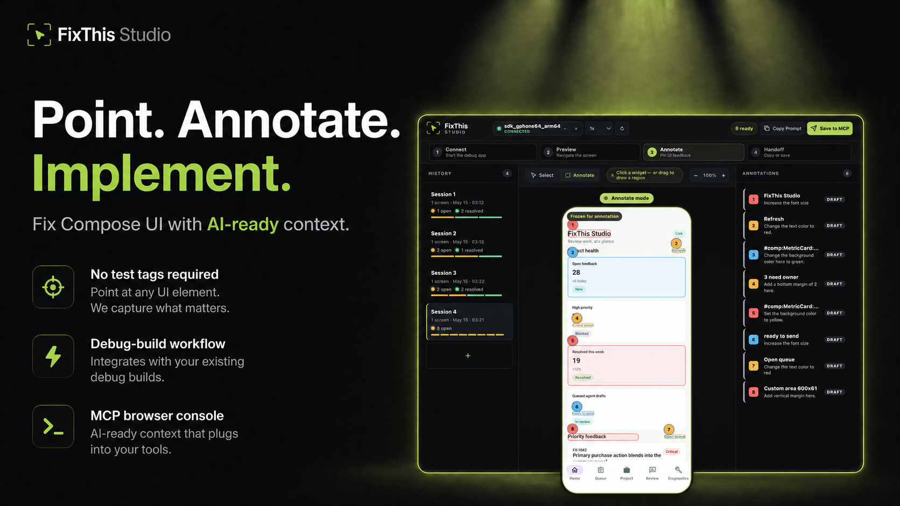

# FixThis for Android Compose



Telling a coding agent *which* part of a complex Compose screen to change is harder than the change itself. "The second card from the bottom — the small chip on its right edge — make the corners rounder" is tedious to write, ambiguous to read, and the agent still has to guess where in the source tree to land.

**FixThis flips that around: point at the UI, type what you want, and the agent gets a structured prompt with the target nailed down.** Behind the screenshot we attach source-file candidates, the surrounding semantic tree, the activity, the bounds, and severity / status — the agent acts on a precise target instead of decoding a description.

Two handoff modes, depending on how you drive your agent:

- **Copy Prompt** — copies a compact Markdown prompt to the clipboard. Paste into Claude, Codex, Cursor, or any chat-style agent and it can start editing immediately. No setup beyond having FixThis running.
- **Save to MCP** — saves the annotation batch as a local handoff. Claude Code or Codex (auto-configured by `fixthis setup --write`) reads it on demand via MCP tools whenever you ask the agent to pick up the work — no copy/paste round trip. Multiple annotations can be batched into one handoff.

Both modes share the same compact prompt format and the same JSON evidence; MCP just removes the manual paste step.

## Why FixThis vs. just sending a screenshot?

Modern coding agents already accept screenshots and accessibility trees. FixThis differs in three ways:

- **Pin to source, not pixels.** A screenshot tells the agent *what* the UI looks like; FixThis adds top-3 ranked source-file candidates with line numbers, match reasons, and a margin score. The agent edits the right call site instead of guessing which composable rendered which pixel.
- **Stable target identity.** Instance grouping (`instance i/N`), duplicate-marker detection, and overlap-group hints keep N visually identical cards distinguishable, so a request like "make the second metric card red" doesn't get applied to the first one or to the composable definition.
- **Batched, structured handoff.** One prompt can carry many annotations across many screens, each with its own bounds, severity, and source pin. Easier to act on than several separate screenshots.

If your screen has a single obvious target with a clear text label, a plain screenshot may already be enough. FixThis pays off most when the UI is dense, list-rendered, or labeled mostly by composable name rather than visible text.

## Scope (V1)

FixThis is intentionally narrow today. Read this before integrating, so it's clear what is and isn't supported:

- **Jetpack Compose only.** Smart Select, source candidates, and screenshot capture use Compose semantics. View-based hierarchies (XML layouts, AndroidView interop, web views) are **not detected** — you can still draw an area selection on top of them, but you won't get source candidates.
- **Debug builds only.** The sidekick ships as a `debugImplementation` artifact and is omitted from release. No production runtime cost, no production privacy surface — but you cannot collect feedback from a release build.
- **Local-only & ADB-only.** Everything runs on your dev machine: the sidekick speaks to the desktop console over ADB, and artifacts live under `.fixthis/`. No cloud, no upload, no external network call. (Privacy details in [Privacy Notes](#privacy-notes).)
- **No required testTags.** Smart Select prefers semantics + nearby labels + composable-name conventions; testTags are recognized when present but not required.
- **No AccessibilityService.** Inspection runs in-process inside the debug app via the sidekick — no system-level a11y permission, no separate APK.
- **MCP-first.** The MCP feedback console (browser UI) is the primary surface. The Android app shows only a tiny connection pill.
- **Source candidates are best-effort.** Smart Select pins the call site well when the target has a `testTag` named like `comp:Foo:variant`, a unique semantic label, or a distinctive composable name. Detection weakens with heavy `Layout` / `SubcomposeLayout` wrappers, dynamic content built from data alone, and `AndroidView` interop. We always show up to 3 candidates plus a margin score so the agent can pick or verify rather than blindly trust rank-1.
- **Screenshots are pixel captures.** Editable / password text is redacted, but screenshots may still contain sensitive content. Review before sharing.

## Requirements

| | Tested with |
| --- | --- |
| JDK (toolchain) | 21 |
| Android Gradle Plugin | 9.1.1 |
| Kotlin | 2.2.21 |
| Compose BOM | 2026.04.01 |
| Android `minSdk` | 24 (Android 7.0) |
| Android `targetSdk` / `compileSdk` | 36 |
| Desktop OS | macOS, Linux, Windows (anywhere `adb` runs) |
| AI agent (optional) | Claude Code, Codex, Cursor, or any chat agent that accepts pasted Markdown |

ADB must be on your PATH. Connect a debuggable Android device or unlocked emulator before running the console.

## Quick Start (try the sample in ~5 min)

The fastest way to see FixThis end-to-end is the bundled sample app:

```bash
# 1. Clone (you can drive everything from the CLI; Android Studio is optional)
git clone <this-repo> && cd FixThis

# 2. Build the desktop CLI + MCP server
./gradlew :fixthis-cli:installDist :fixthis-mcp:installDist

# 3. Verify your environment (ADB on PATH, JDK 21, device reachable)
fixthis-cli/build/install/fixthis/bin/fixthis doctor

# 4. With a device or emulator connected, install + run sample + open the browser console
fixthis-cli/build/install/fixthis/bin/fixthis run --package io.beyondwin.fixthis.sample
```

`fixthis run` installs the sample debug APK, launches it, attaches the sidekick bridge, and opens the FixThis Studio console at `http://127.0.0.1:<port>` in your default browser. From there: click **Annotate**, point at any UI element on the live preview, write a comment, and hit **Copy Prompt** — paste straight into Claude or Codex.

If anything fails, [`docs/troubleshooting.md`](docs/troubleshooting.md) covers ADB, lockscreen, and bridge-attach issues.

## What It Does

FixThis adds a debug-only sidekick to your Compose app. The app itself only shows a small MCP browser connection status pill, while feedback selection, comments, screenshots, and handoff happen in the MCP browser console on the desktop.

The console captures the current screen through the sidekick bridge, lets you select UI targets or visual areas in the browser, and stores local evidence snapshots that an AI coding agent can read through MCP tools.

Saved feedback can include Stable Target Evidence: nullable, additive JSON that describes target identity hints, occurrence among captured merged semantics nodes, source interpretation, screenshot availability, and confidence warnings. Markdown detail modes change only the agent-facing Markdown density; JSON remains complete.

## Install in Your Own App

> ⚠️ **Pre-publication.** FixThis is not yet published to a public Maven repository. External projects must wire this repository explicitly via Gradle composite build (`includeBuild`) or project-dependency, _not_ via the placeholder coordinates below. The plugin / sidekick artifacts will be published once a root `LICENSE` is chosen — see [Release readiness](docs/release-readiness.md) for the blocker list.

### 1. Apply the Gradle plugin

In your `app/build.gradle.kts`:

```kotlin
plugins {
    id("io.beyondwin.fixthis.compose")
}
```

In this repository, the plugin is wired through composite build and `pluginManagement` in `settings.gradle.kts`, so the bundled sample applies it directly. External projects must reproduce that wiring (composite build or project dependency) until a published plugin coordinate exists.

The plugin handles source-index generation and adds the sidekick as a `debugImplementation` automatically. Once published, manual sidekick wiring will look like (placeholder, do not use yet):

```kotlin
// Future, once published. Until then, use composite build.
dependencies {
    debugImplementation("io.beyondwin.fixthis:fixthis-compose-sidekick:0.1.0")
}
```

Release builds are not a supported target — the sidekick is debug-only by design.

### 2. Configure your AI agent

FixThis auto-configures Claude Code and Codex via `fixthis setup --write`:

```bash
# Build CLI / MCP once
./gradlew :fixthis-cli:installDist :fixthis-mcp:installDist

# Wire your agent (run once per project)
fixthis-cli/build/install/fixthis/bin/fixthis setup \
  --package <applicationId> \
  --write \
  --target all
```

`--target all` writes:
- **Claude Code** → project-local `.claude/settings.json`
- **Codex** → user-global `~/.codex/config.toml`

Use `--target codex` or `--target claude` for one of the two. Add `--dry-run` to preview without modifying files. For other chat-style agents (Cursor, ChatGPT, etc.) use **Copy Prompt** — no setup required.

### 3. Open the console

From any configured agent:

```
fixthis_open_feedback_console
```

Or directly from the CLI:

```bash
fixthis console --package <applicationId>
```

See [AGENTS.md](AGENTS.md) for the full AI workflow and [docs/troubleshooting.md](docs/troubleshooting.md) if anything misbehaves.

## Repository Layout

The Android Studio sample app is exposed as Gradle project `:app`, while its files live under `sample/`:

```text
:app                         -> sample/
:fixthis-compose-core     -> pure Kotlin domain contracts, use cases, models, selection, formatters, source matching
:fixthis-compose-sidekick -> debug runtime, MCP status indicator, inspection, screenshots, bridge
:fixthis-gradle-plugin    -> plugin and source-index generation
:fixthis-cli              -> desktop CLI
:fixthis-mcp              -> stdio MCP server and local feedback console
```

The CLI/MCP browser console uses its HTML asset surface, loaded from packaged resources under `fixthis-mcp/src/main/resources/console`.

When developing this repository's console UI, pass `--console-assets-dir` to read `index.html`, `styles.css`, and `app.js` directly from the source tree instead of the installed distribution JAR:

```bash
fixthis console --package io.beyondwin.fixthis.sample \
  --console-assets-dir "$PWD/fixthis-mcp/src/main/resources/console"
```

This option is only for FixThis contributors iterating on the local console assets. Normal users should use the packaged resources. The console JS is bundled — its modular sources live under `fixthis-mcp/src/main/console/`, and `node scripts/build-console-assets.mjs` concatenates them into the `app.js` that `--console-assets-dir` serves. Run that script after editing any module.

`--console-assets-dir` reloads HTML/CSS/JS from source on every request, but the Kotlin server itself runs from the installed JAR. After editing any Kotlin code in `:fixthis-mcp` or `:fixthis-compose-sidekick`, run `bash scripts/restart-console.sh` to rebuild and relaunch the console (add `--with-app` to also reinstall the sample APK). See `CLAUDE.md` for details.

As a safety net, the console compares its bundled build epoch against the running server on load and shows a dismissable staleness banner if they disagree — so a forgotten restart surfaces in the browser instead of silently serving an old JAR.

`gradle/gradle-daemon-jvm.properties` pins the Gradle daemon JVM toolchain to Java 21. Local Android SDK settings still belong in `local.properties`, which is ignored.

## Sample App

The bundled sample (`io.beyondwin.fixthis.sample`, launcher label **FixThis**) is the branded FixThis Studio Compose app, exposed as Gradle project `:app` (sources under `sample/`). Its five bottom-nav tabs — Home, Queue, Project, Review, Diagnostics — preserve deterministic coverage for Smart Select, screenshots, source candidates, form controls, dropdown/menu, dialog, Canvas, disabled controls, repeated cards, long text, weak-semantics fallbacks, and CLI/MCP bridge smoke flows. The fixture at [`sample/fixthis-coverage.json`](sample/fixthis-coverage.json) records the expected evidence scenes the smoke assertions check.

If you want to open it in Android Studio instead of via the CLI quick-start above:

```bash
# Open this repo root in Android Studio and run the `app` configuration, or:
./gradlew :app:assembleDebug
./gradlew :app:installDebug
```

Connected instrumentation tests require an unlocked interactive emulator or device. A physical device that reports `device` in `adb devices` can still fail Compose hierarchy discovery while sitting behind a secure lockscreen.

## CLI And MCP

The CLI can run diagnostics, launch the debug sample, print MCP setup JSON, and open the feedback console:

```bash
fixthis doctor
fixthis run
fixthis setup --package <applicationId>
fixthis setup --package <applicationId> --write --target codex --dry-run
fixthis console --package <applicationId>
```

If `--package` is omitted, `.fixthis/project.json` must already exist so the CLI can read the application id.

By default, `fixthis setup` still prints MCP client JSON for manual configuration. Add `--write` to merge the FixThis MCP server into agent settings files, with `--target codex`, `--target claude`, or `--target all`. Add `--dry-run` with `--write` to print the planned file path and rendered config without modifying files.

MCP is the primary agent workflow for the feedback console. `fixthis mcp` runs as a stdio JSON-RPC server and can open a local web console where you review a live Android screen preview, annotate feedback with a desktop keyboard, and let the agent read the queue. `fixthis console` opens the same console without requiring an MCP client.

The feedback console is a dark Studio workspace: persisted sessions on the left, live or frozen Android preview in the center, and a mode-aware Inspector on the right. It defaults to `Select` mode, where normal preview clicks navigate the app. `Annotate` freezes the latest preview so you can mark feedback targets. Navigation remains debug-only and limited to one-step `back`, `tap`, and `swipe` actions. The compact device control selects the active ADB device for FixThis bridge requests, shows `No device`, `Connecting`, `Connected`, or `Unavailable`, and keeps unavailable, offline, or unauthorized devices visible but not selectable. While `Connected`, the chip can also annotate a blocked sub-state (screen off, lock screen, app backgrounded, Picture-in-Picture, sample app unresponsive, or no Compose UI on the current screen); the canvas shows a per-cause overlay and suppresses selection input until the cause clears, then auto-resumes the prior tool mode, frozen preview, and pending pins.

Top bar actions are short session-level controls: device selection, connection state, `Refresh devices`, `Clear selection`, `Copy Prompt`, and `Save to MCP`. Canvas controls include `Select`, `Annotate`, `Add annotation`, and `Exit Annotate`. `Clear selection` clears only FixThis's active device selection. Live preview interval options are Manual, 1s, 2s, and 5s; the default is 1s. Preview polling pauses while the browser tab is hidden, while the `Annotate` frozen-preview flow is active, and when the selected device becomes unavailable.

Feedback console flow:

1. Open the console from `fixthis console --package <applicationId>` or `fixthis_open_feedback_console`.
2. Click `Start`. The console finds the selected/only ready Android device, opens the debug app when possible, and connects to the FixThis sidekick bridge.
3. Use the recovery card as needed: `Choose device` when multiple ready devices are connected, `Open app`, `Reconnect`, or `Try again` when the app or bridge needs recovery. Draft annotations and the last preview remain visible while reconnecting.
4. When the card shows `Ready`, click `Capture screen` to refresh the preview, then use the app normally from the console preview.
5. Click `Annotate` when ready to leave feedback on the current screen.
6. Select a UI target or drag a visual area and write a comment.
7. Click `Add annotation`; numbered overlay markers and pending rows stay in sync.
8. Review the draft evidence group in the Inspector Draft view, including the frozen screenshot, numbered overlay, and comments.
9. Click `Copy Prompt` for compact Markdown or `Save to MCP` when ready to create a local handoff batch.

`Annotate` freezes the latest preview only; it does not write a session item by itself. You can add multiple browser-side pending annotations to one frozen preview with `Add annotation`. Pending items support Focus and Delete before they are persisted; deleting renumbers pending items so the pending list numbers and overlay numbers match. `Copy Prompt` and `Save to MCP` persist written pending annotations when needed, promote the frozen preview into one evidence snapshot, and connect those items to the same `screenId`. Later `Annotate` work on the same visible app screen can create another evidence snapshot when pending annotations are persisted.

Saved evidence groups can be expanded to review the persisted screenshot, numbered overlay, and saved comments. `Save to MCP` creates a persisted local handoff batch that MCP tools can read. It does not call an external AI API. Agent-facing Markdown is compact and focused on the request, target evidence, and likely source; it intentionally omits internal IDs and repeated storage metadata. JSON remains complete for tools and preserves IDs, paths, and MCP contracts.

Feedback console sessions are resumable. FixThis saves feedback workspace metadata and screenshot artifacts under `.fixthis/feedback-sessions/`, so an MCP or console restart does not discard queued feedback.

## Local Artifacts

Feedback console sessions write workspace metadata and session-owned screenshots under `.fixthis/feedback-sessions/`. These are local debug artifacts and are ignored by git. The current `.gitignore` ignores `.fixthis` as a whole; if your team wants to share `.fixthis/project.json` for package discovery, add an explicit unignore rule for that file.

Use `fixthis clean --project-dir <projectRoot>` to remove only known local artifact directories: `.fixthis/feedback-sessions/`, `.fixthis/preview-cache/`, `.fixthis/artifacts/`, and `.fixthis/smoke-reports/`. The command is symlink-safe, supports `--dry-run` and `--older-than-days <n>`, and preserves `.fixthis/project.json` plus unknown `.fixthis` files or directories.

## Privacy Notes

`.fixthis/feedback-sessions/` artifacts include comments, source hints, screenshots, session metadata, and handoff batches. Editable/password text is redacted automatically, but screenshots are pixel captures and may carry sensitive content — review before sharing exported artifacts. The sidekick is debug-only, runs over local ADB, and never makes external network calls. See [docs/privacy.md](docs/privacy.md) for the full surface.

## Roadmap

V1 is intentionally narrow (see [Scope](#scope-v1)). High-priority items beyond V1, in rough order of likely arrival:

- **Public Maven Central / Gradle Plugin Portal release** — unblocks single-line install for external projects. Currently gated on choosing a root `LICENSE`; tracked in [Release readiness](docs/release-readiness.md).
- **`AndroidView` / interop awareness** — at minimum a clear "View-based subtree" badge on annotations so the agent stops guessing at non-Compose pixels.
- **SSE-driven console state sync** — replace pull-based refresh with server-pushed events so passive viewing, multi-tab, and async server work all stay live. Design in [docs/console-state-sync-design.md](docs/console-state-sync-design.md).
- **Smarter source matching** — populate `scoreMargin` end-to-end, lift detection on `Layout` / `SubcomposeLayout` wrappers, and recognize more composable-name conventions.
- **More agents out of the box** — Cursor, Aider, and others currently work via Copy Prompt; first-class MCP / config writers can follow the Claude Code + Codex pattern.

If you'd like to vote a particular item up or contribute, open an issue or see [CONTRIBUTING.md](CONTRIBUTING.md).

## Further Reading

- [Project overview](docs/project-overview.md)
- [Project overview (English)](docs/project-overview.en.md)
- [Product requirements](docs/fixthis_prd.md)
- [Contributing](CONTRIBUTING.md)
- [Security](SECURITY.md)
- [Release readiness](docs/release-readiness.md)
- [Technical design](docs/fixthis_technical_design.md)
- [Decisions](docs/fixthis_decisions.md)
- [Architecture decisions](docs/adr/README.md)
- [Output schema](docs/output-schema.md)
- [Privacy](docs/privacy.md)
- [Troubleshooting](docs/troubleshooting.md)
- [MCP](docs/mcp.md)
- [Feedback console contract](docs/feedback-console-contract.md)
- [Feedback console UX status](docs/design-feedback-console-ux.md)
- [Console state sync + SSE migration](docs/console-state-sync-design.md)
- [Project improvement proposals](docs/project-improvement-proposals-2026-05-07.md)
- [Project improvement stabilization design](docs/superpowers/specs/2026-05-08-project-improvement-stabilization-design.md)
- [Project improvement stabilization implementation plan](docs/superpowers/plans/2026-05-08-project-improvement-stabilization-implementation.md)
- [Feedback console redesign brief](docs/design-claude-redesign-brief.md)
- [Zero-setup agent configuration](docs/design-zero-setup.md)
