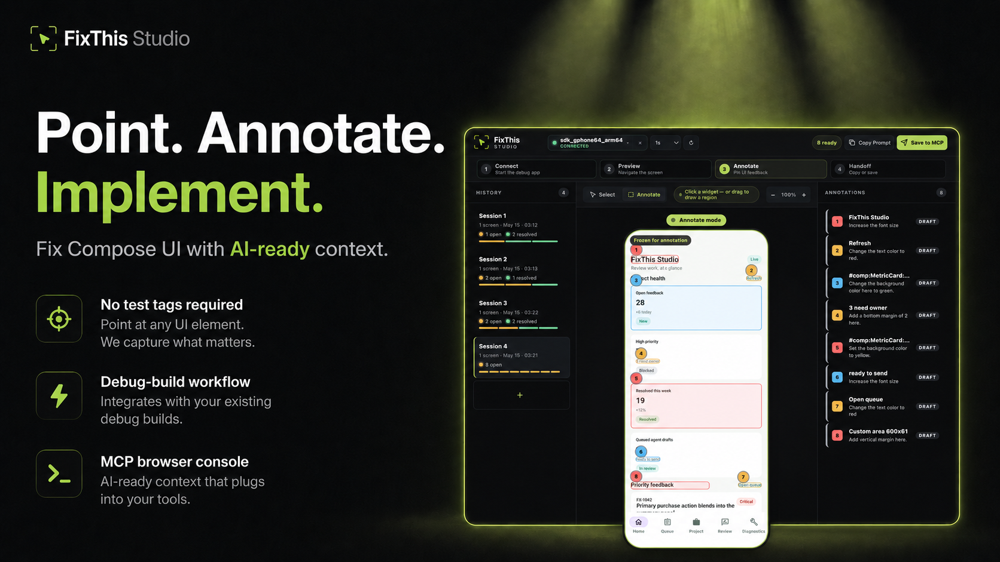

# FixThis for Android Compose

[](https://github.com/beyondwin/FixThis/actions/workflows/ci.yml)
[](LICENSE)
[](https://adoptium.net/)
[](https://nodejs.org/)
[](https://developer.android.com/jetpack/compose)



Point at a Jetpack Compose UI, write the change, and hand Claude, Codex,
Cursor, or another coding agent the source context it needs.

FixThis is debug-only. It attaches a sidekick to a Compose debug app, mirrors
the screen into a local browser console, and turns annotations into a compact
handoff: screenshot bounds, semantics, source candidates, and confidence
warnings.

Click a component to select it. Drag when the target is spacing, empty room,
or something that is not a clean Compose node.

## Works Today

- Try the sample app in about five minutes.
- Install the desktop CLI/MCP with Homebrew, npm, or GitHub Releases.
- Add it to an external app with the Gradle plugin `io.github.beyondwin.fixthis.compose`.
- Let Claude Code or Codex configure the sample with `./scripts/bootstrap-mcp.sh --sample`.
- Let an agent configure your app with `fixthis install-agent`.
- Use **Copy Prompt** with Cursor, ChatGPT, or any chat agent.
- Use **Save to MCP** with Claude Code or Codex.
- **Save to MCP** can attach a bounded, redacted Android diagnostics baseline.
  Switch the session to Manual or Off if you do not want that. **Copy Prompt**
  never starts collection.
- Runs locally over ADB and `127.0.0.1`. No external API calls.

## Quick Start: Agent Installs FixThis in Your App

### Claude Code / Codex Bootstrap Prompt

Paste this into Claude Code or Codex from the root of a Jetpack Compose Android app:

```text
Install FixThis in this project and configure it for this agent.

Use this order:
1. Run `fixthis install-agent --project-dir . --target all --verify --json`.
2. Use the JSON `readiness.state` and `actions[]` as the source of truth.
3. If `requiresUserAction` is true, tell me the exact blocking action.
4. Do not call `fixthis_open_feedback_console` until `readyForMcpTooling` is true, or until the report's `agent_after_restart` action is reached after restart.

Restart Claude Code or Codex if the report asks for it.
Do not configure release builds. Do not commit `.fixthis/`.
```

The agent should run:

```bash
# macOS
brew install beyondwin/tools/fixthis

# Node
npm install -g @beyondwin/fixthis

# macOS/Linux fallback
curl -fsSL https://raw.githubusercontent.com/beyondwin/FixThis/main/scripts/install-fixthis.sh \
  | bash -s -- --version v1.5.0

fixthis install-agent --project-dir . --target all --verify --json
```

If Homebrew already has it, run
`brew update && brew upgrade beyondwin/tools/fixthis` and check
`fixthis --version`.

`fixthis install-agent` applies the Gradle plugin, writes MCP config, and
writes `.fixthis/project.json` plus `.fixthis/agent-setup.*`. If doctor
reports `NEEDS_INSTALL` or metadata is missing, run `./gradlew fixthisSetup`
and rerun `fixthis install-agent --project-dir . --target all --verify --json`.
Restart Claude Code or Codex when the report asks, then call
`fixthis_open_feedback_console`. For a manual check, use
`fixthis doctor --project-dir . --json`.

Published plugin:

```kotlin
plugins {
    id("io.github.beyondwin.fixthis.compose") version "1.5.0"
}
```

The plugin adds the debug-only sidekick and keeps release builds out.

## Quick Start: Sample App to Agent Handoff

```bash
git clone <this-repo> && cd FixThis
./gradlew :fixthis-cli:installDist :fixthis-mcp:installDist
fixthis-cli/build/install/fixthis/bin/fixthis doctor --package io.github.beyondwin.fixthis.sample
fixthis-cli/build/install/fixthis/bin/fixthis run --package io.github.beyondwin.fixthis.sample
```

`fixthis run` installs the sample debug APK, launches it, and opens FixThis
Studio at `http://127.0.0.1:<port>`.

In the console:

1. Click **Annotate**.
2. Click a UI element, or drag an area.
3. Type the change you want.
4. Repeat for other spots on this screen.
5. **Copy Prompt** for a chat agent, or **Save to MCP** for Claude Code / Codex.

You are done when a numbered annotation is visible and you have copied Markdown
or saved a local MCP handoff.

Maintainers can prove that Copy Prompt path on a connected device:

```bash
npm run real-copy-prompt:smoke -- --strict
```

## Pick Your Path

| Goal | Start here |
| --- | --- |
| Try it without touching your app | [Sample quick start](docs/getting-started/try-the-sample.md) |
| Add it to your debug build | [Add to your app](docs/getting-started/add-to-your-app.md) |
| Connect an agent | [Connect your agent](docs/getting-started/connect-your-agent.md) |
| Bootstrap MCP from this repo | [MCP.md](MCP.md) |
| Use the console | [Console tour](docs/guides/feedback-console-tour.md) |
| Understand the product | [Product](docs/product/README.md) |
| Diagnose a failure | [Troubleshooting](docs/guides/troubleshooting.md) |
| Inspect contracts | [Docs index](docs/index.md) |
| Contribute | [CONTRIBUTING.md](CONTRIBUTING.md) |

| Reader | Start here |
| --- | --- |
| First-time user | [Sample quick start](docs/getting-started/try-the-sample.md) |
| External app developer | [Add to your app](docs/getting-started/add-to-your-app.md) |
| Agent in this repo | [AGENTS.md](AGENTS.md) and [project map](docs/guides/project-map.md) |
| Maintainer | [Docs index](docs/index.md) and [project map](docs/guides/project-map.md) |
| Contract or CLI change | [Reference contracts](docs/index.md#reference-contracts) |

## Why not just a screenshot?

A screenshot is enough when the target is obvious. FixThis helps when the UI
is dense, list-rendered, or named mostly by composable:

- Top-3 source candidates with line numbers and match reasons
- `editSurface` hints for call site vs component vs copy vs layout vs interop
- Instance grouping so identical cards stay distinct
- Screen fingerprint so a rotated or changed screen cannot sneak into a save
- Honest confidence: visual-only, stale, or possible AndroidView/WebView
- Bounded runtime diagnostics on Save to MCP
- Retry-safe batches that do not duplicate work

## Modules

| Module | Role |
| --- | --- |
| `:app` (`sample/`) | Validation sample |
| `:fixthis-compose-core` | Pure Kotlin domain |
| `:fixthis-compose-sidekick` | Debug Android runtime |
| `:fixthis-gradle-plugin` | Source index and debug wiring |
| `:fixthis-cli` | Desktop CLI |
| `:fixthis-mcp` | MCP server and local console |

More: [Product](docs/product/README.md), [decisions](docs/product/decision-rationale.md),
[architecture](docs/architecture/overview.md).

## Status

Public install paths:

- Gradle plugin `io.github.beyondwin.fixthis.compose`
- Maven `io.github.beyondwin:fixthis-compose-sidekick` and `fixthis-compose-core`
- Homebrew `brew install beyondwin/tools/fixthis`
- GitHub Release `fixthis-cli-mcp-vX.Y.Z.tar.gz`
- npm `@beyondwin/fixthis`
- MCP Registry `io.github.beyondwin/fixthis`

Live dashboard: [Release readiness](docs/contributing/release-readiness.md).

`main` may be ahead of the latest tag. See [CHANGELOG](CHANGELOG.md#unreleased)
and [release notes](docs/releases/README.md).

Agents in this repo should read [AGENTS.md](AGENTS.md).

## Trust

FixThis stays on your machine. The sidekick talks over ADB, the console binds
to localhost, and **Save to MCP** writes under `.fixthis/`. Screenshots can
still contain sensitive pixels. Review them before sharing. Do not commit
`.fixthis/`.

Details: [Privacy](docs/reference/privacy.md), [Security](SECURITY.md),
[Threat model](docs/reference/threat-model.md).

V1 stays narrow: Compose debug builds, local ADB, MCP-first handoff, best-effort
source candidates, no cloud upload. See [Roadmap](docs/product/roadmap.md).

## License

[MIT](LICENSE). Third-party notices in [`NOTICE`](NOTICE).
