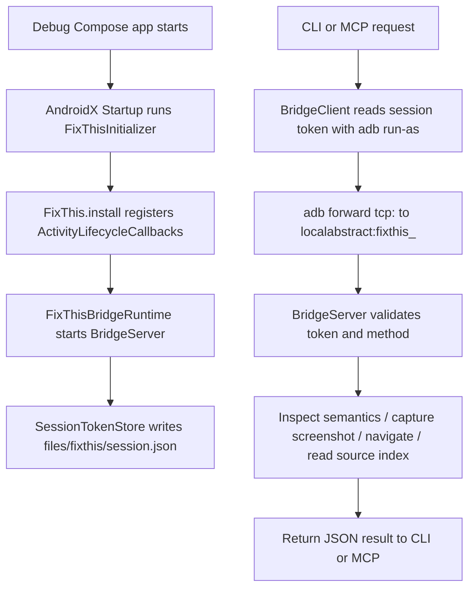
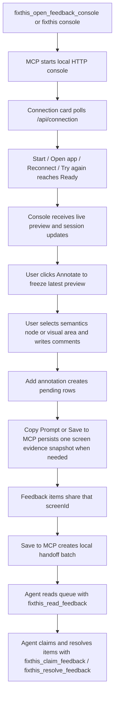

# FixThis Project Overview

This document is an onboarding reference based on the current repository code.
For product concept and maintained rationale, see
[Concept and handoff rationale](../product/concept-and-handoff-rationale.md),
[Product concept](../product/README.md),
[Decision rationale](../product/decision-rationale.md), and
[Handoff prompt rationale](../design/handoff-prompt-rationale.md).

## One-Line Summary

FixThis attaches a sidekick runtime to a Jetpack Compose debug app, captures the current UI's semantics, screenshot, selection position, source candidates, and user feedback locally, then hands them off to an AI coding agent as a readable work queue through the CLI/MCP/feedback console.

## Current Scope

- Android Jetpack Compose debug builds only.
- Sidekick auto-installs into the debug app via AndroidX Startup.
- Reads only the current app process's Compose semantics — no AccessibilityService.
- Local desktop integration via ADB and an app-local socket bridge.
- MCP feedback console is the primary workflow; the app itself shows only MCP browser connection status.
- Source candidates are best-effort hints based on a Gradle source index.
- Screenshot pixels are not automatically PII-redacted; review before sharing.

## Module Map

```text
:app                         sample/ validation app
:fixthis-compose-core     pure Kotlin domain contracts, use cases, models, selection, formatter, source matching
:fixthis-compose-sidekick debug runtime and MCP status indicator installed into target app
fixthis-gradle-plugin/    included Gradle build; debug dependency injection and source-index asset generation
:fixthis-cli              desktop CLI and ADB bridge client
:fixthis-mcp              stdio MCP server, feedback session store, local console server
```

### `:fixthis-compose-core`

Pure Kotlin module. Houses common contracts not directly tied to the Android runtime.

- `domain/annotation`, `domain/snapshot`, `domain/session`: `Annotation`, `Snapshot`, `Session`, typed IDs, repository contracts, delivery/status/target concepts.
- `usecase/annotation/CreateAnnotationUseCase.kt`, `usecase/snapshot/SaveSnapshotUseCase.kt`: pure application use cases over the domain repository contracts.
- `model/Models.kt`, `model/TargetEvidenceModels.kt`: `FixThisAnnotation`, `FixThisNode`, `SelectionInfo`, `SourceCandidate`, `TargetEvidence`, `ScreenshotInfo` and other central models of the export schema.
- `identity/*`: strict `comp:<ComposableName>:<variant>` testTag convention, stable target identity hints, occurrence ordinal/count calculation.
- `selection/NodeSelector.kt`: scores the semantics node under a tap coordinate. Accounts for click action, meaningful text/contentDescription/role/testTag, merged tree membership, center proximity, and root-like penalty.
- `selection/NearbyNodeCollector.kt`: collects meaningful nodes around the selected node as context, with deduplication.
- `source/SourceIndex.kt`, `source/SourceMatcher.kt`: matches the source index produced by the Gradle plugin against semantics evidence.
- `source/SourceMatchReason.kt`, `SourceScoringPolicy.kt`,
  `SourceConfidencePolicy.kt`, `EvidenceProfile.kt`, and
  `MarginContext.kt`: keep source-match reasons, scoring weights, candidate
  caution text, evidence profiling, and score-margin context separate from the
  matcher orchestration.
- `format/FixThisMarkdownFormatter.kt`, `format/FixThisJsonFormatter.kt`, `format/DetailMode.kt`: converts annotations to agent-facing Markdown or JSON. `detailMode` only changes Markdown output density; JSON evidence remains complete.
- `redaction/RedactionPolicy.kt`: default policy for redacting editable/password semantics text.

Boundary invariant: `:fixthis-compose-core` does not know about MCP, CLI, Android UI surfaces, or `.fixthis` file layout. Outer modules translate their DTOs, persistence, bridge, and presentation state into core domain contracts explicitly.

### `:fixthis-compose-sidekick`

Runtime that executes inside the target Android debug app.

- `FixThis.install(application)`: starts the bridge runtime only in debuggable apps and registers Activity lifecycle callbacks.
- `init/FixThisInitializer.kt`: AndroidX Startup entrypoint. Auto-installs at debug app start by adding only the sidekick dependency.
- `lifecycle/FixThisActivityLifecycleCallbacks.kt`: notifies the bridge runtime of resumed/destroyed Activities and attaches the status pill.
- `overlay/FixThisConnectionStatusHostLayout.kt`: shows `MCP connected` if a recent authenticated MCP browser heartbeat is present, otherwise `MCP waiting`.
- `inspect/ComposeRootFinder.kt`: finds the Compose `RootForTest` under the current decor view.
- `inspect/SemanticsInspector.kt`: reads the merged/unmerged semantics tree and converts it to `FixThisNode`.
- `screenshot/*`: saves screenshot PNGs under the app cache.
- `bridge/BridgeServer.kt`: Android local socket bridge and request router.
  Executes `status`, `inspectCurrentScreen`, `captureScreenSnapshot`,
  `readSourceIndex`, `verifyUiChange`, `readScreenshot`, and
  `performNavigation` after token validation.
- `bridge/BridgeModels.kt`, `BridgeRuntime.kt`, `AndroidBridgeEnvironment.kt`,
  `BridgeScreenshotReader.kt`, `BridgeSourceIndexReader.kt`, and
  `NavigationPerformer.kt`: separate bridge DTOs, runtime singleton, Android
  inspection environment, screenshot reads, source-index asset reads, and
  debug-only navigation input.
- `BridgeServer` serialises lifecycle transitions with a coroutine `Mutex`
  and exposes lifecycle state via `state: StateFlow<BridgeServerState>`.
  See ADR `2026-05-14-bridge-server-concurrency` for the rationale.
- `BridgeStatus` availability fields: also reports nullable `screenInteractive`, `keyguardLocked`, `appForeground`, `pictureInPicture`, and `installEpochMillis` (APK last-install timestamp used by `fixthis_status` to detect source staleness). The desktop console uses the availability signals to drive the `Connected` chip's blocked sub-state (screen off, locked, backgrounded, PiP, unresponsive, no Compose UI) and the canvas overlay/input gating.
- `lifecycle/FixThisActivityLifecycleCallbacks.kt` tracks a resumed-activity counter and last-resumed weak reference to stabilize backgrounded/foregrounded detection.

### `fixthis-gradle-plugin/` included build

Gradle plugin applied to the Android application project.

- plugin id: `io.github.beyondwin.fixthis.compose`
- Active on debug variants only.
- Attaches a project dependency if `:fixthis-compose-sidekick` is in the same multi-project build; otherwise attaches the `io.github.beyondwin:fixthis-compose-sidekick:<runtimeVersion>` coordinate for external projects.
- The `generate<Variant>FixThisSourceIndex` task scans Kotlin/XML sources and produces the generated asset.
- `source/KotlinSourceScanner.kt`, `XmlStringResourceScanner.kt`,
  `SourceIndexGenerator.kt`, and `SourceIndexAssets.kt`: keep source scanning,
  XML string-resource extraction, generated asset DTOs, and Gradle task wiring
  separated.

Generated asset:

```text
build/generated/fixthis/<variant>/assets/fixthis/fixthis-source-index.json
build/generated/fixthis/<variant>/assets/fixthis/fixthis-build-info.json
```

Extension defaults:

```kotlin
fixthis {
    enabled.set(true)
    runtimeVersion.set("0.2.3")
    addDebugRuntime.set(true)
    generateSourceIndex.set(true)
    generateProjectMetadata.set(true)
    includeScreenshots.set(true)
    redactEditableText.set(true)
}
```

### `:fixthis-cli`

CLI that runs as a desktop process. Builds the `fixthis` application distribution.

- `fixthis status`: prints bridge connection, current activity, root count, and protocol/source-index state.
- `fixthis run`: runs the default `:app:installDebug`, launches the app, and waits for sidekick status.
- `fixthis doctor`: diagnoses project, package metadata, ADB, device, and sidekick session step by step. `--json` emits a structured report with stable check names, status, message, and fix fields for agent consumption.
- `fixthis init`: agent-first setup that writes Claude Code / Codex MCP config and optionally applies the published Gradle plugin via `--apply-gradle-plugin`.
- `fixthis install-agent`: agent-first installer for external Android repos. Patches the detected app module's Gradle build, writes MCP config, and creates `.fixthis/agent-setup.*` handoff files.
- `fixthis setup`: prints the command/args JSON for MCP client configuration. With `--write`, merges into Claude Code / Codex settings files.
- `fixthis mcp`: runs the stdio server via the sibling or PATH `fixthis-mcp` executable.
- `fixthis console`: runs `fixthis-mcp --console` to open the local feedback console.
- `fixthis clean`: removes known `.fixthis/` artifact directories (`feedback-sessions/`, `preview-cache/`, `artifacts/`, `smoke-reports/`). Preserves `.fixthis/project.json` and unknown entries.

Package name resolution order:

1. `--package` from the CLI/MCP argument.
2. `applicationId` from `<projectDir>/.fixthis/project.json`.
3. Unique Android `applicationId` scanned from `<projectDir>` Gradle `build.gradle(.kts)` files.
4. Fail with a usage error if none or more than one candidate is found.

### `:fixthis-mcp`

MCP stdio server and local feedback console server.

- `McpProtocol`: handles JSON-RPC initialize/tools/resources/ping/cancellation.
- `tools/FixThisTools.kt`: public MCP tool facade and CLI bridge adapter.
- `tools/McpToolRegistry.kt`, `FixThisToolDispatcher.kt`,
  `FixThisResourceDispatcher.kt`, `BridgeResultCache.kt`, and
  `ConsoleServerManager.kt`: separate MCP tool/resource metadata, tool
  dispatch, resource reads, cached bridge results, and local console lifecycle.
- `session/FeedbackSessionService.kt`: thin session workflow façade. It
  coordinates session open/resume, connection diagnosis, app launch recovery,
  preview capture, persisted evidence capture, navigation, annotation save,
  target evidence derivation, handoff, and resolve through focused
  collaborators.
- `session/AnnotationWorkflow.kt`: annotation workflow boundary, including
  frozen-preview save, live fingerprint comparison, handoff, claim, and resolve
  operations.
- `session/domain/McpSessionRepository.kt`, `McpSnapshotRepository.kt`, and
  `McpAnnotationRepository.kt`: MCP adapters for the pure
  `compose-core` session, snapshot, and annotation repository ports.
- `session/SessionDtoModels.kt`, `console/AnnotationRequestModels.kt`: MCP/local-console DTOs and persisted JSON field names. Existing field names such as `items`, `screens`, `itemId`, `screenId`, `targetEvidence`, and `targetReliability` are compatibility contracts.
- `session/SessionDomainMappers.kt`: explicit mapper between DTOs and `compose-core` domain models. Legacy `"ready"` item status is normalized to `AnnotationStatus.OPEN` in the domain.
- `console/ConsoleConnectionModels.kt`: browser console recovery card contract. Serializes `WELCOME`, `READY`, `OPEN_APP`, `STARTING`, `RECONNECT`, `CHOOSE_DEVICE`, `CHECK_PHONE`, `UNSUPPORTED_BUILD` states and primary actions.
- `session/PreviewSnapshotCache.kt`, `SourceIndexRegistry.kt`, `ScreenshotArtifactPromoter.kt`: separates transient preview cache, source-index caching, and frozen preview screenshot promotion from the service.
- `session/FeedbackSessionStore.kt`, `FeedbackSessionPersistence.kt`,
  `SessionMutation.kt`, `SessionReducer.kt`, `SessionEventJournal.kt`,
  `SessionReplayEngine.kt`, and `session/eventlog/*`:
  `.fixthis/feedback-sessions/<session-id>/session.json` snapshot persistence
  plus append-only event logs under `events/`. Event-log replay is
  checkpoint-aware; compaction archives old events only after writing
  `events/checkpoint.json`. The session DTO also stores
  `nextItemSequenceNumber`, a monotonic counter for stable saved annotation
  numbers. The store coordinates locking and persistence while pure reducers
  and replay helpers own state transitions and event-log recovery.
- `console/FeedbackConsoleServer.kt`: `127.0.0.1` HTTP console and `/api/*` endpoints.
- `console/events/*`, `console/ConsoleEventEmitters.kt`, and
  `console/ConsoleEventRoutes.kt`: Server-Sent Events for console state sync.
  Session and preview events carry top-level `sessionId`; the browser applies
  them only when they match the active session, while the initial `snapshot`
  event remains authoritative.
- `console/FeedbackConsoleAssets.kt`: loader that validates and assembles `src/main/resources/console/index.html`, `styles.css`, `app.js` classpath resources.

MCP tools:

- `fixthis_status`
- `fixthis_get_current_screen`
- `fixthis_verify_ui_change`
- `fixthis_open_feedback_console`
- `fixthis_list_feedback_sessions`
- `fixthis_capture_screen`
- `fixthis_navigate_app`
- `fixthis_list_feedback`
- `fixthis_read_feedback`
- `fixthis_claim_feedback`
- `fixthis_resolve_feedback`

Stable target evidence and reliability:

- Saved feedback items may include nullable `targetEvidence` and
  `targetReliability`.
- Evidence is derived from captured merged semantics nodes, strict `comp:<ComposableName>:<variant>` tags when present, occurrence over the captured merged node set, existing source candidates, and available screenshot artifacts.
- Reliability is derived from semantic coverage, source-candidate strength,
  stale-index state, screen-fingerprint checks, and redaction constraints. It
  is rendered as target confidence plus warning metadata for agents.
- `BridgeProtocol.VERSION` is `1.3`; the bridge advertises additive
  capabilities (`targetEvidence`, `detailModes`, `composableIdentity=false`)
  and screen-integrity metadata used to compute nullable fingerprints.
- The default implementation does not depend on Compose tooling internals such as `ui-tooling-data`, `LocalInspectionTables`, `parseSourceInformation`, or `CompositionData.mapTree`.

Resources:

- `fixthis://session/current`
- `fixthis://screen/current`
- `fixthis://screenshot/latest/full.png`
- `fixthis://screenshot/latest/crop.png`
- `fixthis://source-index`

### `:app` (`sample/`)

Repository validation sample app. The Gradle project path is `:app` and the actual source directory is `sample/`, following Android Studio conventions. Application id is `io.github.beyondwin.fixthis.sample`, launcher label is `FixThis`. The `Home`, `Queue`, `Project`, `Review`, and `Diagnostics` tabs form a compact product scene that validates semantics, screenshot, navigation, source matching, form controls, dropdown/menu, dialog, Canvas, disabled controls, repeated cards, long text, and weak-semantics edge cases.

## Runtime Flow



## Feedback Console Flow



Important distinction:

- Preview frames are temporary and stored under `.fixthis/preview-cache/`.
- Saved evidence lives under `.fixthis/feedback-sessions/<session-id>/`.
- Preview/screen artifact URLs and saved item mutations carry the originating
  `sessionId`. Route handlers and browser SSE handlers resolve them against
  that session instead of the current active session, so switching sessions
  during an in-flight request cannot leak saved overlays, screenshot URLs,
  session updates, or preview frames across workspaces.
- `Save to MCP` is local persistence for MCP handoff. It does not call an external AI API.
- Connection recovery is console-local UI state. `GET /api/connection` diagnoses ADB device and sidekick bridge state, while `POST /api/app/launch` launches the selected or only ready app when that is a valid recovery action. These calls do not persist feedback data.
- When a device or bridge drops, pending browser draft work is mirrored as a
  schema-v2 DraftWorkspace under
  `localStorage["fixthis.workspace.<sessionId>.<workspaceId>"]`, with a
  per-session index at `localStorage["fixthis.workspace.index.<sessionId>"]`.
  The workspace carries immutable freeze context, frozen screen data,
  screenshot URL, pending items, revision, lifecycle, and undo/redo history.
  Legacy `fixthis.pending.<sessionId>` mirrors are still read and migrated. On
  reload or session reattach, the user explicitly chooses Recover, Recapture,
  or Discard before the pending rows are exposed again. Deleting a session
  clears that session's browser-local DraftWorkspace entries and legacy mirror.
  The last preview remains visible and is marked stale until the card returns
  to `Ready`.
- When the device is `Connected` but not interactable (screen off, lock screen, app backgrounded, PiP, unresponsive, no Compose UI), the console renders a cause-specific overlay on the canvas and gates selection input. When the cause clears, the prior tool mode, frozen preview, and pending pins are auto-resumed.
- Before `Copy Prompt` or `Save to MCP` persists pending annotations, the
  server compares the frozen preview fingerprint with a lightweight current
  capture when both values exist. A mismatch is returned as a recoverable
  console conflict so the user can re-capture, force-save, or cancel.
- If only some draft annotations have written comments, `Copy Prompt` and
  `Save to MCP` persist the written subset. Copy Prompt keeps residual pin-only
  annotations browser-local; Save to MCP discards those residual pins as part of
  completing the handoff.

## Local Files And Artifacts

Android app-private files:

```text
files/fixthis/session.json
cache/fixthis/<yyyy-MM-dd>/<annotation-id>-full.png
cache/fixthis/<yyyy-MM-dd>/<annotation-id>-crop.png
```

Project-local desktop files:

```text
.fixthis/project.json
.fixthis/artifacts/<annotation-id>/
.fixthis/feedback-sessions/<session-id>/
.fixthis/feedback-sessions/<session-id>/events/
.fixthis/feedback-sessions/<session-id>/events/checkpoint.json
.fixthis/preview-cache/<session-id>/<preview-id>/
```

The current `.gitignore` ignores the entire `.fixthis` directory. To share `.fixthis/project.json` for team-wide package auto-resolution, adjust the ignore rules accordingly.

## Development Commands

Build and install sample:

```bash
./gradlew :app:assembleDebug
./gradlew :app:installDebug
```

Build CLI and MCP distributions:

```bash
./gradlew :fixthis-cli:installDist :fixthis-mcp:installDist
```

Run sample smoke flow:

```bash
fixthis-cli/build/install/fixthis/bin/fixthis run --package io.github.beyondwin.fixthis.sample
```

Open console:

```bash
fixthis-cli/build/install/fixthis/bin/fixthis console --package io.github.beyondwin.fixthis.sample
```

Run local unit tests:

```bash
./gradlew \
  :fixthis-compose-core:test \
  :fixthis-cli:test \
  :fixthis-mcp:test \
  :fixthis-compose-sidekick:testDebugUnitTest \
  :fixthis-gradle-plugin:test \
  --no-daemon
```

Android instrumentation tests require an unlocked interactive emulator or device. A physical device can still report `device` in ADB while a secure lockscreen prevents Compose hierarchy inspection; see [Troubleshooting](../guides/troubleshooting.md#connected-test-says-no-compose-hierarchies-found).

```bash
./gradlew :app:connectedDebugAndroidTest :fixthis-compose-sidekick:connectedDebugAndroidTest --no-daemon
```

## Recommended Reading Order

Recommended order for a developer seeing this project for the first time:

1. [README](../../README.md): product summary and quick start.
2. [Concept and handoff rationale](../product/concept-and-handoff-rationale.md): product concept, key choices, and prompt design in one place.
3. [Product concept](../product/README.md): current scope, users, principles, and non-goals.
4. [Decision rationale](../product/decision-rationale.md): why the major product and technical trade-offs were chosen.
5. This document: current code structure and runtime flow.
6. [MCP tools](../reference/mcp-tools.md): feedback console and MCP tool contracts.
7. [Output schema](../reference/output-schema.md): annotation/session JSON fields.
8. [Handoff prompt rationale](../design/handoff-prompt-rationale.md): why the compact prompt includes its current fields.
9. [Privacy](../reference/privacy.md): local-first, redaction, screenshot caution.
10. [Troubleshooting](../guides/troubleshooting.md): ADB/sidekick/MCP failure diagnosis.
11. [Architecture Decision Records](adr/README.md): durable architecture decisions that the current code upholds.

## Common Confusions

- `:app` is the Gradle project path; the source directory is `sample/`.
- The Android app does not open an MCP server or HTTP server. The MCP and console servers run as desktop processes.
- The app bridge is an Android local socket with a token, accessible from the desktop only via ADB forward.
- Selection and submission do not happen inside the app. Selection and submission happen exclusively in the MCP browser console.
- Source candidates are text/symbol-based ranking from a source index — not exact compiler mappings.
- Semantics redaction is not screenshot pixel redaction.
- The feedback console's `Annotate` mode freezes the preview but does not save. `Add annotation` creates a browser-side pending item. Only `Copy Prompt` or `Save to MCP` creates a persisted evidence snapshot.
- `Copy Prompt` / `Save to MCP` require at least one written draft comment, not
  a comment on every pin. Pin-only residuals are local browser draft state, not
  agent handoff items.
- Saved item numbers are stable after persistence. Pending draft rows may
  renumber while editing, but persisted overlays and handoff numbers do not
  renumber after deletes or session reopens.
- Preview and screen artifact URLs are session-scoped. Do not resolve them
  against the current active session after a user switches workspaces.
- Persisted MCP JSON field names are a compatibility contract. They may differ from domain model names; check the mapper boundary.
- A `Connected` chip does not always mean the device is interactable. Screen off / locked / backgrounded / PiP / unresponsive / no-Compose-UI all stay `Connected` but report a blocked sub-state.
- Compact handoff output uses the v2 format. Instead of a single `src?` line,
  it emits indented candidate lines (rank-1 by default, capped at 3) and
  `viewport:`, `activity:`, `instance i/N`, and collision/duplicate-marker note
  lines. PRECISE/FULL detail modes and the JSON wire format are unchanged.
