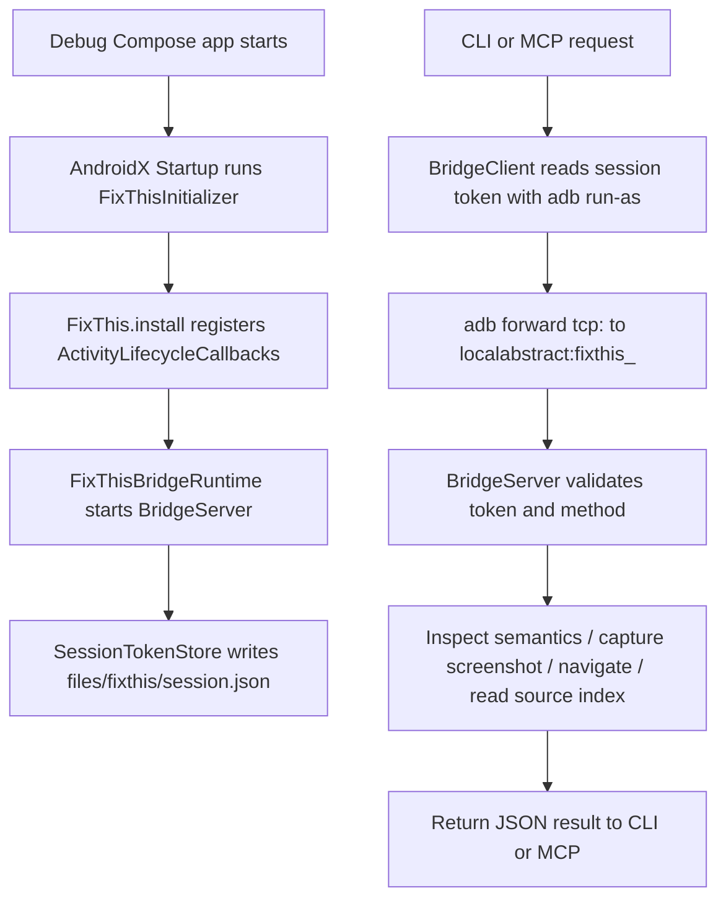
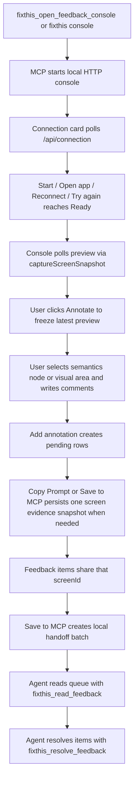

<!-- Current source of truth. Korean original archived at ../archive/project-overview-ko-2026-05.md -->

# FixThis Project Overview

This document is an onboarding reference based on the current repository code. For product requirements and long-term design rationale, see [Product requirements (archived, Korean)](../archive/prd-v1-2026-05-03.md) and [Technical design (archived, Korean)](../archive/technical-design-v1-2026-05-03.md).

## One-Line Summary

FixThis attaches a sidekick runtime to a Jetpack Compose debug app, captures the current UI's semantics, screenshot, selection position, source candidates, and user feedback locally, then hands them off to an AI coding agent as a readable work queue through the CLI/MCP/feedback console.

## Current Scope

- Android Jetpack Compose debug builds only.
- Sidekick auto-installs into the debug app via AndroidX Startup.
- Reads only the current app process's Compose semantics — no AccessibilityService.
- Local desktop integration via ADB and an app-local socket bridge.
- MCP feedback console is the primary workflow; the app itself shows only MCP browser connection status.
- Source candidates are best-effort hints based on a Gradle source index.
- Screenshot pixels are not automatically PII-redacted; review before sharing.

## Module Map

```text
:app                         sample/ validation app
:fixthis-compose-core     pure Kotlin domain contracts, use cases, models, selection, formatter, source matching
:fixthis-compose-sidekick debug runtime and MCP status indicator installed into target app
:fixthis-gradle-plugin    debug dependency injection and source-index asset generation
:fixthis-cli              desktop CLI and ADB bridge client
:fixthis-mcp              stdio MCP server, feedback session store, local console server
```

### `:fixthis-compose-core`

Pure Kotlin module. Houses common contracts not directly tied to the Android runtime.

- `domain/annotation`, `domain/snapshot`, `domain/session`: `Annotation`, `Snapshot`, `Session`, typed IDs, repository contracts, delivery/status/target concepts.
- `usecase/annotation/CreateAnnotationUseCase.kt`, `usecase/snapshot/SaveSnapshotUseCase.kt`: pure application use cases over the domain repository contracts.
- `model/Models.kt`, `model/TargetEvidenceModels.kt`: `FixThisAnnotation`, `FixThisNode`, `SelectionInfo`, `SourceCandidate`, `TargetEvidence`, `ScreenshotInfo` and other central models of the export schema.
- `identity/*`: strict `comp:<ComposableName>:<variant>` testTag convention, stable target identity hints, occurrence ordinal/count calculation.
- `selection/NodeSelector.kt`: scores the semantics node under a tap coordinate. Accounts for click action, meaningful text/contentDescription/role/testTag, merged tree membership, center proximity, and root-like penalty.
- `selection/NearbyNodeCollector.kt`: collects meaningful nodes around the selected node as context, with deduplication.
- `source/SourceIndex.kt`, `source/SourceMatcher.kt`: matches the source index produced by the Gradle plugin against semantics evidence.
- `format/FixThisMarkdownFormatter.kt`, `format/FixThisJsonFormatter.kt`, `format/DetailMode.kt`: converts annotations to agent-facing Markdown or JSON. `detailMode` only changes Markdown output density; JSON evidence remains complete.
- `redaction/RedactionPolicy.kt`: default policy for redacting editable/password semantics text.

Boundary invariant: `:fixthis-compose-core` does not know about MCP, CLI, Android UI surfaces, or `.fixthis` file layout. Outer modules translate their DTOs, persistence, bridge, and presentation state into core domain contracts explicitly.

### `:fixthis-compose-sidekick`

Runtime that executes inside the target Android debug app.

- `FixThis.install(application)`: starts the bridge runtime only in debuggable apps and registers Activity lifecycle callbacks.
- `init/FixThisInitializer.kt`: AndroidX Startup entrypoint. Auto-installs at debug app start by adding only the sidekick dependency.
- `lifecycle/FixThisActivityLifecycleCallbacks.kt`: notifies the bridge runtime of resumed/destroyed Activities and attaches the status pill.
- `overlay/FixThisConnectionStatusHostLayout.kt`: shows `MCP connected` if a recent authenticated MCP browser heartbeat is present, otherwise `MCP waiting`.
- `inspect/ComposeRootFinder.kt`: finds the Compose `RootForTest` under the current decor view.
- `inspect/SemanticsInspector.kt`: reads the merged/unmerged semantics tree and converts it to `FixThisNode`.
- `screenshot/*`: saves screenshot PNGs under the app cache.
- `bridge/BridgeServer.kt`: Android local socket bridge. Executes `status`, `inspectCurrentScreen`, `captureScreenSnapshot`, `readSourceIndex`, `verifyUiChange`, `readScreenshot`, `performNavigation` after token validation.
- `BridgeStatus` availability fields: also reports nullable `screenInteractive`, `keyguardLocked`, `appForeground`, `pictureInPicture`, and `installEpochMillis` (APK last-install timestamp used by `fixthis_status` to detect source staleness). The desktop console uses the availability signals to drive the `Connected` chip's blocked sub-state (screen off, locked, backgrounded, PiP, unresponsive, no Compose UI) and the canvas overlay/input gating.
- `lifecycle/FixThisActivityLifecycleCallbacks.kt` tracks a resumed-activity counter and last-resumed weak reference to stabilize backgrounded/foregrounded detection.

### `:fixthis-gradle-plugin`

Gradle plugin applied to the Android application project.

- plugin id: `io.beyondwin.fixthis.compose`
- Active on debug variants only.
- Attaches a project dependency if `:fixthis-compose-sidekick` is in the same multi-project build; otherwise attaches the `io.beyondwin.fixthis:fixthis-compose-sidekick:<runtimeVersion>` coordinate for external projects.
- The `generate<Variant>FixThisSourceIndex` task scans Kotlin/XML sources and produces the generated asset.

Generated asset:

```text
build/generated/fixthis/<variant>/assets/fixthis/fixthis-source-index.json
build/generated/fixthis/<variant>/assets/fixthis/fixthis-build-info.json
```

Extension defaults:

```kotlin
fixthis {
    enabled.set(true)
    runtimeVersion.set("0.1.0")
    addDebugRuntime.set(true)
    generateSourceIndex.set(true)
    generateProjectMetadata.set(true)
    includeScreenshots.set(true)
    redactEditableText.set(true)
}
```

### `:fixthis-cli`

CLI that runs as a desktop process. Builds the `fixthis` application distribution.

- `fixthis run`: runs the default `:app:installDebug`, launches the app, and waits for sidekick status.
- `fixthis status`: prints bridge connection, current activity, root count, and protocol/source-index state.
- `fixthis doctor`: diagnoses project, package metadata, ADB, device, and sidekick session step by step.
- `fixthis setup`: prints the command/args JSON for MCP client configuration.
- `fixthis mcp`: runs the stdio server via the sibling or PATH `fixthis-mcp` executable.
- `fixthis console`: runs `fixthis-mcp --console` to open the local feedback console.

Package name resolution order:

1. `--package` from the CLI/MCP argument.
2. `applicationId` from `.fixthis/project.json` relative to `--project-dir`.

### `:fixthis-mcp`

MCP stdio server and local feedback console server.

- `McpProtocol`: handles JSON-RPC initialize/tools/resources/ping/cancellation.
- `tools/FixThisTools.kt`: MCP tool/resource registry and CLI bridge adapter.
- `session/FeedbackSessionService.kt`: thin session workflow façade. It
  coordinates session open/resume, connection diagnosis, app launch recovery,
  preview capture, persisted evidence capture, navigation, annotation save,
  target evidence derivation, handoff, and resolve through focused
  collaborators.
- `session/AnnotationRepository.kt`: annotation and draft CRUD boundary,
  including frozen-preview save, live fingerprint comparison, handoff, claim,
  and resolve operations.
- `session/SessionDtoModels.kt`, `console/AnnotationRequestModels.kt`: MCP/local-console DTOs and persisted JSON field names. Existing field names such as `items`, `screens`, `itemId`, and `screenId` are compatibility contracts.
- `session/SessionDomainMappers.kt`: explicit mapper between DTOs and `compose-core` domain models. Legacy `"ready"` item status is normalized to `AnnotationStatus.OPEN` in the domain.
- `console/ConsoleConnectionModels.kt`: browser console recovery card contract. Serializes `WELCOME`, `READY`, `OPEN_APP`, `STARTING`, `RECONNECT`, `CHOOSE_DEVICE`, `CHECK_PHONE`, `UNSUPPORTED_BUILD` states and primary actions.
- `session/PreviewSnapshotCache.kt`, `SourceIndexRegistry.kt`, `ScreenshotArtifactPromoter.kt`: separates transient preview cache, source-index caching, and frozen preview screenshot promotion from the service.
- `session/FeedbackSessionStore.kt`, `FeedbackSessionPersistence.kt`,
  `session/eventlog/*`: `.fixthis/feedback-sessions/<session-id>/session.json`
  snapshot persistence plus append-only event logs under `events/`. Event-log
  replay is checkpoint-aware; compaction archives old events only after writing
  `events/checkpoint.json`.
- `console/FeedbackConsoleServer.kt`: `127.0.0.1` HTTP console and `/api/*` endpoints.
- `console/FeedbackConsoleAssets.kt`: loader that validates and assembles `src/main/resources/console/index.html`, `styles.css`, `app.js` classpath resources.

MCP tools:

- `fixthis_status`
- `fixthis_get_current_screen`
- `fixthis_verify_ui_change`
- `fixthis_open_feedback_console`
- `fixthis_list_feedback_sessions`
- `fixthis_capture_screen`
- `fixthis_navigate_app`
- `fixthis_list_feedback`
- `fixthis_read_feedback`
- `fixthis_claim_feedback`
- `fixthis_resolve_feedback`

Stable Target Evidence v1:

- Saved feedback items may include nullable `targetEvidence`.
- Evidence is derived from captured merged semantics nodes, strict `comp:<ComposableName>:<variant>` tags when present, occurrence over the captured merged node set, existing source candidates, and available screenshot artifacts.
- `BridgeProtocol.VERSION` is `1.3`; the bridge advertises additive
  capabilities (`targetEvidence`, `detailModes`, `composableIdentity=false`)
  and screen-integrity metadata used to compute nullable fingerprints.
- The default implementation does not depend on Compose tooling internals such as `ui-tooling-data`, `LocalInspectionTables`, `parseSourceInformation`, or `CompositionData.mapTree`.

Resources:

- `fixthis://session/current`
- `fixthis://screen/current`
- `fixthis://screenshot/latest/full.png`
- `fixthis://screenshot/latest/crop.png`
- `fixthis://source-index`

### `:app` (`sample/`)

Repository validation sample app. The Gradle project path is `:app` and the actual source directory is `sample/`, following Android Studio conventions. Application id is `io.beyondwin.fixthis.sample`, launcher label is `FixThis`. The `Home`, `Queue`, `Project`, `Review`, and `Diagnostics` tabs form a compact product scene that validates semantics, screenshot, navigation, source matching, form controls, dropdown/menu, dialog, Canvas, disabled controls, repeated cards, long text, and weak-semantics edge cases.

## Runtime Flow



## Feedback Console Flow



Important distinction:

- Preview frames are temporary and stored under `.fixthis/preview-cache/`.
- Saved evidence lives under `.fixthis/feedback-sessions/<session-id>/`.
- `Save to MCP` is local persistence for MCP handoff. It does not call an external AI API.
- Connection recovery is console-local UI state. `GET /api/connection` diagnoses ADB device and sidekick bridge state, while `POST /api/app/launch` launches the selected or only ready app when that is a valid recovery action. These calls do not persist feedback data.
- When a device or bridge drops, pending browser draft work is mirrored to
  `localStorage["fixthis.pending.<sessionId>"]` with frozen preview context.
  On reload or session reattach, the user explicitly chooses Recover,
  Recapture, or Discard before the pending rows are exposed again. The last
  preview remains visible and is marked stale until the card returns to `Ready`.
- When the device is `Connected` but not interactable (screen off, lock screen, app backgrounded, PiP, unresponsive, no Compose UI), the console renders a cause-specific overlay on the canvas and gates selection input. When the cause clears, the prior tool mode, frozen preview, and pending pins are auto-resumed.
- Before `Copy Prompt` or `Save to MCP` persists pending annotations, the
  server compares the frozen preview fingerprint with a lightweight current
  capture when both values exist. A mismatch is returned as a recoverable
  console conflict so the user can re-capture, force-save, or cancel.

## Local Files And Artifacts

Android app-private files:

```text
files/fixthis/session.json
cache/fixthis/<yyyy-MM-dd>/<annotation-id>-full.png
cache/fixthis/<yyyy-MM-dd>/<annotation-id>-crop.png
```

Project-local desktop files:

```text
.fixthis/project.json
.fixthis/artifacts/<annotation-id>/
.fixthis/feedback-sessions/<session-id>/
.fixthis/feedback-sessions/<session-id>/events/
.fixthis/feedback-sessions/<session-id>/events/checkpoint.json
.fixthis/preview-cache/<session-id>/<preview-id>/
```

The current `.gitignore` ignores the entire `.fixthis` directory. To share `.fixthis/project.json` for team-wide package auto-resolution, adjust the ignore rules accordingly.

## Development Commands

Build and install sample:

```bash
./gradlew :app:assembleDebug
./gradlew :app:installDebug
```

Build CLI and MCP distributions:

```bash
./gradlew :fixthis-cli:installDist :fixthis-mcp:installDist
```

Run sample smoke flow:

```bash
fixthis-cli/build/install/fixthis/bin/fixthis run --package io.beyondwin.fixthis.sample
```

Open console:

```bash
fixthis-cli/build/install/fixthis/bin/fixthis console --package io.beyondwin.fixthis.sample
```

Run local unit tests:

```bash
./gradlew test
./gradlew :fixthis-gradle-plugin:test
./gradlew :fixthis-compose-sidekick:testDebugUnitTest
```

Android instrumentation tests require an unlocked interactive emulator or device. A physical device can still report `device` in ADB while a secure lockscreen prevents Compose hierarchy inspection; see [Troubleshooting](../guides/troubleshooting.md#connected-test-says-no-compose-hierarchies-found).

```bash
./gradlew connectedAndroidTest
```

## Recommended Reading Order

Recommended order for a developer seeing this project for the first time:

1. [README](../../README.md): product summary and quick start.
2. This document: current code structure and runtime flow.
3. [MCP tools](../reference/mcp-tools.md): feedback console and MCP tool contracts.
4. [Output schema](../reference/output-schema.md): annotation/session JSON fields.
5. [Privacy](../reference/privacy.md): local-first, redaction, screenshot caution.
6. [Troubleshooting](../guides/troubleshooting.md): ADB/sidekick/MCP failure diagnosis.
7. [Technical design (archived, Korean)](../archive/technical-design-v1-2026-05-03.md): longer design rationale and module-by-module design.
8. [Architecture Decision Records](adr/README.md): durable architecture decisions that the current code upholds.

`docs/superpowers/plans/` and `docs/superpowers/specs/` contain implementation history and work-order records. For current architecture, the above documents and ADRs take precedence.

## Common Confusions

- `:app` is the Gradle project path; the source directory is `sample/`.
- The Android app does not open an MCP server or HTTP server. The MCP and console servers run as desktop processes.
- The app bridge is an Android local socket with a token, accessible from the desktop only via ADB forward.
- Selection and submission do not happen inside the app. Selection and submission happen exclusively in the MCP browser console.
- Source candidates are text/symbol-based ranking from a source index — not exact compiler mappings.
- Semantics redaction is not screenshot pixel redaction.
- The feedback console's `Annotate` mode freezes the preview but does not save. `Add annotation` creates a browser-side pending item. Only `Copy Prompt` or `Save to MCP` creates a persisted evidence snapshot.
- Persisted MCP JSON field names are a compatibility contract. They may differ from domain model names; check the mapper boundary.
- A `Connected` chip does not always mean the device is interactable. Screen off / locked / backgrounded / PiP / unresponsive / no-Compose-UI all stay `Connected` but report a blocked sub-state.
- Compact handoff output uses the v2 format. Instead of a single `src?` line, it emits a `candidates:` block (rank-1 by default, capped at 3) and `viewport:`, `activity:`, `instance i/N`, and collision/duplicate-marker note lines. PRECISE/FULL detail modes and the JSON wire format are unchanged.

---

See also: [Korean original (archived)](../archive/project-overview-ko-2026-05.md)
