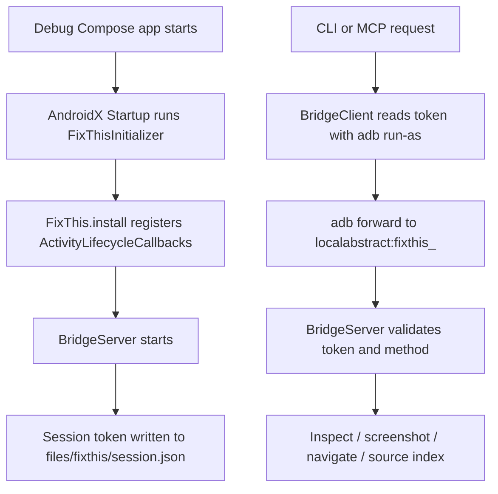
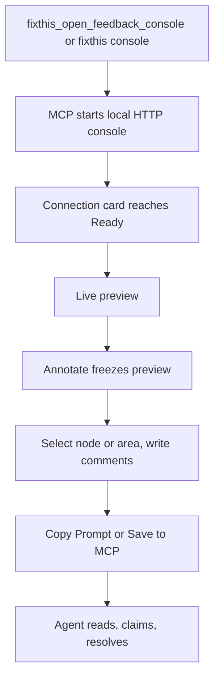

# Architecture Overview

Current-code onboarding. Product context:
[product](../product/README.md), [decisions](../product/decision-rationale.md),
[handoff rationale](../design/handoff-prompt-rationale.md).

## One line

A debug-only Compose sidekick captures semantics, screenshot, selection,
source candidates, and comments locally, then hands them to an agent through
the CLI / MCP / browser console.

## Scope

- Jetpack Compose debug builds only.
- Sidekick auto-installs through AndroidX Startup.
- In-process Compose semantics. No AccessibilityService.
- Local ADB + app-local socket bridge.
- The app shows MCP connection status. Everything else is desktop.
- Source candidates are best-effort from a Gradle source index.
- Screenshots are not auto-redacted. Review before sharing.

## Module Map

```text
:app                         sample/ validation app
:fixthis-compose-core        pure Kotlin domain
:fixthis-compose-sidekick    debug runtime inside the target app
fixthis-gradle-plugin/       debug DI and source-index generation
:fixthis-cli                 desktop CLI and ADB bridge client
:fixthis-mcp                 MCP server, session store, local console
```

### `:fixthis-compose-core`

Pure Kotlin. No MCP, CLI, Android UI, or `.fixthis/` layout.

- Domain models and use cases for annotations, snapshots, sessions.
- Selection scoring (`NodeSelector`) and nearby context.
- Source matching and target reliability.
- Markdown / JSON formatters. `detailMode` only changes Markdown density.
- Redaction policy for editable / password semantics text.

### `:fixthis-compose-sidekick`

Runs inside the target debug app.

- `FixThis.install(application)` starts only in debuggable apps.
- AndroidX Startup entry: `FixThisInitializer`.
- Semantics inspection, screenshot cache, `BridgeServer` on a localabstract
  socket (`status`, `inspectCurrentScreen`, `captureScreenSnapshot`,
  `readSourceIndex`, `verifyUiChange`, `readScreenshot`, `performNavigation`).
- Status pill: `MCP connected` after an authorized browser heartbeat,
  otherwise `MCP waiting`.
- Availability fields drive the console blocked overlay: screen off, locked,
  backgrounded, PiP.

See ADR `2026-05-14-bridge-server-concurrency` for the lifecycle mutex.

### `fixthis-gradle-plugin`

Plugin id: `io.github.beyondwin.fixthis.compose`. Debug variants only.

Generates:

```text
build/generated/fixthis/<variant>/assets/fixthis/fixthis-source-index.json
build/generated/fixthis/<variant>/assets/fixthis/fixthis-build-info.json
```

```kotlin
fixthis {
    enabled.set(true)
    runtimeVersion.set("1.5.0")
    addDebugRuntime.set(true)
    generateSourceIndex.set(true)
    generateProjectMetadata.set(true)
    includeScreenshots.set(true)
    redactEditableText.set(true)
}
```

### `:fixthis-cli`

`status`, `run`, `doctor`, `init`, `install-agent`, `setup`, `mcp`,
`console`, `clean`, `version`.

Package resolution: `--package`, then `.fixthis/project.json`, then a unique
Gradle `applicationId`. Fail if none or more than one.

### `:fixthis-mcp`

MCP stdio server plus `127.0.0.1` HTTP console.

- Session façade: `FeedbackSessionService`.
- Persisted JSON field names (`items`, `screens`, `itemId`, `screenId`,
  `targetEvidence`, `targetReliability`) are compatibility contracts.
- Event log + snapshot under `.fixthis/feedback-sessions/<id>/`.
  `index.json` is a derived cache.
- `/api/events` SSE is primary. Polling is fallback.

MCP tools: `fixthis_status`, `fixthis_get_current_screen`,
`fixthis_verify_ui_change`, `fixthis_open_feedback_console`,
`fixthis_list_feedback_sessions`, `fixthis_capture_screen`,
`fixthis_navigate_app`, `fixthis_list_feedback`, `fixthis_read_feedback`,
`fixthis_claim_feedback`, `fixthis_resolve_feedback`.

Resources: `fixthis://session/current`, `fixthis://screen/current`,
`fixthis://screenshot/latest/full.png`, `fixthis://screenshot/latest/crop.png`,
`fixthis://source-index`.

`BridgeProtocol.VERSION` is `1.3`.

### `:app` (`sample/`)

Gradle path `:app`, sources under `sample/`. Package
`io.github.beyondwin.fixthis.sample`. Tabs: Home, Queue, Project, Review,
Diagnostics.

## Runtime Flow


```mermaid
flowchart TD
    A["Debug Compose app starts"] --> B["AndroidX Startup runs FixThisInitializer"]
    B --> C["FixThis.install registers ActivityLifecycleCallbacks"]
    C --> D["BridgeServer starts"]
    D --> E["Session token written to files/fixthis/session.json"]
    F["CLI or MCP request"] --> G["BridgeClient reads token with adb run-as"]
    G --> H["adb forward to localabstract:fixthis_<package>"]
    H --> I["BridgeServer validates token and method"]
    I --> J["Inspect / screenshot / navigate / source index"]
```

## Console Flow


```mermaid
flowchart TD
    A["fixthis_open_feedback_console or fixthis console"] --> B["MCP starts local HTTP console"]
    B --> C["Connection card reaches Ready"]
    C --> D["Live preview"]
    D --> E["Annotate freezes preview"]
    E --> F["Select node or area, write comments"]
    F --> G["Copy Prompt or Save to MCP"]
    G --> H["Agent reads, claims, resolves"]
```

Preview frames live under `.fixthis/preview-cache/`. Saved evidence lives
under `.fixthis/feedback-sessions/<session-id>/`. Save to MCP is local
persistence, not an external AI call.

## Local Files

App-private:

```text
files/fixthis/session.json
cache/fixthis/<yyyy-MM-dd>/<annotation-id>-full.png
cache/fixthis/<yyyy-MM-dd>/<annotation-id>-crop.png
```

Project-local:

```text
.fixthis/project.json
.fixthis/feedback-sessions/<session-id>/
.fixthis/preview-cache/<session-id>/<preview-id>/
.fixthis/runtime-evidence/<session-id>/<capture-id>/
```

`.gitignore` ignores the whole `.fixthis` directory.

## Dev Commands

```bash
./gradlew :app:assembleDebug
./gradlew :fixthis-cli:installDist :fixthis-mcp:installDist
fixthis-cli/build/install/fixthis/bin/fixthis run --package io.github.beyondwin.fixthis.sample
```

Android instrumentation needs an unlocked interactive emulator or device. A
physical device can report `device` in ADB while a lockscreen still blocks
Compose discovery. See
[Troubleshooting](../guides/troubleshooting.md#connected-test-says-no-compose-hierarchies-found).

## Read Next

1. [README](../../README.md)
2. [Project map](../guides/project-map.md)
3. [MCP tools](../reference/mcp-tools.md)
4. [ADRs](adr/README.md)
