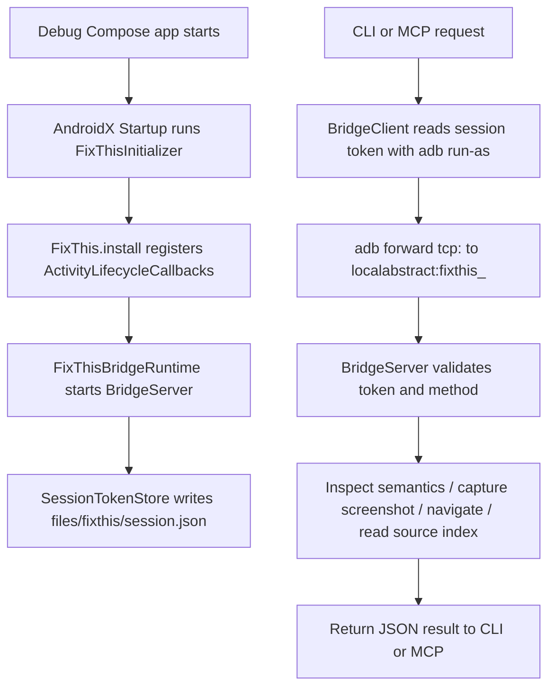
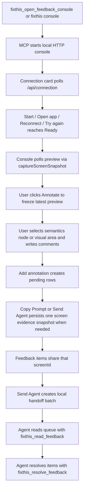

# FixThis Project Overview

> English version: [project-overview.en.md](project-overview.en.md)

이 문서는 현재 저장소의 실제 코드 기준으로 FixThis의 역할, 모듈 경계, 실행 흐름, 개발 명령을 빠르게 파악하기 위한 온보딩 문서다. 제품 요구사항과 장기 설계 배경은 [Product requirements](fixthis_prd.md)와 [Technical design](fixthis_technical_design.md)를 함께 본다.

## 한 줄 요약

FixThis는 Jetpack Compose debug 앱에 sidekick 런타임을 붙여 현재 UI의 semantics, 스크린샷, 선택 위치, source 후보, 사용자 피드백을 로컬에서 수집하고, CLI/MCP/feedback console을 통해 AI 코딩 에이전트가 바로 읽을 수 있는 작업 큐로 넘기는 도구다.

## 현재 범위

- Android Jetpack Compose debug build 전용.
- AndroidX Startup으로 debug 앱에 sidekick 자동 설치.
- AccessibilityService 없이 현재 앱 프로세스의 Compose semantics만 읽음.
- ADB와 app-local socket bridge를 사용한 로컬 desktop 연동.
- MCP feedback console이 주 워크플로이고, 앱 내부에는 MCP browser 연결 상태만 표시한다.
- source candidate는 Gradle source index 기반 best-effort 힌트.
- screenshot pixel은 자동 PII redaction 대상이 아니므로 공유 전 검토 필요.

## 모듈 지도

```text
:app                         sample/ validation app
:fixthis-compose-core     pure Kotlin domain contracts, use cases, models, selection, formatter, source matching
:fixthis-compose-sidekick debug runtime and MCP status indicator installed into target app
:fixthis-gradle-plugin    debug dependency injection and source-index asset generation
:fixthis-cli              desktop CLI and ADB bridge client
:fixthis-mcp              stdio MCP server, feedback session store, local console server
```

### `:fixthis-compose-core`

Pure Kotlin 모듈이다. Android 런타임에 직접 묶이지 않는 공통 계약을 둔다.

- `domain/annotation`, `domain/snapshot`, `domain/session`: `Annotation`, `Snapshot`, `Session`, typed IDs, repository contracts, delivery/status/target concepts.
- `usecase/annotation/CreateAnnotationUseCase.kt`, `usecase/snapshot/SaveSnapshotUseCase.kt`: pure application use cases over the domain repository contracts.
- `model/Models.kt`, `model/TargetEvidenceModels.kt`: `FixThisAnnotation`, `FixThisNode`, `SelectionInfo`, `SourceCandidate`, `TargetEvidence`, `ScreenshotInfo` 등 export schema의 중심 모델.
- `identity/*`: strict `comp:<ComposableName>:<variant>` testTag convention, stable target identity hints, occurrence ordinal/count 계산.
- `selection/NodeSelector.kt`: tap 좌표에 들어온 semantics node를 점수화한다. click action, 의미 있는 text/contentDescription/role/testTag, merged tree 여부, center proximity, root-like penalty를 반영한다.
- `selection/NearbyNodeCollector.kt`: 선택 node 주변의 의미 있는 node를 중복 제거해 context로 모은다.
- `source/SourceIndex.kt`, `source/SourceMatcher.kt`: Gradle plugin이 만든 source index와 semantics 증거를 매칭한다.
- `format/FixThisMarkdownFormatter.kt`, `format/FixThisJsonFormatter.kt`, `format/DetailMode.kt`: annotation을 agent-facing Markdown 또는 JSON으로 변환한다. `detailMode`는 Markdown 출력 밀도만 바꾸며 JSON evidence는 완전하게 유지한다.
- `redaction/RedactionPolicy.kt`: editable/password semantics text redaction 기본 정책.

Boundary invariant: `:fixthis-compose-core` does not know about MCP, CLI, Android UI surfaces, or `.fixthis` file layout. Outer modules translate their DTOs, persistence, bridge, and presentation state into core domain contracts explicitly.

### `:fixthis-compose-sidekick`

타깃 Android debug 앱 안에서 실행되는 런타임이다.

- `FixThis.install(application)`: debuggable 앱에서만 bridge runtime을 시작하고 Activity lifecycle callbacks를 등록한다.
- `init/FixThisInitializer.kt`: AndroidX Startup entrypoint. sidekick dependency만 추가해도 debug 앱 시작 시 자동 설치된다.
- `lifecycle/FixThisActivityLifecycleCallbacks.kt`: resumed/destroyed Activity를 bridge runtime에 알려주고 status pill을 붙인다.
- `overlay/FixThisConnectionStatusHostLayout.kt`: 최근 인증된 MCP browser heartbeat가 있으면 `MCP connected`, 없으면 `MCP waiting`만 표시한다.
- `inspect/ComposeRootFinder.kt`: current decor view 아래 Compose `RootForTest`를 찾는다.
- `inspect/SemanticsInspector.kt`: merged/unmerged semantics tree를 읽고 `FixThisNode`로 변환한다.
- `screenshot/*`: app cache 아래 screenshot PNG를 저장한다.
- `bridge/BridgeServer.kt`: Android local socket bridge. `status`, `inspectCurrentScreen`, `captureScreenSnapshot`, `readSourceIndex`, `verifyUiChange`, `readScreenshot`, `performNavigation`을 token 검증 후 실행한다.
- `BridgeStatus` availability fields: nullable `screenInteractive`, `keyguardLocked`, `appForeground`, `pictureInPicture`, `installEpochMillis`(APK 마지막 설치 시각; `fixthis_status`의 source staleness 감지에 사용)를 함께 보고한다. 데스크톱 콘솔은 이 신호로 `Connected` chip의 blocked sub-state(screen off, locked, backgrounded, PiP, unresponsive, no Compose UI)와 캔버스 overlay/입력 게이팅을 결정한다.
- `lifecycle/FixThisActivityLifecycleCallbacks.kt`는 resumed activity counter와 last-resumed weak reference를 추적해 backgrounded/foregrounded 판정을 안정화한다.

### `:fixthis-gradle-plugin`

Android application project에 적용되는 Gradle plugin이다.

- plugin id: `io.beyondwin.fixthis.compose`
- debug variant에서만 동작한다.
- 같은 multi-project build 안에 `:fixthis-compose-sidekick`이 있으면 project dependency를 붙이고, 외부 프로젝트에서는 `io.beyondwin.fixthis:fixthis-compose-sidekick:<runtimeVersion>` 좌표를 붙인다.
- `generate<Variant>FixThisSourceIndex` task가 Kotlin/XML source를 스캔해 generated asset을 만든다.

Generated asset:

```text
build/generated/fixthis/<variant>/assets/fixthis/fixthis-source-index.json
build/generated/fixthis/<variant>/assets/fixthis/fixthis-build-info.json
```

주요 extension 기본값:

```kotlin
fixthis {
    enabled.set(true)
    runtimeVersion.set("0.1.0")
    addDebugRuntime.set(true)
    generateSourceIndex.set(true)
    generateProjectMetadata.set(true)
    includeScreenshots.set(true)
    redactEditableText.set(true)
}
```

### `:fixthis-cli`

Desktop process로 실행되는 CLI다. `fixthis` application distribution을 만든다.

- `fixthis run`: 기본 `:app:installDebug`를 실행하고 앱을 launch한 뒤 sidekick status를 기다린다.
- `fixthis status`: bridge 연결, current activity, root count, protocol/source-index 상태를 출력한다.
- `fixthis doctor`: project, package metadata, ADB, device, sidekick session을 단계별로 진단한다.
- `fixthis setup`: MCP client용 command/args JSON을 출력한다.
- `fixthis mcp`: sibling 또는 PATH의 `fixthis-mcp` executable로 stdio server를 실행한다.
- `fixthis console`: `fixthis-mcp --console`을 실행해 local feedback console을 연다.

package name 해석 순서:

1. CLI/MCP argument의 `--package`.
2. `--project-dir` 기준 `.fixthis/project.json`의 `applicationId`.

### `:fixthis-mcp`

MCP stdio server와 local feedback console 서버다.

- `McpProtocol`: JSON-RPC initialize/tools/resources/ping/cancellation 처리.
- `tools/FixThisTools.kt`: MCP tool/resource registry와 CLI bridge adapter.
- `session/FeedbackSessionService.kt`: session workflow orchestration. Session open/resume, connection diagnosis, app launch recovery, preview capture, persisted evidence capture, navigation, annotation 저장, target evidence 산출, handoff, resolve를 조율한다.
- `session/SessionDtoModels.kt`, `console/AnnotationRequestModels.kt`: MCP/local-console DTO와 persisted JSON field names. Existing field names such as `items`, `screens`, `itemId`, and `screenId` are compatibility contracts.
- `session/SessionDomainMappers.kt`: DTO와 `compose-core` domain model 사이의 명시적 mapper. Legacy `"ready"` item status는 domain에서 `AnnotationStatus.OPEN`으로 normalize된다.
- `console/ConsoleConnectionModels.kt`: browser console의 recovery card contract. `WELCOME`, `READY`, `OPEN_APP`, `STARTING`, `RECONNECT`, `CHOOSE_DEVICE`, `CHECK_PHONE`, `UNSUPPORTED_BUILD` 상태와 primary action을 직렬화한다.
- `session/PreviewSnapshotCache.kt`, `SourceIndexRegistry.kt`, `ScreenshotArtifactPromoter.kt`: transient preview cache, source-index caching, frozen preview screenshot promotion을 service에서 분리한다.
- `session/FeedbackSessionStore.kt`, `FeedbackSessionPersistence.kt`: `.fixthis/feedback-sessions/<session-id>/session.json` persistence.
- `console/FeedbackConsoleServer.kt`: `127.0.0.1` HTTP console과 `/api/*` endpoints.
- `console/FeedbackConsoleAssets.kt`: `src/main/resources/console/index.html`, `styles.css`, `app.js` classpath resources를 검증하고 조립하는 loader.

MCP tools:

- `fixthis_status`
- `fixthis_get_current_screen`
- `fixthis_verify_ui_change`
- `fixthis_open_feedback_console`
- `fixthis_list_feedback_sessions`
- `fixthis_capture_screen`
- `fixthis_navigate_app`
- `fixthis_list_feedback`
- `fixthis_read_feedback`
- `fixthis_resolve_feedback`

Stable Target Evidence v1:

- Saved feedback items may include nullable `targetEvidence`.
- Evidence is derived from captured merged semantics nodes, strict `comp:<ComposableName>:<variant>` tags when present, occurrence over the captured merged node set, existing source candidates, and available screenshot artifacts.
- `BridgeProtocol.VERSION` remains `1.0`; the bridge advertises additive capabilities (`targetEvidence`, `detailModes`, `composableIdentity=false`).
- The default implementation does not depend on Compose tooling internals such as `ui-tooling-data`, `LocalInspectionTables`, `parseSourceInformation`, or `CompositionData.mapTree`.

Resources:

- `fixthis://session/current`
- `fixthis://screen/current`
- `fixthis://screenshot/latest/full.png`
- `fixthis://screenshot/latest/crop.png`
- `fixthis://source-index`

### `:app` (`sample/`)

저장소 검증용 FixThis Studio Compose sample app이다. Android Studio 관례에 맞춰 Gradle project path는 `:app`이고 실제 source directory는 `sample/`이다. Application id는 `io.beyondwin.fixthis.sample`, launcher label은 `FixThis`다. `Home`, `Queue`, `Project`, `Review`, `Diagnostics` 탭이 하나의 compact product scene을 이루며 semantics, screenshot, navigation, source matching, form controls, dropdown/menu, dialog, Canvas, disabled controls, repeated cards, long text, weak-semantics edge case를 검증한다.

## Runtime Flow



## Feedback Console Flow



Important distinction:

- Preview frames are temporary and stored under `.fixthis/preview-cache/`.
- Saved evidence lives under `.fixthis/feedback-sessions/<session-id>/`.
- `Send Agent` is local persistence for MCP handoff. It does not call an external AI API.
- Connection recovery is console-local UI state. `GET /api/connection` diagnoses ADB device and sidekick bridge state, while `POST /api/app/launch` launches the selected or only ready app when that is a valid recovery action. These calls do not persist feedback data.
- When a device or bridge drops, pending browser draft work and the last preview remain visible. The preview is marked stale until the card returns to `Ready`.
- `Connected`이지만 상호작용이 불가능한 경우(screen off, lock screen, app backgrounded, PiP, unresponsive, no Compose UI) 콘솔은 캔버스에 cause-specific overlay를 그리고 selection 입력을 차단한다. cause가 해제되면 직전 tool mode, frozen preview, pending pin들을 그대로 자동 재개한다.

## Local Files And Artifacts

Android app-private files:

```text
files/fixthis/session.json
cache/fixthis/<yyyy-MM-dd>/<annotation-id>-full.png
cache/fixthis/<yyyy-MM-dd>/<annotation-id>-crop.png
```

Project-local desktop files:

```text
.fixthis/project.json
.fixthis/artifacts/<annotation-id>/
.fixthis/feedback-sessions/<session-id>/
.fixthis/preview-cache/<session-id>/<preview-id>/
```

현재 `.gitignore`는 `.fixthis` 전체를 무시한다. package auto-resolution에 `.fixthis/project.json`을 팀 차원에서 공유하려면 ignore 규칙을 조정해야 한다.

## 개발 명령

Build and install sample:

```bash
./gradlew :app:assembleDebug
./gradlew :app:installDebug
```

Build CLI and MCP distributions:

```bash
./gradlew :fixthis-cli:installDist :fixthis-mcp:installDist
```

Run sample smoke flow:

```bash
fixthis-cli/build/install/fixthis/bin/fixthis run --package io.beyondwin.fixthis.sample
```

Open console:

```bash
fixthis-cli/build/install/fixthis/bin/fixthis console --package io.beyondwin.fixthis.sample
```

Run local unit tests:

```bash
./gradlew test
./gradlew :fixthis-gradle-plugin:test
./gradlew :fixthis-compose-sidekick:testDebugUnitTest
```

Android instrumentation tests require an unlocked interactive emulator or device. A physical device can still report `device` in ADB while a secure lockscreen prevents Compose hierarchy inspection; see [Troubleshooting](troubleshooting.md#connected-test-says-no-compose-hierarchies-found).

```bash
./gradlew connectedAndroidTest
```

## 문서 읽는 순서

처음 보는 개발자에게 권장하는 순서:

1. [README](../README.md): 제품 요약과 빠른 실행.
2. 이 문서: 현재 코드 구조와 runtime 흐름.
3. [MCP](mcp.md): feedback console과 MCP tool contract.
4. [Output schema](output-schema.md): annotation/session JSON field.
5. [Privacy](privacy.md): local-first, redaction, screenshot 주의사항.
6. [Troubleshooting](troubleshooting.md): ADB/sidekick/MCP 실패 진단.
7. [Technical design](fixthis_technical_design.md): 더 긴 설계 배경과 module-by-module 설계.
8. [Architecture Decision Records](adr/README.md): 현재 코드에서 지켜야 하는 durable architecture decisions.

`docs/superpowers/plans/`와 `docs/superpowers/specs/`는 implementation history와 작업 지시 기록이다. 현재 architecture source of truth는 위 current-facing 문서와 ADR을 우선한다.

## 자주 헷갈리는 지점

- `:app`은 Gradle project path이고 source directory는 `sample/`이다.
- Android app은 MCP server나 HTTP server를 열지 않는다. MCP/console server는 desktop process다.
- app bridge는 token이 있는 Android local socket이고 ADB forward로만 desktop에서 접근한다.
- 앱 내부에서는 선택/댓글/제출을 하지 않는다. 선택과 제출은 MCP browser console에서만 한다.
- source candidates는 정확한 compiler mapping이 아니라 source index text/symbol 기반 ranking이다.
- semantics redaction은 screenshot pixel redaction이 아니다.
- feedback console의 `Annotate`는 freeze만 하고 저장하지 않는다. `Add annotation`은 browser-side pending item을 만들고, `Copy Prompt` 또는 `Send Agent`가 필요 시 persisted evidence snapshot을 만든다.
- persisted MCP JSON field names는 compatibility contract다. Domain model naming과 다를 수 있으므로 mapper boundary에서 확인한다.
- `Connected` chip이 항상 상호작용 가능을 의미하지는 않는다. screen off / locked / backgrounded / PiP / unresponsive / no-Compose-UI는 동일하게 `Connected`이지만 blocked sub-state로 보고된다.
- compact handoff 출력은 v2 형식이다. 단일 `src?` 라인 대신 `candidates:` block(rank-1 기본, 최대 3개)과 `viewport:`, `activity:`, `instance i/N`, collision/duplicate-marker note 라인을 사용한다. PRECISE/FULL 모드와 JSON wire format은 변경되지 않는다.
