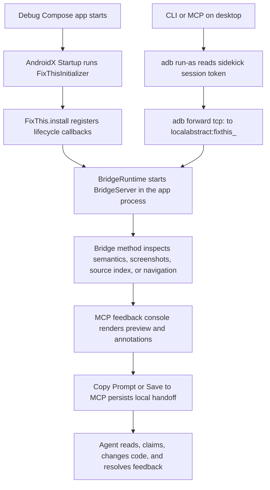

# FixThis 풀스택/툴링 인수인계 가이드

이 문서는 FixThis를 처음 인수인계 받는 주니어 풀스택/툴링
개발자를 위한 긴 형식의 가이드입니다. Android Compose 앱 안에서
수집한 UI 근거가 어떻게 데스크톱 CLI/MCP, 브라우저 콘솔, 로컬
`.fixthis/` handoff로 이어지는지 한 흐름으로 설명합니다.

기존 문서를 대체하지 않습니다. 빠른 제품 이해는
[README](../../README.md), 현재 아키텍처 지도는
[Architecture overview](../architecture/overview.md), 결정 근거는
[Decision rationale](../product/decision-rationale.md), 호환성 계약은
[Reference docs](../index.md#reference-contracts), 검증 명령은
[CONTRIBUTING](../../CONTRIBUTING.md)을 우선합니다.

## 이 문서를 읽는 방법

이 문서의 첫 번째 독자는 Android Compose만 주로 다뤄 본 개발자일
수도 있고, CLI/MCP 서버나 데스크톱 tooling만 주로 다뤄 본 개발자일
수도 있습니다. 그래서 Android 프로세스 안의 runtime, 데스크톱
프로세스의 CLI/MCP, 브라우저 콘솔, 로컬 handoff 파일을 한 흐름으로
이어 설명합니다.

이 문서는 처음 읽는 길잡이입니다. public contract나 호환성 규칙의
source of truth는 reference 문서입니다. 문서끼리 충돌하면 현재 코드,
`docs/reference/*`, `CONTRIBUTING.md`를 우선하고, 이 문서는 그 결정을
이해하기 위한 해설로 봅니다.

검색 가능성을 위해 public tool name, class name, file path는 번역하지
않습니다. 예를 들어 `fixthis_open_feedback_console`,
`FixThisInitializer`, `FeedbackSessionService`,
`fixthis-mcp/src/main/console/` 같은 이름은 그대로 사용합니다.

## FixThis를 한 문장으로 이해하기

FixThis는 Jetpack Compose debug 앱 안에 작은 sidekick runtime을 붙이고,
현재 화면의 semantics, screenshot, source candidate, 사용자의 annotation을
로컬 desktop MCP/브라우저 콘솔로 넘겨 AI coding agent가 수정할 위치와
근거를 빠르게 이해하게 만드는 도구입니다.

핵심 경계는 네 가지입니다.

- Debug-only: release build에는 들어가면 안 됩니다.
- Compose-only: V1은 Compose semantics를 중심으로 동작합니다.
- Local-first: screenshot, semantics, handoff는 로컬 파일과 localhost/ADB
  안에서 처리됩니다.
- MCP/browser-console-first: 앱 안에서 annotation하지 않고 데스크톱
  브라우저 콘솔에서 선택, 작성, 저장합니다.

## 전체 시스템 흐름

Android app process가 소유하는 것은 debug app 안에 주입된 sidekick
runtime입니다. AndroidX Startup이 `FixThisInitializer`를 실행하고,
`FixThis.install`이 lifecycle callback과 status pill을 붙인 뒤,
`BridgeServer`가 app process 안에서 localabstract socket을 엽니다. 이
프로세스는 Compose semantics inspection, screenshot capture, source-index
asset 읽기, debug-only navigation 같은 앱 내부 근거 수집만 담당합니다.

Desktop CLI/MCP process는 Android app process 밖에서 실행됩니다.
`fixthis-cli`와 `fixthis-mcp`는 ADB로 debug app의
`files/fixthis/session.json` token을 읽고, `adb forward tcp:<port>
localabstract:fixthis_<package>`로 app-side bridge에 연결합니다. 중요한
경계는 앱이 MCP server나 HTTP server를 host하지 않는다는 점입니다. MCP,
HTTP feedback console, queue tool, session store는 모두 desktop process
쪽 책임입니다.

Browser console은 `fixthis-mcp`가 localhost에 띄우는 operator UI입니다.
사용자는 여기서 Start, live preview, Annotate, target selection, comment
작성, Copy Prompt, Save to MCP를 수행합니다. 브라우저는 앱 안에서 직접
annotation을 저장하지 않고, console HTTP route를 통해 desktop
`FeedbackSessionService`와 session DTO를 갱신합니다.

`.fixthis/` local persistence는 agent handoff를 위한 desktop-side 작업
공간입니다. `.fixthis/project.json`은 외부 Android repo의 package/setup
힌트를 담고, `.fixthis/feedback-sessions/<session-id>/session.json`과
events는 작성된 feedback queue와 근거를 보존합니다. 이 디렉터리는
로컬 개발 산출물이므로 commit하지 않습니다.

## 프로젝트 구성과 모듈 책임

### `:app` (`sample/`)

- Responsibility: FixThis runtime과 console handoff를 검증하는 bundled
  validation sample app입니다.
- Must not depend on: 실제 외부 앱에서 보이지 않는 product-only shortcut,
  test-only 우회, sample 전용 숨은 계약입니다.
- First files to open: `sample/build.gradle.kts`,
  `sample/src/main/java/io/github/beyondwin/fixthis/sample/MainActivity.kt`,
  `sample/src/main/java/io/github/beyondwin/fixthis/sample/FixThisStudioApp.kt`.
- Important tests: `sample/src/androidTest/java/io/github/beyondwin/fixthis/sample/SampleAppSmokeTest.kt`,
  `sample/src/androidTest/java/io/github/beyondwin/fixthis/sample/SemanticsInspectorSampleAppTest.kt`,
  그리고 `CONTRIBUTING.md`의 sample connected smoke commands.
- Common change types: sample scenario 추가, Compose semantics coverage 확장,
  visual fixture screen 추가, 외부 앱 first-run 흐름을 재현하는 demo 상태
  보강입니다.

### `:fixthis-compose-core`

- Responsibility: pure Kotlin domain입니다. selection, source matching,
  target evidence, reliability, formatter, use case, redaction policy처럼
  Android runtime이나 MCP 저장소 없이 설명할 수 있는 정책을 소유합니다.
- Must not depend on: MCP, CLI, Android UI surface, `.fixthis/` path, browser
  DTO, desktop session persistence입니다.
- First files to open:
  `fixthis-compose-core/src/main/kotlin/io/github/beyondwin/fixthis/compose/core/source/SourceMatcher.kt`,
  `fixthis-compose-core/src/main/kotlin/io/github/beyondwin/fixthis/compose/core/selection/NodeSelector.kt`,
  `fixthis-compose-core/src/main/kotlin/io/github/beyondwin/fixthis/compose/core/target/TargetEvidenceFactory.kt`,
  `fixthis-compose-core/src/main/kotlin/io/github/beyondwin/fixthis/compose/core/target/TargetReliabilityCalculator.kt`,
  `fixthis-compose-core/src/main/kotlin/io/github/beyondwin/fixthis/compose/core/format/FixThisMarkdownFormatter.kt`.
- Important tests: `:fixthis-compose-core:test`,
  `fixthis-compose-core/src/test/kotlin/io/github/beyondwin/fixthis/compose/core/source/SourceMatcherTest.kt`,
  `fixthis-compose-core/src/test/kotlin/io/github/beyondwin/fixthis/compose/core/selection/NodeSelectorTest.kt`,
  `fixthis-compose-core/src/test/kotlin/io/github/beyondwin/fixthis/compose/core/target/TargetEvidenceFactoryTest.kt`,
  `fixthis-compose-core/src/test/kotlin/io/github/beyondwin/fixthis/compose/core/target/TargetReliabilityCalculatorTest.kt`.
- Common change types: source candidate scoring policy, confidence wording,
  target identity/occurrence 계산, formatter 출력 밀도, redaction 기본값,
  source fallback risk 문구 조정입니다.

### `:fixthis-compose-sidekick`

- Responsibility: target Android debug app 안에서 실행되는 runtime입니다.
  AndroidX Startup 진입점, debug guard, lifecycle callback, status pill,
  Compose semantics inspection, screenshot capture, local socket bridge를
  소유합니다.
- Must not depend on: MCP session storage, desktop console state,
  `.fixthis/feedback-sessions`, browser DOM, 외부 agent queue입니다.
- First files to open:
  `fixthis-compose-sidekick/src/main/kotlin/io/github/beyondwin/fixthis/compose/sidekick/init/FixThisInitializer.kt`,
  `fixthis-compose-sidekick/src/main/kotlin/io/github/beyondwin/fixthis/compose/sidekick/FixThis.kt`,
  `fixthis-compose-sidekick/src/main/kotlin/io/github/beyondwin/fixthis/compose/sidekick/bridge/BridgeServer.kt`,
  `fixthis-compose-sidekick/src/main/kotlin/io/github/beyondwin/fixthis/compose/sidekick/inspect/SemanticsInspector.kt`,
  `fixthis-compose-sidekick/src/main/kotlin/io/github/beyondwin/fixthis/compose/sidekick/screenshot/ScreenshotCapturer.kt`.
- Important tests: `:fixthis-compose-sidekick:testDebugUnitTest`,
  `fixthis-compose-sidekick/src/test/kotlin/io/github/beyondwin/fixthis/compose/sidekick/bridge/BridgeServerTest.kt`,
  `fixthis-compose-sidekick/src/test/kotlin/io/github/beyondwin/fixthis/compose/sidekick/FixThisTest.kt`,
  `fixthis-compose-sidekick/src/test/kotlin/io/github/beyondwin/fixthis/compose/sidekick/screenshot/ScreenshotCapturerTest.kt`,
  bridge/runtime behavior가 device state에 의존하면 connected tests.
- Common change types: bridge method 추가, lifecycle 상태 처리, screenshot
  저장 방식, semantics mapping, status pill state, debug-only navigation
  입력 처리입니다.

### `fixthis-gradle-plugin/`

- Responsibility: Android application debug variant에 FixThis runtime을
  연결하고 source-index/build metadata asset을 생성하는 included Gradle
  build입니다.
- Must not depend on: running device state, MCP session file,
  `.fixthis/feedback-sessions`, browser console state입니다.
- First files to open:
  `fixthis-gradle-plugin/src/main/kotlin/io/github/beyondwin/fixthis/gradle/FixThisGradlePlugin.kt`,
  `fixthis-gradle-plugin/src/main/kotlin/io/github/beyondwin/fixthis/gradle/task/GenerateFixThisSourceIndexTask.kt`,
  `fixthis-gradle-plugin/src/main/kotlin/io/github/beyondwin/fixthis/gradle/source/KotlinSourceScanner.kt`,
  `fixthis-gradle-plugin/src/main/kotlin/io/github/beyondwin/fixthis/gradle/source/SourceIndexGenerator.kt`.
- Important tests: `:fixthis-gradle-plugin:test`,
  `fixthis-gradle-plugin/src/test/kotlin/io/github/beyondwin/fixthis/gradle/FixThisGradlePluginTest.kt`,
  `fixthis-gradle-plugin/src/test/kotlin/io/github/beyondwin/fixthis/gradle/GenerateFixThisSourceIndexTaskTest.kt`,
  `fixthis-gradle-plugin/src/test/kotlin/io/github/beyondwin/fixthis/gradle/source/KotlinSourceScannerTest.kt`,
  functional tests under `fixthis-gradle-plugin/src/functionalTest/`.
- Common change types: debug runtime wiring, published coordinate 적용,
  source scanner signal 추가, generated asset schema 확장, release guard와
  consumer fixture 보강입니다.

### `:fixthis-cli`

- Responsibility: desktop command surface와 ADB bridge client입니다.
  `fixthis install-agent`, `fixthis doctor`, `fixthis run`, `fixthis setup`,
  `fixthis mcp`, `fixthis console` 같은 사용자의 shell entrypoint를
  소유합니다.
- Must not depend on: browser DOM state, MCP session internals, app process
  내부 구현 세부사항입니다. App과는 public bridge protocol과 ADB 동작을
  통해서만 대화해야 합니다.
- First files to open:
  `fixthis-cli/src/main/kotlin/io/github/beyondwin/fixthis/cli/Main.kt`,
  `fixthis-cli/src/main/kotlin/io/github/beyondwin/fixthis/cli/commands/DoctorCommand.kt`,
  `fixthis-cli/src/main/kotlin/io/github/beyondwin/fixthis/cli/commands/RunCommand.kt`,
  `fixthis-cli/src/main/kotlin/io/github/beyondwin/fixthis/cli/commands/SetupCommand.kt`,
  `fixthis-cli/src/main/kotlin/io/github/beyondwin/fixthis/cli/BridgeClient.kt`,
  `fixthis-cli/src/main/kotlin/io/github/beyondwin/fixthis/cli/Adb.kt`.
- Important tests: `:fixthis-cli:test`,
  `fixthis-cli/src/test/kotlin/io/github/beyondwin/fixthis/cli/commands/DoctorCommandTest.kt`,
  `fixthis-cli/src/test/kotlin/io/github/beyondwin/fixthis/cli/commands/InstallAgentJsonReportTest.kt`,
  `fixthis-cli/src/test/kotlin/io/github/beyondwin/fixthis/cli/commands/RunCommandTest.kt`,
  `fixthis-cli/src/test/kotlin/io/github/beyondwin/fixthis/cli/BridgeClientTest.kt`,
  CLI surface 문서를 바꾸면 `bash scripts/check-docs-cli-surface.sh`.
- Common change types: command flag 추가, doctor JSON/check 이름 변경,
  package resolution, agent config writer, ADB discovery, bridge error
  rendering입니다.

### `:fixthis-mcp`

- Responsibility: stdio MCP server, local HTTP feedback console, session store,
  handoff rendering, feedback queue tool을 소유하는 desktop module입니다.
- Must not depend on: Android-only API 직접 호출, app-private file layout 직접
  해석, browser-only transient state입니다. Android app과의 통신은 CLI/bridge
  adapter를 통해서만 이뤄져야 합니다.
- First files to open:
  `fixthis-mcp/src/main/kotlin/io/github/beyondwin/fixthis/mcp/McpServer.kt`,
  `fixthis-mcp/src/main/kotlin/io/github/beyondwin/fixthis/mcp/McpProtocol.kt`,
  `fixthis-mcp/src/main/kotlin/io/github/beyondwin/fixthis/mcp/tools/FixThisTools.kt`,
  `fixthis-mcp/src/main/kotlin/io/github/beyondwin/fixthis/mcp/tools/McpToolRegistry.kt`,
  `fixthis-mcp/src/main/kotlin/io/github/beyondwin/fixthis/mcp/console/FeedbackConsoleServer.kt`,
  `fixthis-mcp/src/main/kotlin/io/github/beyondwin/fixthis/mcp/session/FeedbackSessionService.kt`,
  `fixthis-mcp/src/main/console/`.
- Important tests: `:fixthis-mcp:test`,
  `fixthis-mcp/src/test/kotlin/io/github/beyondwin/fixthis/mcp/McpProtocolTest.kt`,
  `fixthis-mcp/src/test/kotlin/io/github/beyondwin/fixthis/mcp/tools/FixThisToolsStatusTest.kt`,
  `fixthis-mcp/src/test/kotlin/io/github/beyondwin/fixthis/mcp/session/FeedbackSessionServiceTest.kt`,
  `fixthis-mcp/src/test/kotlin/io/github/beyondwin/fixthis/mcp/console/FeedbackConsoleServerTest.kt`,
  console JS를 바꾸면 `npm run console:test:fast`와 관련 harness.
- Common change types: MCP tool 추가/변경, console HTTP route, draft workflow,
  Save to MCP, Copy Prompt/compact handoff, event log, session replay,
  feedback claim/resolve queue semantics입니다.

## 기술선정 이유와 장단점

이 섹션은 FixThis가 왜 Android runtime, desktop CLI/MCP, browser console,
local persistence를 지금의 조합으로 묶었는지 설명합니다. 각각의 선택은
"정확한 자동화"보다 "민감한 UI 근거를 로컬에서 안전하게 모아 agent가
검증 가능한 handoff를 받게 한다"는 목표에 맞춰져 있습니다.

### Jetpack Compose semantics

- FixThis에서 하는 역할: debug 앱의 현재 Compose hierarchy에서 text,
  contentDescription, role, action, bounds, testTag 같은 런타임 신호를
  읽어 screen inspection, target selection, source matching, handoff
  evidence의 기본 입력으로 사용합니다.
- 왜 이 기술을 선택했나: Compose semantics는 View hierarchy보다
  FixThis의 V1 대상인 Compose UI와 직접 맞닿아 있고, 앱 프로세스
  안에서 읽을 수 있어 AccessibilityService 없이도 일관된 런타임
  근거를 제공합니다.
- 장점: UI가 어떻게 보이고 상호작용 가능한지에 대한 구조화된 신호를
  screenshot과 함께 제공하므로 agent가 단순 좌표보다 더 검증 가능한
  맥락을 받습니다.
- 단점/한계: semantics는 best-effort 신호입니다. AndroidView/WebView
  interop, 약한 semantics, 누락된 label, stale source index가 있으면
  실제 픽셀과 source candidate가 완전히 일치한다고 단정할 수 없습니다.
- 변경하거나 확장할 때 고려할 점: selection이나 reliability 문구를
  바꿀 때는 semantics node를 확정 근거로 표현하지 말고 confidence,
  warning, fallback을 함께 유지해야 합니다.
- 관련 코드/문서:
  `fixthis-compose-sidekick/src/main/kotlin/io/github/beyondwin/fixthis/compose/sidekick/inspect/`,
  `fixthis-compose-core/src/main/kotlin/io/github/beyondwin/fixthis/compose/core/selection/`,
  `docs/product/decision-rationale.md`, `docs/architecture/overview.md`.

### `debugImplementation`과 debuggable guard

- FixThis에서 하는 역할: FixThis sidekick runtime을 debug build에만
  넣고, 앱이 debuggable일 때만 bridge와 status pill을 시작하게 하는
  안전 경계입니다.
- 왜 이 기술을 선택했나: screenshots, UI text, semantics tree, source
  hints, local handoff는 민감할 수 있으므로 release 사용자에게
  노출되면 안 됩니다.
- 장점: 제품 앱의 release binary와 end-user surface를 건드리지
  않으면서 개발 중인 앱에서만 runtime evidence를 수집할 수 있습니다.
- 단점/한계: release build나 non-debuggable 앱에서는 FixThis를 사용할
  수 없고, 외부 repo onboarding도 debug variant 설정이 올바르지 않으면
  doctor 단계에서 막힙니다.
- 변경하거나 확장할 때 고려할 점: release 지원처럼 보이는 문구나
  설정을 추가하지 말고, guard 실패는 명확한 recovery message와 docs
  link로 연결해야 합니다.
- 관련 코드/문서:
  `fixthis-compose-sidekick/src/main/kotlin/io/github/beyondwin/fixthis/compose/sidekick/FixThis.kt`,
  `fixthis-gradle-plugin/src/main/kotlin/io/github/beyondwin/fixthis/gradle/`,
  `docs/product/decision-rationale.md`, `docs/reference/output-schema.md`.

### AndroidX Startup

- FixThis에서 하는 역할: target debug app 시작 시
  `FixThisInitializer`를 통해 sidekick runtime을 자동 설치하고 Activity
  lifecycle callback, status pill, bridge runtime 준비를 시작합니다.
- 왜 이 기술을 선택했나: 외부 앱 사용자가 `Application` 코드를 직접
  수정하지 않아도 debug dependency 추가만으로 sidekick이 붙는 설치
  경험이 필요했습니다.
- 장점: setup이 단순하고, sample app과 외부 Android repo에서 같은
  runtime 진입점을 공유할 수 있습니다.
- 단점/한계: Startup metadata나 dependency wiring이 빠지면 앱 안에서
  sidekick이 시작되지 않으며, library consumer가 초기화 순서 문제를
  겪을 수 있습니다.
- 변경하거나 확장할 때 고려할 점: initializer는 앱 내부 runtime
  bootstrap에만 머물러야 하며 MCP server, HTTP console, `.fixthis/`
  session store 같은 desktop 책임을 끌어오면 안 됩니다.
- 관련 코드/문서:
  `fixthis-compose-sidekick/src/main/kotlin/io/github/beyondwin/fixthis/compose/sidekick/init/FixThisInitializer.kt`,
  `fixthis-compose-sidekick/src/main/kotlin/io/github/beyondwin/fixthis/compose/sidekick/lifecycle/`,
  `docs/architecture/overview.md`.

### Android local socket과 ADB forward

- FixThis에서 하는 역할: Android app process 안의 `BridgeServer`가
  localabstract socket을 열고, desktop CLI/MCP가 ADB forward로 localhost
  port를 이 socket에 연결해 bridge 요청을 보냅니다.
- 왜 이 기술을 선택했나: Android 앱이 MCP나 HTTP server를 직접 host하지
  않으면서도 desktop tool이 debug app 내부 evidence에 접근해야 했기
  때문입니다.
- 장점: network exposure를 줄이고, ADB와 debuggable app 권한을 전제로
  한 local developer workflow에 맞게 app-side bridge를 작게 유지합니다.
- 단점/한계: ADB, device authorization, app foreground/interactive state,
  session token 읽기 같은 runtime 조건에 실패하면 bridge가 열려 있어도
  desktop에서 사용할 수 없습니다.
- 변경하거나 확장할 때 고려할 점: bridge protocol은 additive하게
  바꾸고, 앱 쪽 socket은 evidence 수집과 debug-only navigation만
  담당하게 유지해야 합니다.
- 관련 코드/문서:
  `fixthis-compose-sidekick/src/main/kotlin/io/github/beyondwin/fixthis/compose/sidekick/bridge/`,
  `fixthis-cli/src/main/kotlin/io/github/beyondwin/fixthis/cli/BridgeClient.kt`,
  `docs/reference/bridge-protocol.md`, `docs/reference/mcp-tools.md`.

### MCP stdio JSON-RPC

- FixThis에서 하는 역할: `fixthis-mcp`가 agent client와 stdio JSON-RPC로
  통신하고, workflow-level MCP tools를 통해 status, screen capture,
  feedback queue, console open, read/claim/resolve를 제공합니다.
- 왜 이 기술을 선택했나: MCP client는 local stdio server를 실행하는
  모델과 잘 맞고, Android 앱에 server 책임을 넣지 않아도 agent가
  desktop process를 통해 앱 evidence를 요청할 수 있습니다.
- 장점: stdout에는 JSON-RPC response만 내보내고 diagnostics는 stderr로
  분리할 수 있어 agent client와 안정적으로 붙습니다.
- 단점/한계: stdio protocol은 wrapper script나 log 출력이 stdout을
  오염시키면 깨지기 쉽고, long-running bridge 요청의 cancellation과
  stale response 처리를 신경 써야 합니다.
- 변경하거나 확장할 때 고려할 점: public tool name,
  request/response shape, queue semantics를 바꾸면
  `docs/reference/mcp-tools.md`와 compatibility tests를 함께 갱신해야
  합니다.
- 관련 코드/문서:
  `fixthis-mcp/src/main/kotlin/io/github/beyondwin/fixthis/mcp/McpProtocol.kt`,
  `fixthis-mcp/src/main/kotlin/io/github/beyondwin/fixthis/mcp/tools/`,
  `docs/reference/mcp-tools.md`.

### Kotlin/JVM과 `kotlinx.serialization`

- FixThis에서 하는 역할: core domain, Android sidekick, CLI, MCP server,
  Gradle plugin 대부분을 Kotlin으로 작성하고, bridge/session/tool DTO를
  typed model과 serialization으로 다룹니다.
- 왜 이 기술을 선택했나: Android runtime과 Gradle plugin은 Kotlin
  생태계와 맞고, desktop CLI/MCP도 같은 모델 언어를 공유하면 mapping과
  test coverage를 단순하게 유지할 수 있습니다.
- 장점: DTO와 domain model을 명시적으로 분리하면서도 compiler가 필드
  누락과 type mismatch를 잡아 주고, JSON 계약을 테스트하기 쉽습니다.
- 단점/한계: persisted JSON 필드 이름은 compatibility contract라서
  Kotlin property rename이나 default 값 변경이 user session을 깨뜨릴 수
  있습니다.
- 변경하거나 확장할 때 고려할 점: `items`, `screens`, `itemId`,
  `screenId`, `targetEvidence`, `targetReliability`, `sourceCandidates` 같은
  persisted field는 additive migration 원칙을 지켜야 합니다.
- 관련 코드/문서:
  `fixthis-mcp/src/main/kotlin/io/github/beyondwin/fixthis/mcp/session/dto/`,
  `fixthis-compose-core/src/main/kotlin/io/github/beyondwin/fixthis/compose/core/model/`,
  `docs/reference/output-schema.md`, `docs/architecture/overview.md`.

### Clikt 기반 CLI

- FixThis에서 하는 역할: `fixthis init`, `fixthis install-agent`,
  `fixthis doctor`, `fixthis run`, `fixthis mcp`, `fixthis console` 같은
  desktop entrypoint와 옵션 파싱을 제공합니다.
- 왜 이 기술을 선택했나: Android repo 안에서 agent-first setup과
  recovery command를 사람이 읽을 수 있는 CLI로 제공해야 했고,
  Kotlin/JVM 코드베이스 안에서 command 구조를 유지하는 편이
  단순했습니다.
- 장점: command별 flag, help, usage error, JSON report 출력을 일관되게
  만들 수 있고 MCP server 실행도 같은 배포물에서 연결할 수 있습니다.
- 단점/한계: CLI는 shell 환경, PATH, ADB 위치, Gradle project shape에
  민감하며 command contract가 문서와 어긋나면 onboarding이 바로
  깨집니다.
- 변경하거나 확장할 때 고려할 점: 새 flag나 command는 `doctor --json`
  report, agent setup files, README/CLI reference, docs consistency script가
  기대하는 surface를 함께 확인해야 합니다.
- 관련 코드/문서: `fixthis-cli/src/main/kotlin/io/github/beyondwin/fixthis/cli/`,
  `docs/reference/cli.md`, `docs/reference/mcp-tools.md`, `CONTRIBUTING.md`.

### Gradle plugin과 source index

- FixThis에서 하는 역할: debug variant에 sidekick runtime을 연결하고,
  source matching에 쓰는 `fixthis-source-index.json`과 build metadata
  asset을 생성합니다.
- 왜 이 기술을 선택했나: compiler plugin보다 호환성 부담이 작고, 외부
  Android repo에 점진적으로 붙일 수 있으며, V1에서 필요한 source
  candidate를 충분히 ranked hint로 제공할 수 있습니다.
- 장점: source scanner와 generated asset을 Gradle task로 관리하므로
  sample, 외부 fixture, release evidence에서 같은 pipeline을 검증할 수
  있습니다.
- 단점/한계: source index는 exact mapping이 아니라 text/symbol 기반
  후보입니다. generated index가 stale하거나 weak semantics를 만나면
  candidate confidence가 낮아질 수 있습니다.
- 변경하거나 확장할 때 고려할 점: candidate를 확정 위치처럼 표현하지
  말고 score, matched terms, owner composable, stale install warning 같은
  검증 힌트를 유지해야 합니다.
- 관련 코드/문서:
  `fixthis-gradle-plugin/src/main/kotlin/io/github/beyondwin/fixthis/gradle/`,
  `fixthis-compose-core/src/main/kotlin/io/github/beyondwin/fixthis/compose/core/source/`,
  `docs/product/decision-rationale.md`, `docs/reference/output-schema.md`.

### Plain browser JavaScript console

- FixThis에서 하는 역할: `fixthis-mcp`가 제공하는 localhost feedback
  console에서 Start, device selection, live preview, Annotate, target
  selection, Copy Prompt, Save to MCP 같은 operator workflow를 구현합니다.
- 왜 이 기술을 선택했나: 현재 console은 product app이 아니라 local
  tooling UI이고, 별도 React/Vue build stack 없이 MCP module에 정적
  asset과 JS harness를 함께 두는 모델이 가장 가볍습니다.
- 장점: 배포와 dev reload가 단순하고, console contract tests가 browser
  state, route, reducer, polling/SSE behavior를 직접 검증하기 쉽습니다.
- 단점/한계: UI 규모가 커질수록 module boundary, state management, DOM
  update 규칙을 JS 파일 구조로 직접 관리해야 하며 framework가 제공하는
  component isolation은 없습니다.
- 변경하거나 확장할 때 고려할 점: React/Vue 같은 framework를 쓰고
  있다고 문서화하지 말고, 현재 `fixthis-mcp/src/main/console/` asset
  contract와 console tests를 기준으로 바꿔야 합니다.
- 관련 코드/문서: `fixthis-mcp/src/main/console/`,
  `fixthis-mcp/src/main/kotlin/io/github/beyondwin/fixthis/mcp/console/`,
  `docs/reference/feedback-console-contract.md`, `CONTRIBUTING.md`.

### SSE와 polling fallback

- FixThis에서 하는 역할: browser console의 preview/session 상태를
  `/api/events` SSE로 push하고, stream이 끊기거나 사용할 수 없을 때만
  preview/session polling fallback으로 복구합니다.
- 왜 이 기술을 선택했나: operator UI는 app state, feedback queue,
  preview update를 거의 실시간으로 받아야 하지만 local tool이므로
  WebSocket보다 단순한 one-way event stream으로 충분했습니다.
- 장점: healthy path에서는 redundant polling을 줄이고, reconnect나 SSE
  drop 상황에서도 fallback이 남아 있어 console이 stale 상태에 갇히지
  않습니다.
- 단점/한계: late event, stale preview response, hidden tab, frozen
  Annotate flow처럼 race가 생길 수 있어 active session fence와 cleanup
  rule이 중요합니다.
- 변경하거나 확장할 때 고려할 점: SSE는 push-first, polling은
  fallback-only라는 contract를 유지하고, sessionId가 맞는 event만 active
  workspace에 적용해야 합니다.
- 관련 코드/문서:
  `fixthis-mcp/src/main/kotlin/io/github/beyondwin/fixthis/mcp/console/events/`,
  `fixthis-mcp/src/main/console/`,
  `docs/reference/feedback-console-contract.md`, `docs/reference/mcp-tools.md`.

### Local file persistence와 event log

- FixThis에서 하는 역할: Save to MCP와 feedback queue의 상태를
  `.fixthis/feedback-sessions/<session-id>/session.json`에 저장하고,
  session mutation을 `events/` append-only log로 남겨 replay와 recovery를
  지원합니다.
- 왜 이 기술을 선택했나: screenshots와 UI text를 외부 서비스로 보내지
  않고, agent가 같은 repo 안에서 handoff queue를 읽고 claim/resolve할
  수 있는 local-first 저장소가 필요했습니다.
- 장점: network나 hosted backend 없이도 session resume, queue state,
  evidence snapshot, compact handoff를 보존할 수 있습니다.
- 단점/한계: `.fixthis/`는 local artifact라 commit하면 안 되고, 사람이
  `index.json`을 직접 고치면 session truth와 어긋날 수 있습니다.
- 변경하거나 확장할 때 고려할 점:
  `.fixthis/feedback-sessions/<session-id>/session.json`이 authoritative
  source이고 `.fixthis/feedback-sessions/index.json`은 derived cache라는
  경계를 지켜야 합니다.
- 관련 코드/문서:
  `fixthis-mcp/src/main/kotlin/io/github/beyondwin/fixthis/mcp/session/lifecycle/store/`,
  `fixthis-mcp/src/main/kotlin/io/github/beyondwin/fixthis/mcp/session/lifecycle/event/`,
  `docs/architecture/overview.md`, `docs/reference/output-schema.md`.

### JUnit, Robolectric, connected Android tests, console JS tests

- FixThis에서 하는 역할: pure Kotlin policy, Android runtime behavior,
  Gradle/CLI/MCP contracts, browser console interaction을 각 계층에 맞는
  테스트로 검증합니다.
- 왜 이 기술을 선택했나: FixThis는 Android process, desktop process,
  browser UI, local files가 함께 움직이므로 한 종류의 테스트만으로는
  release/trust regression을 잡기 어렵습니다.
- 장점: JUnit은 core/CLI/MCP policy를 빠르게 확인하고, Robolectric은
  Android-adjacent unit behavior를 device 없이 다루며, connected tests와
  console JS tests는 실제 runtime/browser 경로를 보강합니다.
- 단점/한계: connected Android tests는 device/emulator 상태와 lockscreen에
  민감하고, browser/console tests는 async event와 timing race를
  안정화해야 합니다.
- 변경하거나 확장할 때 고려할 점: 코드 변경 위치에 따라 가장 좁은
  테스트를 먼저 고르고, runtime trust나 release claim을 바꾸면
  `CONTRIBUTING.md`의 strict evidence command까지 올려야 합니다.
- 관련 코드/문서: `CONTRIBUTING.md`,
  `fixthis-compose-core/src/main/kotlin/io/github/beyondwin/fixthis/compose/core/`,
  `fixthis-compose-sidekick/src/main/kotlin/io/github/beyondwin/fixthis/compose/sidekick/`,
  `fixthis-mcp/src/main/console/`.

### Spotless, detekt, release/trust gates

- FixThis에서 하는 역할: formatting, static analysis, release-readiness,
  external fixture, source-matching, console, runtime trust evidence를 CI와
  local checklist에서 gate로 묶습니다.
- 왜 이 기술을 선택했나: FixThis의 public claims는 설치 가능성,
  debug-only guard, source trust, feedback handoff 신뢰와 연결되므로 단순
  unit test보다 넓은 evidence gate가 필요합니다.
- 장점: style drift와 static analysis regression을 초기에 잡고,
  release/trust scripts가 문서 claim과 실제 runnable path 사이의 간극을
  줄입니다.
- 단점/한계: gate가 많아지면 실행 시간이 길고 Android/Node/ADB 환경
  의존성이 커지며, 일부 strict runtime evidence는 로컬 장비 상태 때문에
  재현 비용이 높습니다.
- 변경하거나 확장할 때 고려할 점: docs-only 변경은 필요한 좁은 check로
  충분하지만, release/trust 문구나 runtime behavior를 바꾸면 해당 gate를
  건너뛰지 말고 실패 원인을 기록해야 합니다.
- 관련 코드/문서: `CONTRIBUTING.md`, `.github/workflows/ci.yml`,
  `docs/architecture/overview.md`, `docs/product/decision-rationale.md`.

## 실제 로직 추적

## 데이터와 저장소 구조

## 호환성 계약과 금지사항

## 변경 유형별 작업 가이드

## 검증 명령과 실패 해석

## 처음 3일 온보딩 루트
