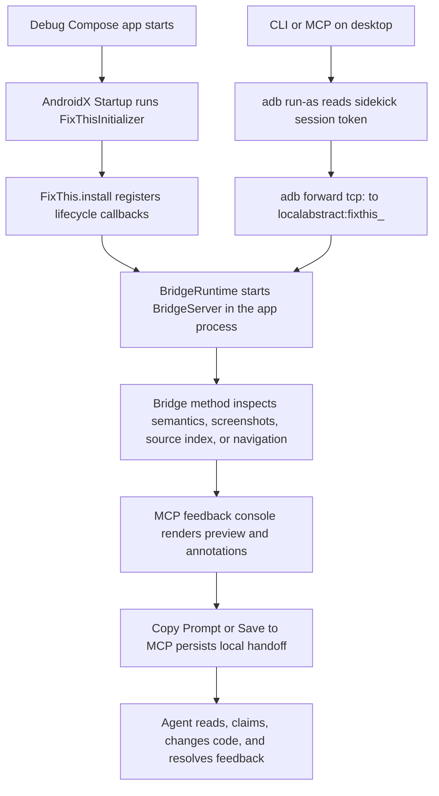

# FixThis 풀스택/툴링 인수인계 가이드

이 문서는 FixThis를 처음 인수인계 받는 주니어 풀스택/툴링
개발자를 위한 긴 형식의 가이드입니다. Android Compose 앱 안에서
수집한 UI 근거가 어떻게 데스크톱 CLI/MCP, 브라우저 콘솔, 로컬
`.fixthis/` handoff로 이어지는지 한 흐름으로 설명합니다.

기존 문서를 대체하지 않습니다. 빠른 제품 이해는
[README](../../README.md), 현재 아키텍처 지도는
[Architecture overview](../architecture/overview.md), 결정 근거는
[Decision rationale](../product/decision-rationale.md), 호환성 계약은
[Reference docs](../index.md#reference-contracts), 검증 명령은
[CONTRIBUTING](../../CONTRIBUTING.md)을 우선합니다.

## 이 문서를 읽는 방법

## FixThis를 한 문장으로 이해하기

## 전체 시스템 흐름

## 프로젝트 구성과 모듈 책임

## 기술선정 이유와 장단점

## 실제 로직 추적

## 데이터와 저장소 구조

## 호환성 계약과 금지사항

## 변경 유형별 작업 가이드

## 검증 명령과 실패 해석

## 처음 3일 온보딩 루트
