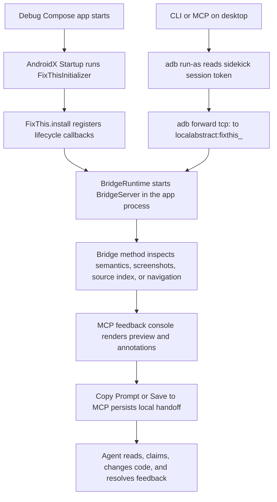

# FixThis 풀스택/툴링 인수인계 가이드

이 문서는 FixThis를 처음 인수인계 받는 주니어 풀스택/툴링
개발자를 위한 긴 형식의 가이드입니다. Android Compose 앱 안에서
수집한 UI 근거가 어떻게 데스크톱 CLI/MCP, 브라우저 콘솔, 로컬
`.fixthis/` handoff로 이어지는지 한 흐름으로 설명합니다.

기존 문서를 대체하지 않습니다. 빠른 제품 이해는
[README](../../README.md), 현재 아키텍처 지도는
[Architecture overview](../architecture/overview.md), 결정 근거는
[Decision rationale](../product/decision-rationale.md), 호환성 계약은
[Reference docs](../index.md#reference-contracts), 검증 명령은
[CONTRIBUTING](../../CONTRIBUTING.md)을 우선합니다.

## 이 문서를 읽는 방법

이 문서의 첫 번째 독자는 Android Compose만 주로 다뤄 본 개발자일
수도 있고, CLI/MCP 서버나 데스크톱 tooling만 주로 다뤄 본 개발자일
수도 있습니다. 그래서 Android 프로세스 안의 runtime, 데스크톱
프로세스의 CLI/MCP, 브라우저 콘솔, 로컬 handoff 파일을 한 흐름으로
이어 설명합니다.

이 문서는 처음 읽는 길잡이입니다. public contract나 호환성 규칙의
source of truth는 reference 문서입니다. 문서끼리 충돌하면 현재 코드,
`docs/reference/*`, `CONTRIBUTING.md`를 우선하고, 이 문서는 그 결정을
이해하기 위한 해설로 봅니다.

검색 가능성을 위해 public tool name, class name, file path는 번역하지
않습니다. 예를 들어 `fixthis_open_feedback_console`,
`FixThisInitializer`, `FeedbackSessionService`,
`fixthis-mcp/src/main/console/` 같은 이름은 그대로 사용합니다.

## FixThis를 한 문장으로 이해하기

FixThis는 Jetpack Compose debug 앱 안에 작은 sidekick runtime을 붙이고,
현재 화면의 semantics, screenshot, source candidate, 사용자의 annotation을
로컬 desktop MCP/브라우저 콘솔로 넘겨 AI coding agent가 수정할 위치와
근거를 빠르게 이해하게 만드는 도구입니다.

핵심 경계는 네 가지입니다.

- Debug-only: release build에는 들어가면 안 됩니다.
- Compose-only: V1은 Compose semantics를 중심으로 동작합니다.
- Local-first: screenshot, semantics, handoff는 로컬 파일과 localhost/ADB
  안에서 처리됩니다.
- MCP/browser-console-first: 앱 안에서 annotation하지 않고 데스크톱
  브라우저 콘솔에서 선택, 작성, 저장합니다.

## 전체 시스템 흐름

Android app process가 소유하는 것은 debug app 안에 주입된 sidekick
runtime입니다. AndroidX Startup이 `FixThisInitializer`를 실행하고,
`FixThis.install`이 lifecycle callback과 status pill을 붙인 뒤,
`BridgeServer`가 app process 안에서 localabstract socket을 엽니다. 이
프로세스는 Compose semantics inspection, screenshot capture, source-index
asset 읽기, debug-only navigation 같은 앱 내부 근거 수집만 담당합니다.

Desktop CLI/MCP process는 Android app process 밖에서 실행됩니다.
`fixthis-cli`와 `fixthis-mcp`는 ADB로 debug app의
`files/fixthis/session.json` token을 읽고, `adb forward tcp:<port>
localabstract:fixthis_<package>`로 app-side bridge에 연결합니다. 중요한
경계는 앱이 MCP server나 HTTP server를 host하지 않는다는 점입니다. MCP,
HTTP feedback console, queue tool, session store는 모두 desktop process
쪽 책임입니다.

Browser console은 `fixthis-mcp`가 localhost에 띄우는 operator UI입니다.
사용자는 여기서 Start, live preview, Annotate, target selection, comment
작성, Copy Prompt, Save to MCP를 수행합니다. 브라우저는 앱 안에서 직접
annotation을 저장하지 않고, console HTTP route를 통해 desktop
`FeedbackSessionService`와 session DTO를 갱신합니다.

`.fixthis/` local persistence는 agent handoff를 위한 desktop-side 작업
공간입니다. `.fixthis/project.json`은 외부 Android repo의 package/setup
힌트를 담고, `.fixthis/feedback-sessions/<session-id>/session.json`과
events는 작성된 feedback queue와 근거를 보존합니다. 이 디렉터리는
로컬 개발 산출물이므로 commit하지 않습니다.

## 프로젝트 구성과 모듈 책임

### `:app` (`sample/`)

- Responsibility: FixThis runtime과 console handoff를 검증하는 bundled
  validation sample app입니다.
- Must not depend on: 실제 외부 앱에서 보이지 않는 product-only shortcut,
  test-only 우회, sample 전용 숨은 계약입니다.
- First files to open: `sample/build.gradle.kts`,
  `sample/src/main/java/io/github/beyondwin/fixthis/sample/MainActivity.kt`,
  `sample/src/main/java/io/github/beyondwin/fixthis/sample/FixThisStudioApp.kt`.
- Important tests: `sample/src/androidTest/java/io/github/beyondwin/fixthis/sample/SampleAppSmokeTest.kt`,
  `sample/src/androidTest/java/io/github/beyondwin/fixthis/sample/SemanticsInspectorSampleAppTest.kt`,
  그리고 `CONTRIBUTING.md`의 sample connected smoke commands.
- Common change types: sample scenario 추가, Compose semantics coverage 확장,
  visual fixture screen 추가, 외부 앱 first-run 흐름을 재현하는 demo 상태
  보강입니다.

### `:fixthis-compose-core`

- Responsibility: pure Kotlin domain입니다. selection, source matching,
  target evidence, reliability, formatter, use case, redaction policy처럼
  Android runtime이나 MCP 저장소 없이 설명할 수 있는 정책을 소유합니다.
- Must not depend on: MCP, CLI, Android UI surface, `.fixthis/` path, browser
  DTO, desktop session persistence입니다.
- First files to open:
  `fixthis-compose-core/src/main/kotlin/io/github/beyondwin/fixthis/compose/core/source/SourceMatcher.kt`,
  `fixthis-compose-core/src/main/kotlin/io/github/beyondwin/fixthis/compose/core/selection/NodeSelector.kt`,
  `fixthis-compose-core/src/main/kotlin/io/github/beyondwin/fixthis/compose/core/target/TargetEvidenceFactory.kt`,
  `fixthis-compose-core/src/main/kotlin/io/github/beyondwin/fixthis/compose/core/target/TargetReliabilityCalculator.kt`,
  `fixthis-compose-core/src/main/kotlin/io/github/beyondwin/fixthis/compose/core/format/FixThisMarkdownFormatter.kt`.
- Important tests: `:fixthis-compose-core:test`,
  `fixthis-compose-core/src/test/kotlin/io/github/beyondwin/fixthis/compose/core/source/SourceMatcherTest.kt`,
  `fixthis-compose-core/src/test/kotlin/io/github/beyondwin/fixthis/compose/core/selection/NodeSelectorTest.kt`,
  `fixthis-compose-core/src/test/kotlin/io/github/beyondwin/fixthis/compose/core/target/TargetEvidenceFactoryTest.kt`,
  `fixthis-compose-core/src/test/kotlin/io/github/beyondwin/fixthis/compose/core/target/TargetReliabilityCalculatorTest.kt`.
- Common change types: source candidate scoring policy, confidence wording,
  target identity/occurrence 계산, formatter 출력 밀도, redaction 기본값,
  source fallback risk 문구 조정입니다.

### `:fixthis-compose-sidekick`

- Responsibility: target Android debug app 안에서 실행되는 runtime입니다.
  AndroidX Startup 진입점, debug guard, lifecycle callback, status pill,
  Compose semantics inspection, screenshot capture, local socket bridge를
  소유합니다.
- Must not depend on: MCP session storage, desktop console state,
  `.fixthis/feedback-sessions`, browser DOM, 외부 agent queue입니다.
- First files to open:
  `fixthis-compose-sidekick/src/main/kotlin/io/github/beyondwin/fixthis/compose/sidekick/init/FixThisInitializer.kt`,
  `fixthis-compose-sidekick/src/main/kotlin/io/github/beyondwin/fixthis/compose/sidekick/FixThis.kt`,
  `fixthis-compose-sidekick/src/main/kotlin/io/github/beyondwin/fixthis/compose/sidekick/bridge/BridgeServer.kt`,
  `fixthis-compose-sidekick/src/main/kotlin/io/github/beyondwin/fixthis/compose/sidekick/inspect/SemanticsInspector.kt`,
  `fixthis-compose-sidekick/src/main/kotlin/io/github/beyondwin/fixthis/compose/sidekick/screenshot/ScreenshotCapturer.kt`.
- Important tests: `:fixthis-compose-sidekick:testDebugUnitTest`,
  `fixthis-compose-sidekick/src/test/kotlin/io/github/beyondwin/fixthis/compose/sidekick/bridge/BridgeServerTest.kt`,
  `fixthis-compose-sidekick/src/test/kotlin/io/github/beyondwin/fixthis/compose/sidekick/FixThisTest.kt`,
  `fixthis-compose-sidekick/src/test/kotlin/io/github/beyondwin/fixthis/compose/sidekick/screenshot/ScreenshotCapturerTest.kt`,
  bridge/runtime behavior가 device state에 의존하면 connected tests.
- Common change types: bridge method 추가, lifecycle 상태 처리, screenshot
  저장 방식, semantics mapping, status pill state, debug-only navigation
  입력 처리입니다.

### `fixthis-gradle-plugin/`

- Responsibility: Android application debug variant에 FixThis runtime을
  연결하고 source-index/build metadata asset을 생성하는 included Gradle
  build입니다.
- Must not depend on: running device state, MCP session file,
  `.fixthis/feedback-sessions`, browser console state입니다.
- First files to open:
  `fixthis-gradle-plugin/src/main/kotlin/io/github/beyondwin/fixthis/gradle/FixThisGradlePlugin.kt`,
  `fixthis-gradle-plugin/src/main/kotlin/io/github/beyondwin/fixthis/gradle/task/GenerateFixThisSourceIndexTask.kt`,
  `fixthis-gradle-plugin/src/main/kotlin/io/github/beyondwin/fixthis/gradle/source/KotlinSourceScanner.kt`,
  `fixthis-gradle-plugin/src/main/kotlin/io/github/beyondwin/fixthis/gradle/source/SourceIndexGenerator.kt`.
- Important tests: `:fixthis-gradle-plugin:test`,
  `fixthis-gradle-plugin/src/test/kotlin/io/github/beyondwin/fixthis/gradle/FixThisGradlePluginTest.kt`,
  `fixthis-gradle-plugin/src/test/kotlin/io/github/beyondwin/fixthis/gradle/GenerateFixThisSourceIndexTaskTest.kt`,
  `fixthis-gradle-plugin/src/test/kotlin/io/github/beyondwin/fixthis/gradle/source/KotlinSourceScannerTest.kt`,
  functional tests under `fixthis-gradle-plugin/src/functionalTest/`.
- Common change types: debug runtime wiring, published coordinate 적용,
  source scanner signal 추가, generated asset schema 확장, release guard와
  consumer fixture 보강입니다.

### `:fixthis-cli`

- Responsibility: desktop command surface와 ADB bridge client입니다.
  `fixthis install-agent`, `fixthis doctor`, `fixthis run`, `fixthis setup`,
  `fixthis mcp`, `fixthis console` 같은 사용자의 shell entrypoint를
  소유합니다.
- Must not depend on: browser DOM state, MCP session internals, app process
  내부 구현 세부사항입니다. App과는 public bridge protocol과 ADB 동작을
  통해서만 대화해야 합니다.
- First files to open:
  `fixthis-cli/src/main/kotlin/io/github/beyondwin/fixthis/cli/Main.kt`,
  `fixthis-cli/src/main/kotlin/io/github/beyondwin/fixthis/cli/commands/DoctorCommand.kt`,
  `fixthis-cli/src/main/kotlin/io/github/beyondwin/fixthis/cli/commands/RunCommand.kt`,
  `fixthis-cli/src/main/kotlin/io/github/beyondwin/fixthis/cli/commands/SetupCommand.kt`,
  `fixthis-cli/src/main/kotlin/io/github/beyondwin/fixthis/cli/BridgeClient.kt`,
  `fixthis-cli/src/main/kotlin/io/github/beyondwin/fixthis/cli/Adb.kt`.
- Important tests: `:fixthis-cli:test`,
  `fixthis-cli/src/test/kotlin/io/github/beyondwin/fixthis/cli/commands/DoctorCommandTest.kt`,
  `fixthis-cli/src/test/kotlin/io/github/beyondwin/fixthis/cli/commands/InstallAgentJsonReportTest.kt`,
  `fixthis-cli/src/test/kotlin/io/github/beyondwin/fixthis/cli/commands/RunCommandTest.kt`,
  `fixthis-cli/src/test/kotlin/io/github/beyondwin/fixthis/cli/BridgeClientTest.kt`,
  CLI surface 문서를 바꾸면 `bash scripts/check-docs-cli-surface.sh`.
- Common change types: command flag 추가, doctor JSON/check 이름 변경,
  package resolution, agent config writer, ADB discovery, bridge error
  rendering입니다.

### `:fixthis-mcp`

- Responsibility: stdio MCP server, local HTTP feedback console, session store,
  handoff rendering, feedback queue tool을 소유하는 desktop module입니다.
- Must not depend on: Android-only API 직접 호출, app-private file layout 직접
  해석, browser-only transient state입니다. Android app과의 통신은 CLI/bridge
  adapter를 통해서만 이뤄져야 합니다.
- First files to open:
  `fixthis-mcp/src/main/kotlin/io/github/beyondwin/fixthis/mcp/McpServer.kt`,
  `fixthis-mcp/src/main/kotlin/io/github/beyondwin/fixthis/mcp/McpProtocol.kt`,
  `fixthis-mcp/src/main/kotlin/io/github/beyondwin/fixthis/mcp/tools/FixThisTools.kt`,
  `fixthis-mcp/src/main/kotlin/io/github/beyondwin/fixthis/mcp/tools/McpToolRegistry.kt`,
  `fixthis-mcp/src/main/kotlin/io/github/beyondwin/fixthis/mcp/console/FeedbackConsoleServer.kt`,
  `fixthis-mcp/src/main/kotlin/io/github/beyondwin/fixthis/mcp/session/FeedbackSessionService.kt`,
  `fixthis-mcp/src/main/console/`.
- Important tests: `:fixthis-mcp:test`,
  `fixthis-mcp/src/test/kotlin/io/github/beyondwin/fixthis/mcp/McpProtocolTest.kt`,
  `fixthis-mcp/src/test/kotlin/io/github/beyondwin/fixthis/mcp/tools/FixThisToolsStatusTest.kt`,
  `fixthis-mcp/src/test/kotlin/io/github/beyondwin/fixthis/mcp/session/FeedbackSessionServiceTest.kt`,
  `fixthis-mcp/src/test/kotlin/io/github/beyondwin/fixthis/mcp/console/FeedbackConsoleServerTest.kt`,
  console JS를 바꾸면 `npm run console:test:fast`와 관련 harness.
- Common change types: MCP tool 추가/변경, console HTTP route, draft workflow,
  Save to MCP, Copy Prompt/compact handoff, event log, session replay,
  feedback claim/resolve queue semantics입니다.

## 기술선정 이유와 장단점

## 실제 로직 추적

## 데이터와 저장소 구조

## 호환성 계약과 금지사항

## 변경 유형별 작업 가이드

## 검증 명령과 실패 해석

## 처음 3일 온보딩 루트
