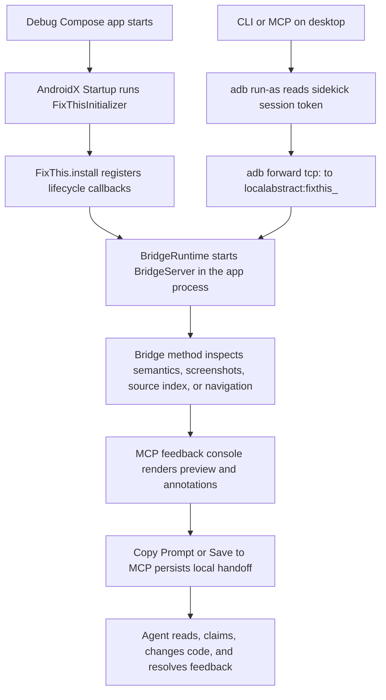

# FixThis 풀스택/툴링 인수인계 가이드

이 문서는 FixThis를 처음 인수인계 받는 풀스택/툴링
개발자를 위한 긴 형식의 가이드입니다. Android Compose 앱 안에서
수집한 UI 근거가 어떻게 데스크톱 CLI/MCP, 브라우저 콘솔, 로컬
`.fixthis/` handoff로 이어지는지 한 흐름으로 설명합니다.

기존 문서를 대체하지 않습니다. 빠른 제품 이해는
[README](../../README.md), 현재 아키텍처 지도는
[Architecture overview](../architecture/overview.md), 결정 근거는
[Decision rationale](../product/decision-rationale.md), 호환성 계약은
[Reference docs](../index.md#reference-contracts), 검증 명령은
[CONTRIBUTING](../../CONTRIBUTING.md)을 우선합니다.

## 이 문서를 읽는 방법

이 문서의 첫 번째 독자는 Android Compose만 주로 다뤄 본 개발자일
수도 있고, CLI/MCP 서버나 데스크톱 tooling만 주로 다뤄 본 개발자일
수도 있습니다. 그래서 Android 프로세스 안의 runtime, 데스크톱
프로세스의 CLI/MCP, 브라우저 콘솔, 로컬 handoff 파일을 한 흐름으로
이어 설명합니다.

이 문서는 처음 읽는 길잡이입니다. public contract나 호환성 규칙의
source of truth는 reference 문서입니다. 문서끼리 충돌하면 현재 코드,
`docs/reference/*`, `CONTRIBUTING.md`를 우선하고, 이 문서는 그 결정을
이해하기 위한 해설로 봅니다.

검색 가능성을 위해 public tool name, class name, file path는 번역하지
않습니다. 예를 들어 `fixthis_open_feedback_console`,
`FixThisInitializer`, `FeedbackSessionService`,
`fixthis-mcp/src/main/console/` 같은 이름은 그대로 사용합니다.

## FixThis를 한 문장으로 이해하기

FixThis는 Jetpack Compose debug 앱 안에 작은 sidekick runtime을 붙이고,
현재 화면의 semantics, screenshot, source candidate, 사용자의 annotation을
로컬 desktop MCP/브라우저 콘솔로 넘겨 AI coding agent가 수정할 위치와
근거를 빠르게 이해하게 만드는 도구입니다.

핵심 경계는 네 가지입니다.

- Debug-only: release build에는 들어가면 안 됩니다.
- Compose-only: V1은 Compose semantics를 중심으로 동작합니다.
- Local-first: screenshot, semantics, handoff는 로컬 파일과 localhost/ADB
  안에서 처리됩니다.
- MCP/browser-console-first: 앱 안에서 annotation하지 않고 데스크톱
  브라우저 콘솔에서 선택, 작성, 저장합니다.

## 전체 시스템 흐름



Android app process가 소유하는 것은 debug app 안에 주입된 sidekick
runtime입니다. AndroidX Startup이 `FixThisInitializer`를 실행하고,
`FixThis.install`이 lifecycle callback과 status pill을 붙인 뒤,
`BridgeServer`가 app process 안에서 localabstract socket을 엽니다. 이
프로세스는 Compose semantics inspection, screenshot capture, source-index
asset 읽기, debug-only navigation 같은 앱 내부 근거 수집만 담당합니다.

Desktop CLI/MCP process는 Android app process 밖에서 실행됩니다.
`fixthis-cli`와 `fixthis-mcp`는 ADB로 debug app의
`files/fixthis/session.json` token을 읽고, `adb forward tcp:<port>
localabstract:fixthis_<package>`로 app-side bridge에 연결합니다. 중요한
경계는 앱이 MCP server나 HTTP server를 host하지 않는다는 점입니다. MCP,
HTTP feedback console, queue tool, session store는 모두 desktop process
쪽 책임입니다.

Browser console은 `fixthis-mcp`가 localhost에 띄우는 operator UI입니다.
사용자는 여기서 Start, live preview, Annotate, target selection, comment
작성, Copy Prompt, Save to MCP를 수행합니다. 브라우저는 앱 안에서 직접
annotation을 저장하지 않고, console HTTP route를 통해 desktop
`FeedbackSessionService`와 session DTO를 갱신합니다.

`.fixthis/` local persistence는 agent handoff를 위한 desktop-side 작업
공간입니다. `.fixthis/project.json`은 외부 Android repo의 package/setup
힌트를 담고, `.fixthis/feedback-sessions/<session-id>/session.json`과
events는 작성된 feedback queue와 근거를 보존합니다. 이 디렉터리는
로컬 개발 산출물이므로 commit하지 않습니다.

## 프로젝트 구성과 모듈 책임

### `:app` (`sample/`)

- Responsibility: FixThis runtime과 console handoff를 검증하는 bundled
  validation sample app입니다.
- Must not depend on: 실제 외부 앱에서 보이지 않는 product-only shortcut,
  test-only 우회, sample 전용 숨은 계약입니다.
- First files to open: `sample/build.gradle.kts`,
  `sample/src/main/java/io/github/beyondwin/fixthis/sample/MainActivity.kt`,
  `sample/src/main/java/io/github/beyondwin/fixthis/sample/FixThisStudioApp.kt`.
- Important tests: `sample/src/androidTest/java/io/github/beyondwin/fixthis/sample/SampleAppSmokeTest.kt`,
  `sample/src/androidTest/java/io/github/beyondwin/fixthis/sample/SemanticsInspectorSampleAppTest.kt`,
  그리고 `CONTRIBUTING.md`의 sample connected smoke commands.
- Common change types: sample scenario 추가, Compose semantics coverage 확장,
  visual fixture screen 추가, 외부 앱 first-run 흐름을 재현하는 demo 상태
  보강입니다.

### `:fixthis-compose-core`

- Responsibility: pure Kotlin domain입니다. selection, source matching,
  target evidence, reliability, formatter, use case, redaction policy처럼
  Android runtime이나 MCP 저장소 없이 설명할 수 있는 정책을 소유합니다.
- Must not depend on: MCP, CLI, Android UI surface, `.fixthis/` path, browser
  DTO, desktop session persistence입니다.
- First files to open:
  `fixthis-compose-core/src/main/kotlin/io/github/beyondwin/fixthis/compose/core/source/SourceMatcher.kt`,
  `fixthis-compose-core/src/main/kotlin/io/github/beyondwin/fixthis/compose/core/selection/NodeSelector.kt`,
  `fixthis-compose-core/src/main/kotlin/io/github/beyondwin/fixthis/compose/core/target/TargetEvidenceFactory.kt`,
  `fixthis-compose-core/src/main/kotlin/io/github/beyondwin/fixthis/compose/core/target/TargetReliabilityCalculator.kt`,
  `fixthis-compose-core/src/main/kotlin/io/github/beyondwin/fixthis/compose/core/format/FixThisMarkdownFormatter.kt`.
- Important tests: `:fixthis-compose-core:test`,
  `fixthis-compose-core/src/test/kotlin/io/github/beyondwin/fixthis/compose/core/source/SourceMatcherTest.kt`,
  `fixthis-compose-core/src/test/kotlin/io/github/beyondwin/fixthis/compose/core/selection/NodeSelectorTest.kt`,
  `fixthis-compose-core/src/test/kotlin/io/github/beyondwin/fixthis/compose/core/target/TargetEvidenceFactoryTest.kt`,
  `fixthis-compose-core/src/test/kotlin/io/github/beyondwin/fixthis/compose/core/target/TargetReliabilityCalculatorTest.kt`.
- Common change types: source candidate scoring policy, confidence wording,
  target identity/occurrence 계산, formatter 출력 밀도, redaction 기본값,
  source fallback risk 문구 조정입니다.

### `:fixthis-compose-sidekick`

- Responsibility: target Android debug app 안에서 실행되는 runtime입니다.
  AndroidX Startup 진입점, debug guard, lifecycle callback, status pill,
  Compose semantics inspection, screenshot capture, local socket bridge를
  소유합니다.
- Must not depend on: MCP session storage, desktop console state,
  `.fixthis/feedback-sessions`, browser DOM, 외부 agent queue입니다.
- First files to open:
  `fixthis-compose-sidekick/src/main/kotlin/io/github/beyondwin/fixthis/compose/sidekick/init/FixThisInitializer.kt`,
  `fixthis-compose-sidekick/src/main/kotlin/io/github/beyondwin/fixthis/compose/sidekick/FixThis.kt`,
  `fixthis-compose-sidekick/src/main/kotlin/io/github/beyondwin/fixthis/compose/sidekick/bridge/BridgeServer.kt`,
  `fixthis-compose-sidekick/src/main/kotlin/io/github/beyondwin/fixthis/compose/sidekick/inspect/SemanticsInspector.kt`,
  `fixthis-compose-sidekick/src/main/kotlin/io/github/beyondwin/fixthis/compose/sidekick/screenshot/ScreenshotCapturer.kt`.
- Important tests: `:fixthis-compose-sidekick:testDebugUnitTest`,
  `fixthis-compose-sidekick/src/test/kotlin/io/github/beyondwin/fixthis/compose/sidekick/bridge/BridgeServerTest.kt`,
  `fixthis-compose-sidekick/src/test/kotlin/io/github/beyondwin/fixthis/compose/sidekick/FixThisTest.kt`,
  `fixthis-compose-sidekick/src/test/kotlin/io/github/beyondwin/fixthis/compose/sidekick/screenshot/ScreenshotCapturerTest.kt`,
  bridge/runtime behavior가 device state에 의존하면 connected tests.
- Common change types: bridge method 추가, lifecycle 상태 처리, screenshot
  저장 방식, semantics mapping, status pill state, debug-only navigation
  입력 처리입니다.

### `fixthis-gradle-plugin/`

- Responsibility: Android application debug variant에 FixThis runtime을
  연결하고 source-index/build metadata asset을 생성하는 included Gradle
  build입니다.
- Must not depend on: running device state, MCP session file,
  `.fixthis/feedback-sessions`, browser console state입니다.
- First files to open:
  `fixthis-gradle-plugin/src/main/kotlin/io/github/beyondwin/fixthis/gradle/FixThisGradlePlugin.kt`,
  `fixthis-gradle-plugin/src/main/kotlin/io/github/beyondwin/fixthis/gradle/task/GenerateFixThisSourceIndexTask.kt`,
  `fixthis-gradle-plugin/src/main/kotlin/io/github/beyondwin/fixthis/gradle/source/KotlinSourceScanner.kt`,
  `fixthis-gradle-plugin/src/main/kotlin/io/github/beyondwin/fixthis/gradle/source/SourceIndexGenerator.kt`.
- Important tests: `:fixthis-gradle-plugin:test`,
  `fixthis-gradle-plugin/src/test/kotlin/io/github/beyondwin/fixthis/gradle/FixThisGradlePluginTest.kt`,
  `fixthis-gradle-plugin/src/test/kotlin/io/github/beyondwin/fixthis/gradle/GenerateFixThisSourceIndexTaskTest.kt`,
  `fixthis-gradle-plugin/src/test/kotlin/io/github/beyondwin/fixthis/gradle/source/KotlinSourceScannerTest.kt`,
  functional tests under `fixthis-gradle-plugin/src/functionalTest/`.
- Common change types: debug runtime wiring, published coordinate 적용,
  source scanner signal 추가, generated asset schema 확장, release guard와
  consumer fixture 보강입니다.

### `:fixthis-cli`

- Responsibility: desktop command surface와 ADB bridge client입니다.
  `fixthis install-agent`, `fixthis doctor`, `fixthis run`, `fixthis setup`,
  `fixthis mcp`, `fixthis console` 같은 사용자의 shell entrypoint를
  소유합니다.
- Must not depend on: browser DOM state, MCP session internals, app process
  내부 구현 세부사항입니다. App과는 public bridge protocol과 ADB 동작을
  통해서만 대화해야 합니다.
- First files to open:
  `fixthis-cli/src/main/kotlin/io/github/beyondwin/fixthis/cli/Main.kt`,
  `fixthis-cli/src/main/kotlin/io/github/beyondwin/fixthis/cli/commands/DoctorCommand.kt`,
  `fixthis-cli/src/main/kotlin/io/github/beyondwin/fixthis/cli/commands/RunCommand.kt`,
  `fixthis-cli/src/main/kotlin/io/github/beyondwin/fixthis/cli/commands/SetupCommand.kt`,
  `fixthis-cli/src/main/kotlin/io/github/beyondwin/fixthis/cli/BridgeClient.kt`,
  `fixthis-cli/src/main/kotlin/io/github/beyondwin/fixthis/cli/Adb.kt`.
- Important tests: `:fixthis-cli:test`,
  `fixthis-cli/src/test/kotlin/io/github/beyondwin/fixthis/cli/commands/DoctorCommandTest.kt`,
  `fixthis-cli/src/test/kotlin/io/github/beyondwin/fixthis/cli/commands/InstallAgentJsonReportTest.kt`,
  `fixthis-cli/src/test/kotlin/io/github/beyondwin/fixthis/cli/commands/RunCommandTest.kt`,
  `fixthis-cli/src/test/kotlin/io/github/beyondwin/fixthis/cli/BridgeClientTest.kt`,
  CLI surface 문서를 바꾸면 `bash scripts/check-docs-cli-surface.sh`.
- Common change types: command flag 추가, doctor JSON/check 이름 변경,
  package resolution, agent config writer, ADB discovery, bridge error
  rendering입니다.

### `:fixthis-mcp`

- Responsibility: stdio MCP server, local HTTP feedback console, session store,
  handoff rendering, feedback queue tool을 소유하는 desktop module입니다.
- Must not depend on: Android-only API 직접 호출, app-private file layout 직접
  해석, browser-only transient state입니다. Android app과의 통신은 CLI/bridge
  adapter를 통해서만 이뤄져야 합니다.
- First files to open:
  `fixthis-mcp/src/main/kotlin/io/github/beyondwin/fixthis/mcp/McpServer.kt`,
  `fixthis-mcp/src/main/kotlin/io/github/beyondwin/fixthis/mcp/McpProtocol.kt`,
  `fixthis-mcp/src/main/kotlin/io/github/beyondwin/fixthis/mcp/tools/FixThisTools.kt`,
  `fixthis-mcp/src/main/kotlin/io/github/beyondwin/fixthis/mcp/tools/McpToolRegistry.kt`,
  `fixthis-mcp/src/main/kotlin/io/github/beyondwin/fixthis/mcp/console/FeedbackConsoleServer.kt`,
  `fixthis-mcp/src/main/kotlin/io/github/beyondwin/fixthis/mcp/session/FeedbackSessionService.kt`,
  `fixthis-mcp/src/main/console/`.
- Important tests: `:fixthis-mcp:test`,
  `fixthis-mcp/src/test/kotlin/io/github/beyondwin/fixthis/mcp/McpProtocolTest.kt`,
  `fixthis-mcp/src/test/kotlin/io/github/beyondwin/fixthis/mcp/tools/FixThisToolsStatusTest.kt`,
  `fixthis-mcp/src/test/kotlin/io/github/beyondwin/fixthis/mcp/session/FeedbackSessionServiceTest.kt`,
  `fixthis-mcp/src/test/kotlin/io/github/beyondwin/fixthis/mcp/console/FeedbackConsoleServerTest.kt`,
  console JS를 바꾸면 `npm run console:test:fast`와 관련 harness.
- Common change types: MCP tool 추가/변경, console HTTP route, draft workflow,
  Save to MCP, Copy Prompt/compact handoff, event log, session replay,
  feedback claim/resolve queue semantics입니다.

## 기술선정 이유와 장단점

이 섹션은 FixThis가 왜 Android runtime, desktop CLI/MCP, browser console,
local persistence를 지금의 조합으로 묶었는지 설명합니다. 각각의 선택은
"정확한 자동화"보다 "민감한 UI 근거를 로컬에서 안전하게 모아 agent가
검증 가능한 handoff를 받게 한다"는 목표에 맞춰져 있습니다.

### Jetpack Compose semantics

- FixThis에서 하는 역할: debug 앱의 현재 Compose hierarchy에서 text,
  contentDescription, role, action, bounds, testTag 같은 런타임 신호를
  읽어 screen inspection, target selection, source matching, handoff
  evidence의 기본 입력으로 사용합니다.
- 왜 이 기술을 선택했나: Compose semantics는 View hierarchy보다
  FixThis의 V1 대상인 Compose UI와 직접 맞닿아 있고, 앱 프로세스
  안에서 읽을 수 있어 AccessibilityService 없이도 일관된 런타임
  근거를 제공합니다.
- 장점: UI가 어떻게 보이고 상호작용 가능한지에 대한 구조화된 신호를
  screenshot과 함께 제공하므로 agent가 단순 좌표보다 더 검증 가능한
  맥락을 받습니다.
- 단점/한계: semantics는 best-effort 신호입니다. AndroidView/WebView
  interop, 약한 semantics, 누락된 label, stale source index가 있으면
  실제 픽셀과 source candidate가 완전히 일치한다고 단정할 수 없습니다.
- 변경하거나 확장할 때 고려할 점: selection이나 reliability 문구를
  바꿀 때는 semantics node를 확정 근거로 표현하지 말고 confidence,
  warning, fallback을 함께 유지해야 합니다.
- 관련 코드/문서:
  `fixthis-compose-sidekick/src/main/kotlin/io/github/beyondwin/fixthis/compose/sidekick/inspect/`,
  `fixthis-compose-core/src/main/kotlin/io/github/beyondwin/fixthis/compose/core/selection/`,
  `docs/product/decision-rationale.md`, `docs/architecture/overview.md`.

### `debugImplementation`과 debuggable guard

- FixThis에서 하는 역할: FixThis sidekick runtime을 debug build에만
  넣고, 앱이 debuggable일 때만 bridge와 status pill을 시작하게 하는
  안전 경계입니다.
- 왜 이 기술을 선택했나: screenshots, UI text, semantics tree, source
  hints, local handoff는 민감할 수 있으므로 release 사용자에게
  노출되면 안 됩니다.
- 장점: 제품 앱의 release binary와 end-user surface를 건드리지
  않으면서 개발 중인 앱에서만 runtime evidence를 수집할 수 있습니다.
- 단점/한계: release build나 non-debuggable 앱에서는 FixThis를 사용할
  수 없고, 외부 repo onboarding도 debug variant 설정이 올바르지 않으면
  doctor 단계에서 막힙니다.
- 변경하거나 확장할 때 고려할 점: release 지원처럼 보이는 문구나
  설정을 추가하지 말고, guard 실패는 명확한 recovery message와 docs
  link로 연결해야 합니다.
- 관련 코드/문서:
  `fixthis-compose-sidekick/src/main/kotlin/io/github/beyondwin/fixthis/compose/sidekick/FixThis.kt`,
  `fixthis-gradle-plugin/src/main/kotlin/io/github/beyondwin/fixthis/gradle/`,
  `docs/product/decision-rationale.md`, `docs/reference/output-schema.md`.

### AndroidX Startup

- FixThis에서 하는 역할: target debug app 시작 시
  `FixThisInitializer`를 통해 sidekick runtime을 자동 설치하고 Activity
  lifecycle callback, status pill, bridge runtime 준비를 시작합니다.
- 왜 이 기술을 선택했나: 외부 앱 사용자가 `Application` 코드를 직접
  수정하지 않아도 debug dependency 추가만으로 sidekick이 붙는 설치
  경험이 필요했습니다.
- 장점: setup이 단순하고, sample app과 외부 Android repo에서 같은
  runtime 진입점을 공유할 수 있습니다.
- 단점/한계: Startup metadata나 dependency wiring이 빠지면 앱 안에서
  sidekick이 시작되지 않으며, library consumer가 초기화 순서 문제를
  겪을 수 있습니다.
- 변경하거나 확장할 때 고려할 점: initializer는 앱 내부 runtime
  bootstrap에만 머물러야 하며 MCP server, HTTP console, `.fixthis/`
  session store 같은 desktop 책임을 끌어오면 안 됩니다.
- 관련 코드/문서:
  `fixthis-compose-sidekick/src/main/kotlin/io/github/beyondwin/fixthis/compose/sidekick/init/FixThisInitializer.kt`,
  `fixthis-compose-sidekick/src/main/kotlin/io/github/beyondwin/fixthis/compose/sidekick/lifecycle/`,
  `docs/architecture/overview.md`.

### Android local socket과 ADB forward

- FixThis에서 하는 역할: Android app process 안의 `BridgeServer`가
  localabstract socket을 열고, desktop CLI/MCP가 ADB forward로 localhost
  port를 이 socket에 연결해 bridge 요청을 보냅니다.
- 왜 이 기술을 선택했나: Android 앱이 MCP나 HTTP server를 직접 host하지
  않으면서도 desktop tool이 debug app 내부 evidence에 접근해야 했기
  때문입니다.
- 장점: network exposure를 줄이고, ADB와 debuggable app 권한을 전제로
  한 local developer workflow에 맞게 app-side bridge를 작게 유지합니다.
- 단점/한계: ADB, device authorization, app foreground/interactive state,
  session token 읽기 같은 runtime 조건에 실패하면 bridge가 열려 있어도
  desktop에서 사용할 수 없습니다.
- 변경하거나 확장할 때 고려할 점: bridge protocol은 additive하게
  바꾸고, 앱 쪽 socket은 evidence 수집과 debug-only navigation만
  담당하게 유지해야 합니다.
- 관련 코드/문서:
  `fixthis-compose-sidekick/src/main/kotlin/io/github/beyondwin/fixthis/compose/sidekick/bridge/`,
  `fixthis-cli/src/main/kotlin/io/github/beyondwin/fixthis/cli/BridgeClient.kt`,
  `docs/reference/bridge-protocol.md`, `docs/reference/mcp-tools.md`.

### MCP stdio JSON-RPC

- FixThis에서 하는 역할: `fixthis-mcp`가 agent client와 stdio JSON-RPC로
  통신하고, workflow-level MCP tools를 통해 status, screen capture,
  feedback queue, console open, read/claim/resolve를 제공합니다.
- 왜 이 기술을 선택했나: MCP client는 local stdio server를 실행하는
  모델과 잘 맞고, Android 앱에 server 책임을 넣지 않아도 agent가
  desktop process를 통해 앱 evidence를 요청할 수 있습니다.
- 장점: stdout에는 JSON-RPC response만 내보내고 diagnostics는 stderr로
  분리할 수 있어 agent client와 안정적으로 붙습니다.
- 단점/한계: stdio protocol은 wrapper script나 log 출력이 stdout을
  오염시키면 깨지기 쉽고, long-running bridge 요청의 cancellation과
  stale response 처리를 신경 써야 합니다.
- 변경하거나 확장할 때 고려할 점: public tool name,
  request/response shape, queue semantics를 바꾸면
  `docs/reference/mcp-tools.md`와 compatibility tests를 함께 갱신해야
  합니다.
- 관련 코드/문서:
  `fixthis-mcp/src/main/kotlin/io/github/beyondwin/fixthis/mcp/McpProtocol.kt`,
  `fixthis-mcp/src/main/kotlin/io/github/beyondwin/fixthis/mcp/tools/`,
  `docs/reference/mcp-tools.md`.

### Kotlin/JVM과 `kotlinx.serialization`

- FixThis에서 하는 역할: core domain, Android sidekick, CLI, MCP server,
  Gradle plugin 대부분을 Kotlin으로 작성하고, bridge/session/tool DTO를
  typed model과 serialization으로 다룹니다.
- 왜 이 기술을 선택했나: Android runtime과 Gradle plugin은 Kotlin
  생태계와 맞고, desktop CLI/MCP도 같은 모델 언어를 공유하면 mapping과
  test coverage를 단순하게 유지할 수 있습니다.
- 장점: DTO와 domain model을 명시적으로 분리하면서도 compiler가 필드
  누락과 type mismatch를 잡아 주고, JSON 계약을 테스트하기 쉽습니다.
- 단점/한계: persisted JSON 필드 이름은 compatibility contract라서
  Kotlin property rename이나 default 값 변경이 user session을 깨뜨릴 수
  있습니다.
- 변경하거나 확장할 때 고려할 점: `items`, `screens`, `itemId`,
  `screenId`, `targetEvidence`, `targetReliability`, `sourceCandidates` 같은
  persisted field는 additive migration 원칙을 지켜야 합니다.
- 관련 코드/문서:
  `fixthis-mcp/src/main/kotlin/io/github/beyondwin/fixthis/mcp/session/dto/`,
  `fixthis-compose-core/src/main/kotlin/io/github/beyondwin/fixthis/compose/core/model/`,
  `docs/reference/output-schema.md`, `docs/architecture/overview.md`.

### Clikt 기반 CLI

- FixThis에서 하는 역할: `fixthis init`, `fixthis install-agent`,
  `fixthis doctor`, `fixthis run`, `fixthis mcp`, `fixthis console` 같은
  desktop entrypoint와 옵션 파싱을 제공합니다.
- 왜 이 기술을 선택했나: Android repo 안에서 agent-first setup과
  recovery command를 사람이 읽을 수 있는 CLI로 제공해야 했고,
  Kotlin/JVM 코드베이스 안에서 command 구조를 유지하는 편이
  단순했습니다.
- 장점: command별 flag, help, usage error, JSON report 출력을 일관되게
  만들 수 있고 MCP server 실행도 같은 배포물에서 연결할 수 있습니다.
- 단점/한계: CLI는 shell 환경, PATH, ADB 위치, Gradle project shape에
  민감하며 command contract가 문서와 어긋나면 onboarding이 바로
  깨집니다.
- 변경하거나 확장할 때 고려할 점: 새 flag나 command는 `doctor --json`
  report, agent setup files, README/CLI reference, docs consistency script가
  기대하는 surface를 함께 확인해야 합니다.
- 관련 코드/문서: `fixthis-cli/src/main/kotlin/io/github/beyondwin/fixthis/cli/`,
  `docs/reference/cli.md`, `docs/reference/mcp-tools.md`, `CONTRIBUTING.md`.

### Gradle plugin과 source index

- FixThis에서 하는 역할: debug variant에 sidekick runtime을 연결하고,
  source matching에 쓰는 `fixthis-source-index.json`과 build metadata
  asset을 생성합니다.
- 왜 이 기술을 선택했나: compiler plugin보다 호환성 부담이 작고, 외부
  Android repo에 점진적으로 붙일 수 있으며, V1에서 필요한 source
  candidate를 충분히 ranked hint로 제공할 수 있습니다.
- 장점: source scanner와 generated asset을 Gradle task로 관리하므로
  sample, 외부 fixture, release evidence에서 같은 pipeline을 검증할 수
  있습니다.
- 단점/한계: source index는 exact mapping이 아니라 text/symbol 기반
  후보입니다. generated index가 stale하거나 weak semantics를 만나면
  candidate confidence가 낮아질 수 있습니다.
- 변경하거나 확장할 때 고려할 점: candidate를 확정 위치처럼 표현하지
  말고 score, matched terms, owner composable, stale install warning 같은
  검증 힌트를 유지해야 합니다.
- 관련 코드/문서:
  `fixthis-gradle-plugin/src/main/kotlin/io/github/beyondwin/fixthis/gradle/`,
  `fixthis-compose-core/src/main/kotlin/io/github/beyondwin/fixthis/compose/core/source/`,
  `docs/product/decision-rationale.md`, `docs/reference/output-schema.md`.

### Plain browser JavaScript console

- FixThis에서 하는 역할: `fixthis-mcp`가 제공하는 localhost feedback
  console에서 Start, device selection, live preview, Annotate, target
  selection, Copy Prompt, Save to MCP 같은 operator workflow를 구현합니다.
- 왜 이 기술을 선택했나: 현재 console은 product app이 아니라 local
  tooling UI이고, 별도 React/Vue build stack 없이 MCP module에 정적
  asset과 JS harness를 함께 두는 모델이 가장 가볍습니다.
- 장점: 배포와 dev reload가 단순하고, console contract tests가 browser
  state, route, reducer, polling/SSE behavior를 직접 검증하기 쉽습니다.
- 단점/한계: UI 규모가 커질수록 module boundary, state management, DOM
  update 규칙을 JS 파일 구조로 직접 관리해야 하며 framework가 제공하는
  component isolation은 없습니다.
- 변경하거나 확장할 때 고려할 점: React/Vue 같은 framework를 쓰고
  있다고 문서화하지 말고, 현재 `fixthis-mcp/src/main/console/` asset
  contract와 console tests를 기준으로 바꿔야 합니다.
- 관련 코드/문서: `fixthis-mcp/src/main/console/`,
  `fixthis-mcp/src/main/kotlin/io/github/beyondwin/fixthis/mcp/console/`,
  `docs/reference/feedback-console-contract.md`, `CONTRIBUTING.md`.

### SSE와 polling fallback

- FixThis에서 하는 역할: browser console의 preview/session 상태를
  `/api/events` SSE로 push하고, stream이 끊기거나 사용할 수 없을 때만
  preview/session polling fallback으로 복구합니다.
- 왜 이 기술을 선택했나: operator UI는 app state, feedback queue,
  preview update를 거의 실시간으로 받아야 하지만 local tool이므로
  WebSocket보다 단순한 one-way event stream으로 충분했습니다.
- 장점: healthy path에서는 redundant polling을 줄이고, reconnect나 SSE
  drop 상황에서도 fallback이 남아 있어 console이 stale 상태에 갇히지
  않습니다.
- 단점/한계: late event, stale preview response, hidden tab, frozen
  Annotate flow처럼 race가 생길 수 있어 active session fence와 cleanup
  rule이 중요합니다.
- 변경하거나 확장할 때 고려할 점: SSE는 push-first, polling은
  fallback-only라는 contract를 유지하고, sessionId가 맞는 event만 active
  workspace에 적용해야 합니다.
- 관련 코드/문서:
  `fixthis-mcp/src/main/kotlin/io/github/beyondwin/fixthis/mcp/console/events/`,
  `fixthis-mcp/src/main/console/`,
  `docs/reference/feedback-console-contract.md`, `docs/reference/mcp-tools.md`.

### Local file persistence와 event log

- FixThis에서 하는 역할: Save to MCP와 feedback queue의 상태를
  `.fixthis/feedback-sessions/<session-id>/session.json`에 저장하고,
  session mutation을 `events/` append-only log로 남겨 replay와 recovery를
  지원합니다.
- 왜 이 기술을 선택했나: screenshots와 UI text를 외부 서비스로 보내지
  않고, agent가 같은 repo 안에서 handoff queue를 읽고 claim/resolve할
  수 있는 local-first 저장소가 필요했습니다.
- 장점: network나 hosted backend 없이도 session resume, queue state,
  evidence snapshot, compact handoff를 보존할 수 있습니다.
- 단점/한계: `.fixthis/`는 local artifact라 commit하면 안 되고, 사람이
  `index.json`을 직접 고치면 session truth와 어긋날 수 있습니다.
- 변경하거나 확장할 때 고려할 점:
  `.fixthis/feedback-sessions/<session-id>/session.json`이 authoritative
  source이고 `.fixthis/feedback-sessions/index.json`은 derived cache라는
  경계를 지켜야 합니다.
- 관련 코드/문서:
  `fixthis-mcp/src/main/kotlin/io/github/beyondwin/fixthis/mcp/session/lifecycle/store/`,
  `fixthis-mcp/src/main/kotlin/io/github/beyondwin/fixthis/mcp/session/lifecycle/event/`,
  `docs/architecture/overview.md`, `docs/reference/output-schema.md`.

### JUnit, Robolectric, connected Android tests, console JS tests

- FixThis에서 하는 역할: pure Kotlin policy, Android runtime behavior,
  Gradle/CLI/MCP contracts, browser console interaction을 각 계층에 맞는
  테스트로 검증합니다.
- 왜 이 기술을 선택했나: FixThis는 Android process, desktop process,
  browser UI, local files가 함께 움직이므로 한 종류의 테스트만으로는
  release/trust regression을 잡기 어렵습니다.
- 장점: JUnit은 core/CLI/MCP policy를 빠르게 확인하고, Robolectric은
  Android-adjacent unit behavior를 device 없이 다루며, connected tests와
  console JS tests는 실제 runtime/browser 경로를 보강합니다.
- 단점/한계: connected Android tests는 device/emulator 상태와 lockscreen에
  민감하고, browser/console tests는 async event와 timing race를
  안정화해야 합니다.
- 변경하거나 확장할 때 고려할 점: 코드 변경 위치에 따라 가장 좁은
  테스트를 먼저 고르고, runtime trust나 release claim을 바꾸면
  `CONTRIBUTING.md`의 strict evidence command까지 올려야 합니다.
- 관련 코드/문서: `CONTRIBUTING.md`,
  `fixthis-compose-core/src/main/kotlin/io/github/beyondwin/fixthis/compose/core/`,
  `fixthis-compose-sidekick/src/main/kotlin/io/github/beyondwin/fixthis/compose/sidekick/`,
  `fixthis-mcp/src/main/console/`.

### Spotless, detekt, release/trust gates

- FixThis에서 하는 역할: formatting, static analysis, release-readiness,
  external fixture, source-matching, console, runtime trust evidence를 CI와
  local checklist에서 gate로 묶습니다.
- 왜 이 기술을 선택했나: FixThis의 public claims는 설치 가능성,
  debug-only guard, source trust, feedback handoff 신뢰와 연결되므로 단순
  unit test보다 넓은 evidence gate가 필요합니다.
- 장점: style drift와 static analysis regression을 초기에 잡고,
  release/trust scripts가 문서 claim과 실제 runnable path 사이의 간극을
  줄입니다.
- 단점/한계: gate가 많아지면 실행 시간이 길고 Android/Node/ADB 환경
  의존성이 커지며, 일부 strict runtime evidence는 로컬 장비 상태 때문에
  재현 비용이 높습니다.
- 변경하거나 확장할 때 고려할 점: docs-only 변경은 필요한 좁은 check로
  충분하지만, release/trust 문구나 runtime behavior를 바꾸면 해당 gate를
  건너뛰지 말고 실패 원인을 기록해야 합니다.
- 관련 코드/문서: `CONTRIBUTING.md`, `.github/workflows/ci.yml`,
  `docs/architecture/overview.md`, `docs/product/decision-rationale.md`.

## 실제 로직 추적

이 섹션은 사용자가 보는 한 동작이 어느 명령, Android runtime, bridge,
MCP server, browser console, local file로 이어지는지 추적하는 지도입니다.
Graphify나 검색 결과는 탐색 힌트로만 쓰고, 행동을 바꿀 때는 아래에 적은
실제 코드 경로와 `docs/reference/*` 계약을 먼저 확인합니다.

### 외부 앱 설치: `fixthis install-agent`

- 사용자가 보는 동작: 외부 Android repo에서 `fixthis install-agent --project-dir . --target all`을
  실행하면 app module의 debug 설정과 agent
  MCP config가 준비되고, `.fixthis/project.json` 같은 handoff 파일이
  생성됩니다. README의 agent-first quick start는 바로 다음 단계로
  `fixthis doctor --project-dir . --json`을 요구합니다.
- 시작 명령/도구: `fixthis install-agent --project-dir . --target all`,
  `fixthis init`, recovery path의 `./gradlew fixthisSetup`.
- 핵심 코드 경로: `fixthis-cli/src/main/kotlin/io/github/beyondwin/fixthis/cli/commands/SetupCommand.kt`,
  `fixthis-cli/src/main/kotlin/io/github/beyondwin/fixthis/cli/commands/InstallAgentJsonReport.kt`,
  `docs/reference/cli.md`, `docs/getting-started/agent-install-snippet.md`.
- 데이터가 이동하는 방식: CLI가 Gradle project에서 application id와 app
  module을 추론하고, debug dependency/setup metadata를 쓰며, agent가 읽을
  MCP 실행 정보와 project metadata를 `.fixthis/` 아래에 남깁니다. 이
  단계는 Android app process를 실행하지 않고 desktop filesystem과 Gradle
  files만 다룹니다.
- 실패할 수 있는 지점: application id가 여러 개라 모호한 경우, app
  module을 못 찾는 경우, Gradle 파일을 자동 patch할 수 없는 경우, 이미
  사용자가 편집 중인 agent config와 merge conflict가 나는 경우입니다.
- 수정할 때 먼저 볼 테스트: `fixthis-cli/src/test/kotlin/io/github/beyondwin/fixthis/cli/commands/InstallAgentJsonReportTest.kt`,
  `fixthis-cli/src/test/kotlin/io/github/beyondwin/fixthis/cli/commands/SetupCommandTest.kt`,
  `npm run docs:agent-bootstrap:test`, `bash scripts/check-docs-cli-surface.sh`.

### 상태 진단: `fixthis doctor --json`

- 사용자가 보는 동작: agent나 사용자가 JSON report를 보고 project setup,
  package, generated metadata, ADB, device, sidekick bridge 상태 중 어디가
  막혔는지 확인합니다. README는 이 JSON readiness result를 source of truth로
  다룹니다.
- 시작 명령/도구: `fixthis doctor --project-dir . --json`,
  `fixthis doctor --package <applicationId> --json`, MCP의 `fixthis_status`.
- 핵심 코드 경로: `fixthis-cli/src/main/kotlin/io/github/beyondwin/fixthis/cli/commands/DoctorCommand.kt`,
  `fixthis-cli/src/main/kotlin/io/github/beyondwin/fixthis/cli/Adb.kt`,
  `docs/architecture/overview.md`, `docs/reference/mcp-tools.md`.
- 데이터가 이동하는 방식: CLI가 local Gradle/project metadata와 ADB device
  상태를 읽고, running debug app이 있으면 `adb run-as`와 `adb forward`를
  통해 app-side bridge status를 조회합니다. app은 HTTP/MCP를 host하지 않고
  sidekick session token과 local socket만 제공합니다.
- 실패할 수 있는 지점: Android SDK/ADB 미설치, unauthorized/offline
  device, app 미설치 또는 미실행, non-debuggable build, `files/fixthis/session.json`
  token 읽기 실패, bridge protocol version drift입니다.
- 수정할 때 먼저 볼 테스트: `fixthis-cli/src/test/kotlin/io/github/beyondwin/fixthis/cli/commands/DoctorCommandTest.kt`,
  `fixthis-mcp/src/test/kotlin/io/github/beyondwin/fixthis/mcp/tools/FixThisToolsStatusTest.kt`,
  `npm run first-run:smoke:test`, `npm run evidence:test`.

### 샘플 실행: `fixthis run`

- 사용자가 보는 동작: sample debug APK가 install/launch되고 CLI가 sidekick
  bridge에 붙어 사용자가 feedback console이나 MCP handoff를 시도할 수 있는
  상태로 만듭니다.
- 시작 명령/도구: `fixthis-cli/build/install/fixthis/bin/fixthis run --package io.github.beyondwin.fixthis.sample`,
  `fixthis run --package <applicationId>`, README의 sample quick start.
- 핵심 코드 경로: `fixthis-cli/src/main/kotlin/io/github/beyondwin/fixthis/cli/commands/RunCommand.kt`,
  `fixthis-cli/src/main/kotlin/io/github/beyondwin/fixthis/cli/BridgeClient.kt`,
  `README.md`, `docs/reference/mcp-tools.md`.
- 데이터가 이동하는 방식: CLI가 Gradle install task를 실행하고 launcher
  activity를 시작한 뒤, ADB forward로 app-side localabstract socket에
  연결해 bridge status를 확인합니다. 샘플 앱 자체는 validation target이고
  desktop MCP/HTTP session store를 소유하지 않습니다.
- 실패할 수 있는 지점: install task 실패, package/activity 불일치,
  emulator lockscreen이나 background app, stale sample APK와 새 console의
  bridge version mismatch, `adb forward` port 충돌입니다.
- 수정할 때 먼저 볼 테스트: `fixthis-cli/src/test/kotlin/io/github/beyondwin/fixthis/cli/commands/RunCommandTest.kt`,
  `sample/src/androidTest/java/io/github/beyondwin/fixthis/sample/SampleAppSmokeTest.kt`,
  `sample/src/androidTest/java/io/github/beyondwin/fixthis/sample/SemanticsInspectorSampleAppTest.kt`.

### 앱 내부 sidekick 시작

- 사용자가 보는 동작: debug 앱이 뜨면 작은 connection status pill이 보이고,
  console heartbeat가 recent일 때만 `MCP connected`처럼 표시됩니다. 앱 안에서
  annotation UI가 열리지는 않습니다.
- 시작 명령/도구: debug build 실행, AndroidX Startup의
  `FixThisInitializer`, `fixthis run`, console의 `Start`.
- 핵심 코드 경로: `fixthis-compose-sidekick/src/main/kotlin/io/github/beyondwin/fixthis/compose/sidekick/init/FixThisInitializer.kt`,
  `fixthis-compose-sidekick/src/main/kotlin/io/github/beyondwin/fixthis/compose/sidekick/FixThis.kt`,
  `fixthis-compose-sidekick/src/main/kotlin/io/github/beyondwin/fixthis/compose/sidekick/bridge/BridgeServer.kt`,
  `docs/architecture/overview.md`.
- 데이터가 이동하는 방식: initializer가 app process 안에서 lifecycle
  callback, status pill, bridge runtime을 등록하고, `SessionTokenStore`가
  `files/fixthis/session.json`을 app-private storage에 씁니다. desktop은
  이후 `adb run-as`로 이 token을 읽습니다.
- 실패할 수 있는 지점: dependency가 debug variant에 들어가지 않은 경우,
  Startup metadata 누락, release/non-debuggable build, process lifecycle이
  예상과 다르게 시작되는 경우, stale socket name retry입니다.
- 수정할 때 먼저 볼 테스트: `fixthis-compose-sidekick/src/test/kotlin/io/github/beyondwin/fixthis/compose/sidekick/FixThisTest.kt`,
  `fixthis-compose-sidekick/src/test/kotlin/io/github/beyondwin/fixthis/compose/sidekick/bridge/BridgeServerStartupTest.kt`,
  `:fixthis-compose-sidekick:testDebugUnitTest`.

### Bridge 요청 처리

- 사용자가 보는 동작: CLI/MCP 명령이 현재 화면, screenshot, navigation,
  status, verify 결과를 받아옵니다. 사용자는 localhost console을 보지만,
  Android 앱이 console HTTP route를 제공하는 것은 아닙니다.
- 시작 명령/도구: `fixthis_status`, `fixthis_get_current_screen`,
  `fixthis_capture_screen`, `fixthis_navigate_app`, CLI bridge calls.
- 핵심 코드 경로: `fixthis-compose-sidekick/src/main/kotlin/io/github/beyondwin/fixthis/compose/sidekick/bridge/BridgeProtocol.kt`,
  `fixthis-compose-sidekick/src/main/kotlin/io/github/beyondwin/fixthis/compose/sidekick/bridge/BridgeModels.kt`,
  `fixthis-compose-sidekick/src/main/kotlin/io/github/beyondwin/fixthis/compose/sidekick/bridge/BridgeServer.kt`,
  `docs/reference/bridge-protocol.md`.
- 데이터가 이동하는 방식: desktop이 `adb forward tcp:<port>
  localabstract:fixthis_<package>`를 만들고, token이 들어간 length-prefixed
  JSON frame을 app-side socket으로 보냅니다. `BridgeProtocol.kt`는
  `VERSION`, frame format, request/response shape를 갖고, `BridgeModels.kt`는
  `BridgeStatus`, `BridgeCapabilities`, screen/screenshot/verification DTO를
  갖습니다.
- 실패할 수 있는 지점: token mismatch, frame size/JSON parse error,
  unsupported method, protocol version drift, app foreground/interactive
  상태 부족, socket bind/forward stale state입니다.
- 수정할 때 먼저 볼 테스트: `fixthis-compose-sidekick/src/test/kotlin/io/github/beyondwin/fixthis/compose/sidekick/bridge/BridgeProtocolTest.kt`,
  `fixthis-compose-sidekick/src/test/kotlin/io/github/beyondwin/fixthis/compose/sidekick/bridge/BridgeServerTest.kt`,
  `fixthis-mcp/src/test/kotlin/io/github/beyondwin/fixthis/mcp/console/BridgeProtocolVersionSyncTest.kt`.

### Compose screen inspection

- 사용자가 보는 동작: agent가 현재 Compose screen tree, activity, roots,
  selected/nearby nodes, screenshot artifact URI를 받아 UI 수정 근거로 씁니다.
- 시작 명령/도구: `fixthis_get_current_screen`, `fixthis_capture_screen`,
  console live preview capture, `fixthis_navigate_app`의 `captureAfter`.
- 핵심 코드 경로: `fixthis-compose-sidekick/src/main/kotlin/io/github/beyondwin/fixthis/compose/sidekick/inspect/SemanticsInspector.kt`,
  `fixthis-compose-sidekick/src/main/kotlin/io/github/beyondwin/fixthis/compose/sidekick/screenshot/ScreenshotCapturer.kt`,
  `fixthis-mcp/src/main/kotlin/io/github/beyondwin/fixthis/mcp/session/preview/PreviewCaptureService.kt`,
  `docs/reference/output-schema.md`.
- 데이터가 이동하는 방식: app-side inspector가 merged/unmerged Compose
  semantics roots와 screenshot metadata를 bridge DTO로 반환하고, MCP session
  layer가 이를 captured screen DTO나 transient preview로 변환합니다. live
  preview frame은 session history가 아니며 persisted `screens`는 frozen
  preview를 handoff할 때 생긴 evidence snapshot입니다.
- 실패할 수 있는 지점: Compose root가 아직 없음, system UI/keyboard/permission
  dialog가 화면을 가림, screenshot capture 실패, View/WebView interop로
  semantics가 약함, preview fingerprint 불일치입니다.
- 수정할 때 먼저 볼 테스트: `fixthis-compose-sidekick/src/androidTest/kotlin/io/github/beyondwin/fixthis/compose/sidekick/SemanticsInspectorTest.kt`,
  `sample/src/androidTest/java/io/github/beyondwin/fixthis/sample/SemanticsInspectorSampleAppTest.kt`,
  `fixthis-mcp/src/test/kotlin/io/github/beyondwin/fixthis/mcp/session/PreviewCaptureServiceTest.kt`.

### Source matching

- 사용자가 보는 동작: handoff와 queue Markdown에 source candidate가 표시되어
  agent가 먼저 열어볼 파일/라인 힌트를 얻습니다. 이 후보는 ranked hint이고
  확정 정답이 아닙니다.
- 시작 명령/도구: Gradle plugin의 source-index generation, `fixthis_status`의
  source-index availability, `Copy Prompt`, `Save to MCP`, `fixthis_read_feedback`.
- 핵심 코드 경로: `fixthis-compose-core/src/main/kotlin/io/github/beyondwin/fixthis/compose/core/source/SourceMatcher.kt`,
  `fixthis-compose-core/src/main/kotlin/io/github/beyondwin/fixthis/compose/core/source/SourceIndex.kt`,
  `fixthis-gradle-plugin/src/main/kotlin/io/github/beyondwin/fixthis/gradle/task/GenerateFixThisSourceIndexTask.kt`,
  `docs/reference/output-schema.md`.
- 데이터가 이동하는 방식: Gradle plugin이 source index asset을 만들고
  sidekick이 asset을 읽어 bridge snapshot에 availability와 candidates를
  반영합니다. MCP/core는 semantics label, strict tag, owner, text signal을
  조합해 후보를 score/rank하고 `sourceCandidates`와 target evidence에
  보존합니다.
- 실패할 수 있는 지점: source index asset 누락, APK가 source보다 stale,
  weak semantics, shared component call-site ambiguity, 낮은 score margin,
  generated/third-party UI입니다.
- 수정할 때 먼저 볼 테스트: `fixthis-compose-core/src/test/kotlin/io/github/beyondwin/fixthis/compose/core/source/SourceMatcherTest.kt`,
  `fixthis-compose-core/src/test/kotlin/io/github/beyondwin/fixthis/compose/core/source/SourceMatcherSharedComponentTest.kt`,
  `fixthis-gradle-plugin/src/test/kotlin/io/github/beyondwin/fixthis/gradle/GenerateFixThisSourceIndexTaskTest.kt`,
  `npm run source-matching:fixtures:test`.

### Feedback console 열기

- 사용자가 보는 동작: MCP tool이 localhost URL을 열거나 반환하고, 브라우저에
  session history, connection card, preview stage, inspector가 나타납니다.
- 시작 명령/도구: `fixthis_open_feedback_console`,
  `fixthis console --package <applicationId>`, `scripts/fixthis-console-dev.sh`.
- 핵심 코드 경로: `fixthis-mcp/src/main/kotlin/io/github/beyondwin/fixthis/mcp/tools/FixThisTools.kt`,
  `fixthis-mcp/src/main/kotlin/io/github/beyondwin/fixthis/mcp/console/FeedbackConsoleServer.kt`,
  `fixthis-mcp/src/main/kotlin/io/github/beyondwin/fixthis/mcp/console/ConsoleRoutes.kt`,
  `docs/reference/feedback-console-contract.md`.
- 데이터가 이동하는 방식: MCP process가 local HTTP server를 띄우고 session
  id와 console token을 가진 URL을 browser에 제공합니다. Mutating `/api/*`
  요청은 localhost origin과 `X-FixThis-Console-Token`으로 보호됩니다.
- 실패할 수 있는 지점: port 충돌, stale console JAR/assets, browser token
  mismatch, non-local origin, old session reopen 실패, stdout JSON-RPC 오염입니다.
- 수정할 때 먼저 볼 테스트: `fixthis-mcp/src/test/kotlin/io/github/beyondwin/fixthis/mcp/console/FeedbackConsoleServerTest.kt`,
  `fixthis-mcp/src/test/kotlin/io/github/beyondwin/fixthis/mcp/console/ConsoleAssetContractTest.kt`,
  `fixthis-mcp/src/test/kotlin/io/github/beyondwin/fixthis/mcp/tools/FixThisToolsStatusTest.kt`.

### Live preview와 Annotate

- 사용자가 보는 동작: Select mode에서는 preview click이 debug-only navigation을
  수행하고, Annotate를 누르면 최신 preview가 frozen state가 되어 target
  selection과 visual-area drag가 pending annotation을 만듭니다.
- 시작 명령/도구: console의 `Start`, `Select`, `Annotate`, `/api/preview`,
  `/api/events`, `/api/items/draft` 계열 route.
- 핵심 코드 경로: `fixthis-mcp/src/main/kotlin/io/github/beyondwin/fixthis/mcp/console/PreviewRoutes.kt`,
  `fixthis-mcp/src/main/kotlin/io/github/beyondwin/fixthis/mcp/console/FeedbackItemRoutes.kt`,
  `fixthis-mcp/src/main/console/preview.js`,
  `fixthis-mcp/src/main/console/annotations.js`,
  `docs/reference/feedback-console-contract.md`.
- 데이터가 이동하는 방식: MCP console이 bridge capture를 transient preview로
  저장하고, healthy path에서는 SSE `preview-ready`가 browser를 갱신합니다.
  Annotate는 preview를 freeze할 뿐 durable session item을 쓰지 않고,
  pending draft는 browser state와 localStorage recovery envelope에 남습니다.
- 실패할 수 있는 지점: SSE drop 후 fallback polling race, session switch 중
  stale response, hidden tab, frozen preview와 live app drift, target bounds가
  screenshot 밖으로 나간 경우입니다.
- 수정할 때 먼저 볼 테스트: `fixthis-mcp/src/test/kotlin/io/github/beyondwin/fixthis/mcp/console/ConsolePreviewRoutesTest.kt`,
  `fixthis-mcp/src/test/kotlin/io/github/beyondwin/fixthis/mcp/console/ConsoleFeedbackItemValidationRoutesTest.kt`,
  `scripts/consoleEvents-test.mjs`, `npm run console:preview:test`.

### `Copy Prompt`와 `Save to MCP`

- 사용자가 보는 동작: `Copy Prompt`는 written pending annotation을 compact
  Markdown으로 clipboard에 복사하고, `Save to MCP`는 같은 written subset을
  MCP queue에 보냅니다. pin-only residual은 Copy Prompt에서는 browser-local로
  남고, Save to MCP에서는 handoff 완료 과정에서 버려집니다.
- 시작 명령/도구: console top bar의 `Copy Prompt`, `Save to MCP`,
  `/api/items/batch`, `/api/agent-handoffs`.
- 핵심 코드 경로: `fixthis-mcp/src/main/kotlin/io/github/beyondwin/fixthis/mcp/console/FeedbackItemRoutes.kt`,
  `fixthis-mcp/src/main/kotlin/io/github/beyondwin/fixthis/mcp/console/HandoffPreviewRoutes.kt`,
  `fixthis-mcp/src/main/kotlin/io/github/beyondwin/fixthis/mcp/session/FeedbackSessionService.kt`,
  `fixthis-mcp/src/main/console/prompt.js`,
  `docs/reference/mcp-tools.md`.
- 데이터가 이동하는 방식: frozen preview가 한 번 promoted되어 persisted
  `screenId`를 가진 evidence snapshot이 되고, written items가 그 screen을
  공유합니다. Copy Prompt는 copied item에 handoff timestamp를 남기고
  clipboard text를 만들며, Save to MCP는 local handoff batch를 만들고 item
  `delivery`를 `sent`로 바꿉니다. 외부 AI API 호출은 없습니다.
- 실패할 수 있는 지점: written comment가 없는 draft, screen fingerprint
  mismatch로 인한 HTTP 409, idempotency key 누락, screenshot artifact promote
  실패, clipboard permission 실패, stale draft workspace입니다.
- 수정할 때 먼저 볼 테스트: `fixthis-mcp/src/test/kotlin/io/github/beyondwin/fixthis/mcp/session/FeedbackSessionServiceTest.kt`,
  `fixthis-mcp/src/test/kotlin/io/github/beyondwin/fixthis/mcp/console/ConsoleHandoffRoutesTest.kt`,
  `fixthis-mcp/src/test/kotlin/io/github/beyondwin/fixthis/mcp/session/CompactHandoffRendererTest.kt`,
  `scripts/real-copy-prompt-smoke-test.mjs`.

### Agent queue 처리: read/claim/resolve

- 사용자가 보는 동작: agent가 sent feedback을 읽고, 작업 전 claim해서
  `in_progress`로 표시한 뒤, 수정 후 resolved/needs_clarification/wont_fix로
  닫습니다. console history row에는 working 상태가 반영됩니다.
- 시작 명령/도구: `fixthis_list_feedback`, `fixthis_read_feedback`,
  `fixthis_claim_feedback`, `fixthis_resolve_feedback`.
- 핵심 코드 경로: `fixthis-mcp/src/main/kotlin/io/github/beyondwin/fixthis/mcp/tools/FixThisTools.kt`,
  `fixthis-mcp/src/main/kotlin/io/github/beyondwin/fixthis/mcp/tools/McpToolRegistry.kt`,
  `fixthis-mcp/src/main/kotlin/io/github/beyondwin/fixthis/mcp/session/FeedbackSessionService.kt`,
  `docs/reference/mcp-tools.md`.
- 데이터가 이동하는 방식: MCP tools는 authoritative
  `.fixthis/feedback-sessions/<session-id>/session.json`을 읽고 mutation을
  event log와 session snapshot에 반영합니다. 기본 list/read는
  `delivery: sent`이고 unfinished인 item 중심이며, `includeAll: true`는 확장
  조회입니다.
- 실패할 수 있는 지점: session id 누락/closed session, 이미 다른 agent가
  claim한 item, draft-only item을 queue로 착각, stale index cache,
  resolve status enum mismatch입니다.
- 수정할 때 먼저 볼 테스트: `fixthis-mcp/src/test/kotlin/io/github/beyondwin/fixthis/mcp/session/FeedbackSessionServiceClaimTest.kt`,
  `fixthis-mcp/src/test/kotlin/io/github/beyondwin/fixthis/mcp/tools/FixThisToolsEventLogIntegrationTest.kt`,
  `fixthis-mcp/src/test/kotlin/io/github/beyondwin/fixthis/mcp/session/FeedbackQueueFormatterTest.kt`.

### `fixthis_verify_ui_change`

- 사용자가 보는 동작: agent가 변경 후 현재 화면에 기대 text가 존재하는지
  빠르게 확인하고 pass/fail message를 받습니다. `role`은 caller가 넘긴
  semantic hint로 결과 normalization에 남지만, 현재 sidekick matching은
  text/contentDescription 중심입니다.
- 시작 명령/도구: MCP tool `fixthis_verify_ui_change` with `expectedText`,
  optional `role`.
- 핵심 코드 경로: `fixthis-mcp/src/main/kotlin/io/github/beyondwin/fixthis/mcp/tools/FixThisTools.kt`,
  `fixthis-compose-sidekick/src/main/kotlin/io/github/beyondwin/fixthis/compose/sidekick/bridge/BridgeServer.kt`,
  `fixthis-compose-sidekick/src/main/kotlin/io/github/beyondwin/fixthis/compose/sidekick/bridge/BridgeModels.kt`,
  `docs/reference/mcp-tools.md`.
- 데이터가 이동하는 방식: MCP tool이 bridge request로 expected text와
  optional role hint를 보냅니다. sidekick은 현재 Compose semantics의
  text/contentDescription에서 expected text match를 찾고,
  `BridgeUiVerificationResult`를 반환합니다. MCP layer는 role hint를
  fallback normalized output에 반영할 수 있지만, role로 semantics match를
  필터링하지는 않습니다. 이 도구는 UI assertion 보조 도구이지
  screenshot/source candidate를 대체하지 않습니다.
- 실패할 수 있는 지점: 앱이 다른 화면에 있음, text가 redaction 또는
  localization 때문에 다름, Compose semantics에 text가 노출되지 않음,
  role hint를 match filter로 오해함, bridge가 stale APK에 붙어 있음입니다.
- 수정할 때 먼저 볼 테스트: `fixthis-mcp/src/test/kotlin/io/github/beyondwin/fixthis/mcp/McpProtocolTest.kt`,
  `fixthis-compose-sidekick/src/test/kotlin/io/github/beyondwin/fixthis/compose/sidekick/bridge/BridgeServerTest.kt`,
  `docs/reference/mcp-tools.md`의 tool contract.

## 데이터와 저장소 구조

FixThis의 저장소는 app-private runtime artifact, desktop project artifact,
browser-local recovery artifact로 나뉩니다. persisted feedback에서는
per-session `session.json`이 authoritative source이고,
`.fixthis/feedback-sessions/index.json`은 재생성 가능한 derived cache입니다.
`.fixthis/` 전체는 local-only handoff/screenshot/workspace 영역이라 commit하지
않습니다.

- `files/fixthis/session.json`: target debug app의 app-private storage에 있는
  sidekick session token과 bridge socket 정보를 담습니다. desktop CLI/MCP가
  `adb shell run-as <package> cat files/fixthis/session.json`으로 읽고, bridge
  request token으로 사용합니다. 관련 문서: `docs/reference/bridge-protocol.md`.
- `cache/fixthis/<yyyy-MM-dd>/<annotation-id>-full.png`: app-side
  `ScreenshotCapturer`가 저장하는 full screenshot artifact입니다. bridge가
  path와 metadata를 반환하고, desktop session layer가 preview 또는 persisted
  evidence artifact로 복사할 수 있습니다.
- `cache/fixthis/<yyyy-MM-dd>/<annotation-id>-crop.png`: 선택 target/visual
  area에 대응하는 crop screenshot artifact입니다. crop은 있을 때만 handoff
  Markdown이나 item screenshot metadata에 나타납니다.
- `.fixthis/project.json`: 외부 Android repo의 package/setup/project root
  힌트를 담는 desktop-side project metadata입니다. `fixthis install-agent`와
  `fixthis doctor`가 agent-first setup/recovery를 이어 가는 데 사용합니다.
- `.fixthis/feedback-sessions/<session-id>/session.json`: feedback session의
  authoritative snapshot입니다. `screens`, `items`, `handoffBatches`,
  sequence/status/counters가 여기에 있고, read/claim/resolve mutation의
  최종 truth입니다.
- `.fixthis/feedback-sessions/<session-id>/events/`: session mutation event
  log입니다. Save to MCP, claim, resolve, close 같은 변경을 append/replay할
  수 있게 남기며, 장애 분석에서 `session.json`과 함께 봅니다.
- `.fixthis/feedback-sessions/index.json`: session list를 빠르게 보여 주는
  derived cache입니다. per-session `session.json`을 훑어 재생성할 수 있으므로
  사람이 직접 고치는 대상이 아닙니다.
- `.fixthis/preview-cache/<session-id>/`: live preview와 frozen preview의
  transient screenshot/cache 영역입니다. preview frame은 session history가
  아니며, Copy Prompt/Save to MCP가 실행될 때만 필요한 screenshot이
  `.fixthis/feedback-sessions/<session-id>/` 아래 persisted evidence로
  promoted됩니다.
- `localStorage["fixthis.workspace.<sessionId>.<workspaceId>"]`: browser-only
  DraftWorkspace recovery envelope입니다. frozen context, screenshot URL,
  pending items, revision, lifecycle, undo/redo history를 담고 reload/reattach
  후 Recover/Recapture/Discard 선택을 가능하게 합니다. per-session index는
  `localStorage["fixthis.workspace.index.<sessionId>"]`입니다.

## 호환성 계약과 금지사항

- Debug-only scope: FixThis sidekick은 `debugImplementation`/debuggable app
  전용입니다. release build 지원처럼 보이는 코드, 문서, install path를
  추가하지 않습니다.
- Compose-only V1 scope: V1의 inspection과 target evidence는 Compose
  semantics 중심입니다. View 기반 앱, Flutter, remote AccessibilityService
  지원을 현재 계약처럼 문서화하지 않습니다.
- no committed `.fixthis/` or `graphify-out/`: `.fixthis/`는 screenshot,
  feedback, local setup artifact를 담고 `graphify-out/`은 navigation aid입니다.
  둘 다 product runtime dependency가 아니며 commit 대상이 아닙니다.
- persisted JSON fields: `items`, `screens`, `itemId`, `screenId`,
  `targetEvidence`, `targetReliability`, `sourceCandidates`는 compatibility
  anchor입니다. rename/remove 대신 additive field와 nullable/default migration을
  사용합니다.
- MCP tool names and queue semantics: `fixthis_status`,
  `fixthis_get_current_screen`, `fixthis_verify_ui_change`,
  `fixthis_open_feedback_console`, `fixthis_list_feedback_sessions`,
  `fixthis_capture_screen`, `fixthis_navigate_app`, `fixthis_list_feedback`,
  `fixthis_read_feedback`, `fixthis_claim_feedback`,
  `fixthis_resolve_feedback` 이름과 sent/unfinished 기본 queue 의미를 깨지
  않습니다.
- Bridge protocol additive compatibility: `BridgeProtocol.VERSION`과 wire
  shape는 `docs/reference/bridge-protocol.md`의 version policy를 따릅니다.
  wire-visible rename/remove/semantics change는 version bump와 mirror update가
  필요하고, additive nullable field는 older partner가 무시할 수 있어야 합니다.
- Source index as best-effort ranked hints: `sourceCandidates`와 edit-surface
  후보는 inspection hint입니다. agent-facing 문구는 screenshot, target,
  source를 함께 검증하라고 안내해야 하며 확정 파일/라인처럼 쓰면 안 됩니다.
- Screenshot privacy and redaction limits: semantics text redaction은 screenshot
  pixel redaction이 아닙니다. screenshot, comments, prompt text, source hints,
  target evidence는 기본적으로 업로드하지 않지만 local artifact도 민감할 수
  있어 공유/commit 금지입니다.
- stdio JSON-RPC stdout/stderr rules: `fixthis mcp` stdio mode의 stdout에는
  JSON-RPC response만 나가야 하고 diagnostics/log는 stderr로 가야 합니다.
  wrapper script가 stdout을 오염시키면 MCP client parse가 깨집니다.
- `:fixthis-compose-core` dependency boundary: core는 pure Kotlin domain으로
  MCP, CLI, Android UI surface, `.fixthis/` path, browser DTO에 의존하지
  않습니다. outer module이 DTO/storage/protocol boundary translation을 맡습니다.

## 변경 유형별 작업 가이드

### CLI 명령을 추가하거나 바꿀 때

먼저 `fixthis-cli/src/main/kotlin/io/github/beyondwin/fixthis/cli/Main.kt`,
`fixthis-cli/src/main/kotlin/io/github/beyondwin/fixthis/cli/commands/`,
`docs/reference/cli.md`, README quick start를 엽니다. ADB나 bridge를 건드리면
`fixthis-cli/src/main/kotlin/io/github/beyondwin/fixthis/cli/Adb.kt`와
`fixthis-cli/src/main/kotlin/io/github/beyondwin/fixthis/cli/BridgeClient.kt`도
같이 봅니다.

Focused checks는 `:fixthis-cli:test`, 관련 command test, `bash
scripts/check-docs-cli-surface.sh`, CLI docs를 바꾼 경우 `node
scripts/check-doc-consistency.mjs`입니다.

### MCP tool을 바꿀 때

먼저 `fixthis-mcp/src/main/kotlin/io/github/beyondwin/fixthis/mcp/tools/FixThisTools.kt`,
`fixthis-mcp/src/main/kotlin/io/github/beyondwin/fixthis/mcp/tools/McpToolRegistry.kt`,
`fixthis-mcp/src/main/kotlin/io/github/beyondwin/fixthis/mcp/McpProtocol.kt`,
`docs/reference/mcp-tools.md`를 엽니다. queue semantics를 바꾸면
`FeedbackSessionService`와 output schema도 함께 확인합니다.

Focused checks는 `:fixthis-mcp:test --tests '*tools*'`, 관련 session service
test, `docs/reference/mcp-tools.md` consistency review, stdio stdout/stderr
manual smoke입니다.

### Console HTTP route를 바꿀 때

먼저 `fixthis-mcp/src/main/kotlin/io/github/beyondwin/fixthis/mcp/console/ConsoleRoutes.kt`,
`FeedbackConsoleServer.kt`, 변경 대상 route 파일(`PreviewRoutes.kt`,
`FeedbackItemRoutes.kt`, `SessionRoutes.kt`, `ConnectionRoutes.kt` 등),
`docs/reference/feedback-console-contract.md`를 엽니다.

Focused checks는 `./gradlew :fixthis-mcp:test --tests '*console*' --no-daemon`,
route별 test(`ConsolePreviewRoutesTest`, `ConsoleFeedbackItemRoutesTest`,
`ConsoleSessionRoutesTest`), browser token/origin rejection test입니다.

### Browser console 동작을 바꿀 때

먼저 `fixthis-mcp/src/main/console/consoleApp.js`,
`fixthis-mcp/src/main/console/domain/consoleReducer.js`,
`fixthis-mcp/src/main/console/api.js`, 변경 대상 view/effect 파일,
`docs/reference/feedback-console-contract.md`를 엽니다. packaged asset을 바꾸면
`fixthis-mcp/src/main/resources/console/app.js`도 generated output으로
갱신되어야 합니다.

Focused checks는 `npm run console:test:fast`, 관련 named script
(`npm run console:preview:test`, `npm run console:draft:test`,
`npm run console:fsm:test`), `node scripts/build-console-assets.mjs --check`입니다.

### Sidekick bridge를 바꿀 때

먼저 `fixthis-compose-sidekick/src/main/kotlin/io/github/beyondwin/fixthis/compose/sidekick/bridge/BridgeProtocol.kt`,
`BridgeModels.kt`, `BridgeServer.kt`, CLI의 `BridgeClient.kt`,
`docs/reference/bridge-protocol.md`를 엽니다. method나 field가 wire-visible이면
version bump checklist를 그대로 따릅니다.

Focused checks는 `:fixthis-compose-sidekick:testDebugUnitTest`,
`BridgeProtocolTest`, `BridgeServerTest`,
`:fixthis-mcp:test --tests '*BridgeProtocolVersionSyncTest*'`, bridge runtime
변경이면 connected smoke입니다.

### Source matching 또는 target reliability를 바꿀 때

먼저 `fixthis-compose-core/src/main/kotlin/io/github/beyondwin/fixthis/compose/core/source/`,
`fixthis-compose-core/src/main/kotlin/io/github/beyondwin/fixthis/compose/core/target/`,
`fixthis-compose-core/src/main/kotlin/io/github/beyondwin/fixthis/compose/core/domain/evidence/`,
`docs/reference/output-schema.md`, `docs/reference/feedback-console-contract.md`를
엽니다.

Focused checks는 `:fixthis-compose-core:test --tests '*SourceMatcher*'`,
`:fixthis-compose-core:test --tests '*TargetReliability*'`,
`npm run source-matching:fixtures:test`, handoff renderer tests입니다.

### Gradle plugin/source index를 바꿀 때

먼저 `fixthis-gradle-plugin/src/main/kotlin/io/github/beyondwin/fixthis/gradle/FixThisGradlePlugin.kt`,
`fixthis-gradle-plugin/src/main/kotlin/io/github/beyondwin/fixthis/gradle/task/GenerateFixThisSourceIndexTask.kt`,
`fixthis-gradle-plugin/src/main/kotlin/io/github/beyondwin/fixthis/gradle/source/`,
`docs/product/decision-rationale.md`를 엽니다.

Focused checks는 `:fixthis-gradle-plugin:test`,
`GenerateFixThisSourceIndexTaskTest`, `SourceIndexGeneratorTest`, external fixture
또는 first-run smoke입니다. source index schema가 바뀌면 output schema와
source-matching fixtures를 함께 확인합니다.

### 문서나 release claim을 바꿀 때

먼저 변경 claim의 source of truth 문서(`CONTRIBUTING.md`,
`docs/reference/*`, `docs/architecture/overview.md`,
`docs/contributing/release-readiness.md`)와 해당 구현 파일을 함께 엽니다.
문서 claim은 코드와 runnable command가 받쳐야 합니다.

Focused checks는 docs-only면 `node scripts/check-doc-consistency.mjs`와
`git diff --check`, release/trust claim이면
`node scripts/check-release-readiness.mjs`, `npm run release:gate:test`, 해당
evidence profile입니다.

## 검증 명령과 실패 해석

검증 명령의 source of truth는 `CONTRIBUTING.md`입니다. 아래 목록은 변경
유형별 출발점이며, release/runtime trust claim을 바꿀수록 더 넓은 gate로
올립니다.

### Docs-only 변경

```bash
node scripts/check-doc-consistency.mjs
git diff --check
graphify update .
```

`check-doc-consistency`가 anchor나 문서 surface drift를 잡고, `git diff
--check`는 whitespace/error를 잡습니다. `graphify update .`는 navigation
artifact 갱신용이며 이 repo에서는 `graphify-out/`을 commit하지 않습니다.
이번 문서처럼 단일 guide만 바꾸고 CLI/README/CONTRIBUTING surface를 바꾸지
않으면 필요한 좁은 docs check를 우선합니다.

### 빠른 Kotlin/JVM 확인

```bash
./gradlew :fixthis-compose-core:test --no-daemon
./gradlew :fixthis-cli:test --no-daemon
./gradlew :fixthis-mcp:test --no-daemon
./gradlew :fixthis-gradle-plugin:test --no-daemon
```

core 정책, CLI command, MCP/session, Gradle plugin 변경의 기본 확인입니다.
실패가 특정 package에 갇히면 `--tests '*SourceMatcher*'`, `--tests '*console*'`
처럼 좁혀 재현한 뒤 전체 module test로 되돌립니다.

### Android runtime 확인

```bash
./gradlew :fixthis-compose-sidekick:testDebugUnitTest --no-daemon
```

sidekick lifecycle, bridge, screenshot, semantics mapping을 바꿀 때의 빠른
확인입니다. 실제 device state, ADB forward, app launch, screenshot evidence가
claim에 들어가면 connected tests나 `CONTRIBUTING.md`의 strict runtime
evidence command로 올립니다. device/emulator가 없어서 deferred가 나오면
release/trust claim에는 그 한계를 명시합니다.

### Console JS 확인

```bash
npm run console:test:fast
npm run console:draft:test
npm run console:preview:test
node scripts/build-console-assets.mjs --check
```

browser console state, draft recovery, preview/SSE/polling, packaged asset
drift를 확인합니다. route 변경은 Kotlin `:fixthis-mcp:test --tests '*console*'`
도 같이 실행합니다.

### Release/trust evidence

```bash
npm run evidence:trust
npm run evidence:trust -- --strict-runtime
npm run release:check
node scripts/check-release-readiness.mjs
```

이 명령들은 release/runtime trust claim을 바꿀 때만 올립니다. 실패 해석은
runner summary가 출력한 canonical command를 다시 실행하는 방식으로 합니다.
Android SDK, ready emulator, Playwright/Chromium, npm install 상태가 부족하면
환경 문제인지 제품 regression인지 분리해 기록합니다.

## 처음 3일 온보딩 루트

### Day 1: 제품 경계와 happy path를 몸으로 확인

1. `README.md`, `docs/architecture/overview.md`,
   `docs/product/decision-rationale.md`, `docs/reference/mcp-tools.md`를 읽고
   debug-only, Compose-only, local-first, browser-console-first 경계를 적습니다.
2. `./gradlew :app:installDebug`와
   `fixthis run --package io.github.beyondwin.fixthis.sample` sample path를
   따라가며 앱 status pill과
   bridge status가 어디서 나오는지 확인합니다.
3. `fixthis_open_feedback_console` 또는
   `fixthis console --package io.github.beyondwin.fixthis.sample`로 console을
   열고 Start, live preview,
   Annotate, Copy Prompt, Save to MCP의 차이를 직접 확인합니다.

### Day 2: 데이터와 contract를 따라 읽기

1. `files/fixthis/session.json`에서 `.fixthis/feedback-sessions/<session-id>/session.json`
   까지 token, preview, persisted screen, item, handoff batch가 이동하는 순서를
   그립니다.
2. `docs/reference/bridge-protocol.md`, `docs/reference/output-schema.md`,
   `docs/reference/feedback-console-contract.md`에서 rename/remove 금지 필드와
   source candidate warning 문구를 표시합니다.
3. `BridgeProtocol.kt`, `BridgeModels.kt`, `FeedbackSessionService.kt`,
   `SessionDtoModels.kt`, `SourceMatcher.kt`를 열어 reference 문서와 실제 DTO가
   맞는지 확인합니다.

### Day 3: 작은 변경을 가정하고 검증 루프 설계

1. CLI command, MCP tool, console route, browser JS, sidekick bridge, source
   matching, Gradle source index 중 하나의 가상 변경을 고르고 이 문서의
   변경 유형별 작업 가이드에 따라 first files와 focused tests를 적습니다.
2. docs-only 변경이면 `node scripts/check-doc-consistency.mjs`와
   `git diff --check`를, console JS 변경이면 `npm run console:test:fast`와
   `node scripts/build-console-assets.mjs --check`를, bridge 변경이면 protocol
   version sync test를 어떤 순서로 돌릴지 정합니다.
3. 마지막으로 `.fixthis/`, `graphify-out/`, screenshot artifact, generated
   preview cache가 commit 대상이 아닌지 `git status --short`로 확인하는 습관을
   붙입니다.
