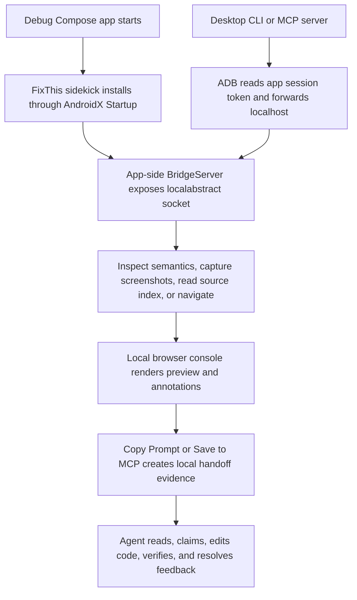

# FixThis Project Map

FixThis attaches a debug-only sidekick runtime to a Jetpack Compose app, mirrors UI context into a local desktop console, and turns UI annotations into source-aware handoffs for coding agents.

Use this page when you need to understand where to start. For the long-form
maintainer explanation, read [Fullstack/tooling handover](fullstack-tooling-handover.md).
For task-by-task agent navigation before editing, read
[Agent code compass](../architecture/agent-code-compass.md). For stable API,
CLI, MCP, bridge, and persisted JSON behavior, prefer the reference docs under
[`docs/reference/`](../reference/).

## Source-Of-Truth Priority

When sources disagree, use this order:

1. Current Kotlin, JavaScript, Gradle, shell, and Markdown implementation.
2. `docs/reference/*` for stable CLI, MCP, bridge, output schema, privacy, compatibility, and console contracts.
3. `CONTRIBUTING.md`, `docs/contributing/*`, and release docs for required checks and release state.
4. `docs/guides/*`, `docs/architecture/*`, and `docs/product/*` for explanations and navigation.
5. `docs/superpowers/*`, `docs/specs/*`, and `docs/plans/*` for historical planning context.

Historical planning files are useful for understanding why work happened. They are not current contracts unless a maintained guide, reference page, or source file explicitly points to them.

## Runtime Flow

The Android app does not host MCP or HTTP. The desktop `fixthis-mcp` process owns the local HTTP console, MCP tools, session store, and `.fixthis/feedback-sessions/` queue.

## Module Map

| Module | Responsibility | Must Not Depend On | Start With | Focused Checks |
| --- | --- | --- | --- | --- |
| `:app` (`sample/`) | Validation sample app and product-scene fixtures | External-app-only shortcuts or hidden contracts | `sample/src/main/java/io/github/beyondwin/fixthis/sample/FixThisStudioApp.kt` | `./gradlew :app:assembleDebug` |
| `:fixthis-compose-core` | Pure Kotlin domain: selection, source matching, target evidence, reliability, formatter, redaction | Android UI, MCP, CLI, browser DTOs, `.fixthis/` paths | `fixthis-compose-core/src/main/kotlin/io/github/beyondwin/fixthis/compose/core/source/SourceMatcher.kt` | `./gradlew :fixthis-compose-core:test --no-daemon` |
| `:fixthis-compose-sidekick` | Debug runtime inside the target app: startup, lifecycle, semantics, screenshot, local socket bridge | MCP session storage, desktop console state, browser DOM | `fixthis-compose-sidekick/src/main/kotlin/io/github/beyondwin/fixthis/compose/sidekick/bridge/BridgeServer.kt` | `./gradlew :fixthis-compose-sidekick:testDebugUnitTest --no-daemon` |
| `fixthis-gradle-plugin` | Debug variant wiring and source-index/build metadata generation | Running device state, MCP queue state, browser session state | `fixthis-gradle-plugin/src/main/kotlin/io/github/beyondwin/fixthis/gradle/FixThisGradlePlugin.kt` | `./gradlew :fixthis-gradle-plugin:test --no-daemon` |
| `:fixthis-cli` | Desktop command surface, ADB bridge client, setup/install/doctor/run commands | Browser DOM state or MCP internals | `fixthis-cli/src/main/kotlin/io/github/beyondwin/fixthis/cli/Main.kt` | `./gradlew :fixthis-cli:test --no-daemon` |
| `:fixthis-mcp` | MCP stdio server, local feedback console, session store, handoff rendering, queue tools | Android-only APIs or app-private files outside bridge/CLI adapters | `fixthis-mcp/src/main/kotlin/io/github/beyondwin/fixthis/mcp/session/FeedbackSessionService.kt` | `./gradlew :fixthis-mcp:test --no-daemon` |

## Work Routes

| Work Type | First Docs | First Source Files | Verification |
| --- | --- | --- | --- |
| External app setup | `docs/getting-started/add-to-your-app.md`, `docs/reference/cli.md`, `docs/reference/agent-setup-schema.md` | `fixthis-cli/src/main/kotlin/io/github/beyondwin/fixthis/cli/commands/InstallAgentCommand.kt`, `fixthis-cli/src/main/kotlin/io/github/beyondwin/fixthis/cli/commands/DoctorCommand.kt` | `bash scripts/check-docs-cli-surface.sh`, `./gradlew :fixthis-cli:test --no-daemon` |
| Agent and MCP workflow | `docs/getting-started/connect-your-agent.md`, `docs/guides/agents.md`, `docs/reference/mcp-tools.md` | `fixthis-mcp/src/main/kotlin/io/github/beyondwin/fixthis/mcp/tools/FixThisTools.kt`, `fixthis-mcp/src/main/kotlin/io/github/beyondwin/fixthis/mcp/tools/McpToolRegistry.kt` | `./gradlew :fixthis-mcp:test --no-daemon` |
| Compact handoff or output schema | `docs/reference/output-schema.md`, `docs/reference/feedback-console-contract.md`, `docs/design/handoff-prompt-rationale.md` | `fixthis-mcp/src/main/kotlin/io/github/beyondwin/fixthis/mcp/session/handoff/CompactHandoffRenderer.kt`, `fixthis-compose-core/src/main/kotlin/io/github/beyondwin/fixthis/compose/core/format/FixThisMarkdownFormatter.kt` | `npm run handoff:eval:test`, `./gradlew :fixthis-mcp:test --no-daemon` |
| Source matching and target reliability | `docs/reference/source-matching.md`, `docs/reference/output-schema.md` | `fixthis-compose-core/src/main/kotlin/io/github/beyondwin/fixthis/compose/core/source/SourceMatcher.kt`, `fixthis-compose-core/src/main/kotlin/io/github/beyondwin/fixthis/compose/core/target/TargetReliabilityCalculator.kt` | `npm run source-matching:fixtures:test`, `./gradlew :fixthis-compose-core:test --no-daemon` |
| Bridge protocol and Android runtime | `docs/reference/bridge-protocol.md`, `docs/architecture/overview.md` | `fixthis-compose-sidekick/src/main/kotlin/io/github/beyondwin/fixthis/compose/sidekick/bridge/BridgeServer.kt`, `fixthis-cli/src/main/kotlin/io/github/beyondwin/fixthis/cli/BridgeClient.kt` | `./gradlew :fixthis-compose-sidekick:testDebugUnitTest :fixthis-cli:test --no-daemon` |
| Console UI and session lifecycle | `docs/reference/feedback-console-contract.md`, `docs/architecture/console-state-sync-design.md` | `fixthis-mcp/src/main/console/app.js`, `fixthis-mcp/src/main/kotlin/io/github/beyondwin/fixthis/mcp/session/FeedbackSessionService.kt` | `npm run console:test:fast`, `./gradlew :fixthis-mcp:test --no-daemon` |
| Runtime evidence collection and handoff policy | `docs/reference/mcp-tools.md`, `docs/reference/output-schema.md`, `docs/reference/privacy.md` | `fixthis-cli/src/main/kotlin/io/github/beyondwin/fixthis/cli/runtime/AndroidRuntimeEvidenceCollector.kt`, `fixthis-mcp/src/main/kotlin/io/github/beyondwin/fixthis/mcp/session/runtime/RuntimeEvidenceCaptureCoordinator.kt`, `fixthis-mcp/src/main/console/runtimeEvidence.js` | `npm run runtime-evidence:smoke:test`, `npm run runtime-evidence:smoke -- --strict`, `npm run android:proof -- --strict` |
| Release readiness | `docs/contributing/release-readiness.md`, `docs/contributing/release-process.md`, `CONTRIBUTING.md` | `scripts/check-release-readiness.mjs`, `scripts/evidence-runner.mjs`, `scripts/release-gate.mjs`, `package.json` | `npm run release:check` |
| Architecture and guardrails | `docs/architecture/agent-code-compass.md`, `docs/architecture/adr/README.md`, `docs/architecture/adr/0008-session-package-decomposition.md` | `fixthis-mcp/src/test/kotlin/io/github/beyondwin/fixthis/mcp/architecture/ModuleBoundaryTest.kt`, `fixthis-mcp/src/test/kotlin/io/github/beyondwin/fixthis/mcp/architecture/SessionPackageBoundaryTest.kt`, `fixthis-mcp/src/test/kotlin/io/github/beyondwin/fixthis/mcp/architecture/ArchitectureHotspotBudgetTest.kt` | `./gradlew :fixthis-mcp:test --tests '*architecture*' --no-daemon`, `git diff --check` |

## Artifact Boundaries

- Do not commit `.fixthis/`; it contains local handoff sessions, screenshots,
  generated setup handoffs, smoke artifacts, and bounded runtime evidence under
  `.fixthis/runtime-evidence/<session-id>/<capture-id>/`.
- Do not commit Android build outputs, local source-matching fixture workspaces, or screenshots unless a maintained doc explicitly asks for a checked-in asset.
- When changing code, run the focused checks for the touched module, then the broader check requested by `CONTRIBUTING.md` or the release workflow.
- When changing docs that mention CLI commands or flags, run `bash scripts/check-docs-cli-surface.sh`.
- Runtime evidence collection is a host CLI/MCP capability over ADB. It does
  not add app-side Bridge capabilities or change Bridge protocol `1.3`.

## Next Reads

- [Documentation index](../index.md) for all maintained docs.
- [Architecture overview](../architecture/overview.md) for module and runtime detail.
- [Agent code compass](../architecture/agent-code-compass.md) for task-by-task source, boundary, and check routing before code edits.
- [Fullstack/tooling handover](fullstack-tooling-handover.md) for deep maintainer onboarding.
- [MCP tools reference](../reference/mcp-tools.md) for agent tool contracts.
- [Output schema](../reference/output-schema.md) for persisted JSON and handoff fields.
- [Contributing](../../CONTRIBUTING.md) for local validation and release checks.
