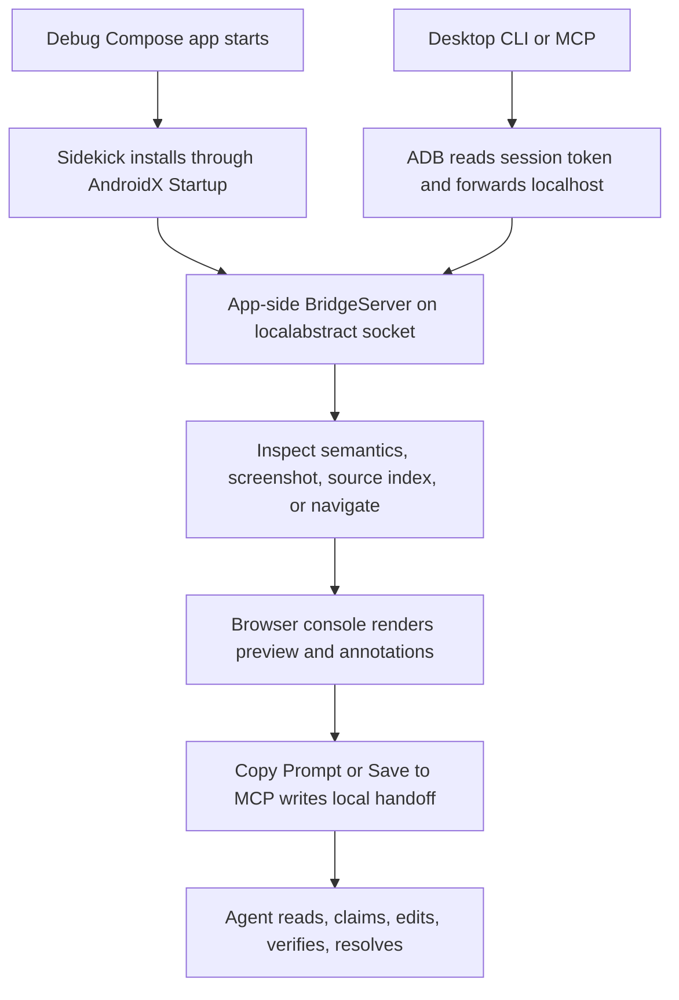

# FixThis Project Map

FixThis attaches a debug-only sidekick to a Jetpack Compose app, mirrors the
UI into a local desktop console, and turns annotations into source-aware
handoffs.

Deep maintainer notes: [tooling handover](fullstack-tooling-handover.md).
Task-by-task source routing: [agent code compass](../architecture/agent-code-compass.md).
Stable contracts: [`docs/reference/`](../reference/).

## Source Of Truth

When sources disagree:

1. Current Kotlin, JavaScript, Gradle, shell, and Markdown implementation.
2. `docs/reference/*` for CLI, MCP, bridge, output schema, privacy,
   compatibility, and console contracts.
3. `CONTRIBUTING.md`, `docs/contributing/*`, and release docs for required
   checks and release state.
4. `docs/guides/*`, `docs/architecture/*`, and `docs/product/*` for explanations.
5. `docs/superpowers/*`, `docs/specs/*`, and `docs/plans/*` for historical
   planning only. Each of those folders has a README saying they are not
   current contracts. Tagged `docs/releases/vX.Y.Z.md` notes are frozen.

Historical files explain why work happened. They are not current contracts
unless a maintained page or source file points to them.

## Runtime Flow

```mermaid
flowchart TD
    A["Debug Compose app starts"] --> B["Sidekick installs through AndroidX Startup"]
    B --> C["App-side BridgeServer on localabstract socket"]
    D["Desktop CLI or MCP"] --> E["ADB reads session token and forwards localhost"]
    E --> C
    C --> F["Inspect semantics, screenshot, source index, or navigate"]
    F --> G["Browser console renders preview and annotations"]
    G --> H["Copy Prompt or Save to MCP writes local handoff"]
    H --> I["Agent reads, claims, edits, verifies, resolves"]
```

The Android app does not host MCP or HTTP. Desktop `fixthis-mcp` owns the
local HTTP console, MCP tools, session store, and `.fixthis/feedback-sessions/`.

## Module Map

| Module | Responsibility | Must not depend on | Start with | Focused checks |
| --- | --- | --- | --- | --- |
| `:app` (`sample/`) | Validation sample | External-app-only shortcuts | `sample/src/main/java/io/github/beyondwin/fixthis/sample/FixThisStudioApp.kt` | `./gradlew :app:assembleDebug` |
| `:fixthis-compose-core` | Pure Kotlin domain: selection, source matching, target evidence, formatter, redaction | Android UI, MCP, CLI, browser DTOs, `.fixthis/` paths | `fixthis-compose-core/src/main/kotlin/io/github/beyondwin/fixthis/compose/core/source/SourceMatcher.kt` | `./gradlew :fixthis-compose-core:test --no-daemon` |
| `:fixthis-compose-sidekick` | Debug runtime: startup, lifecycle, semantics, screenshot, local socket | MCP storage, desktop console, browser DOM | `fixthis-compose-sidekick/src/main/kotlin/io/github/beyondwin/fixthis/compose/sidekick/bridge/BridgeServer.kt` | `./gradlew :fixthis-compose-sidekick:testDebugUnitTest --no-daemon` |
| `fixthis-gradle-plugin` | Debug variant wiring and source-index generation | Device state, MCP queue, browser session | `fixthis-gradle-plugin/src/main/kotlin/io/github/beyondwin/fixthis/gradle/FixThisGradlePlugin.kt` | `./gradlew :fixthis-gradle-plugin:test --no-daemon` |
| `:fixthis-cli` | Desktop commands, ADB bridge client | Browser DOM or MCP internals | `fixthis-cli/src/main/kotlin/io/github/beyondwin/fixthis/cli/Main.kt` | `./gradlew :fixthis-cli:test --no-daemon` |
| `:fixthis-mcp` | MCP stdio server, console, session store, handoff, queue | Android-only APIs | `fixthis-mcp/src/main/kotlin/io/github/beyondwin/fixthis/mcp/session/FeedbackSessionService.kt` | `./gradlew :fixthis-mcp:test --no-daemon` |

## Work Routes

| Work | First docs | First source | Verification |
| --- | --- | --- | --- |
| External app setup | `docs/getting-started/add-to-your-app.md`, `docs/reference/cli.md`, `docs/reference/agent-setup-schema.md` | `fixthis-cli/src/main/kotlin/io/github/beyondwin/fixthis/cli/commands/SetupCommand.kt`, `fixthis-cli/src/main/kotlin/io/github/beyondwin/fixthis/cli/commands/DoctorCommand.kt` | `bash scripts/check-docs-cli-surface.sh`, `./gradlew :fixthis-cli:test --no-daemon` |
| Agent and MCP | `docs/getting-started/connect-your-agent.md`, `docs/guides/agents.md`, `docs/reference/mcp-tools.md` | `fixthis-mcp/src/main/kotlin/io/github/beyondwin/fixthis/mcp/tools/FixThisTools.kt`, `fixthis-mcp/src/main/kotlin/io/github/beyondwin/fixthis/mcp/tools/McpToolRegistry.kt` | `./gradlew :fixthis-mcp:test --no-daemon` |
| Compact handoff | `docs/reference/output-schema.md`, `docs/reference/feedback-console-contract.md`, `docs/design/handoff-prompt-rationale.md` | `fixthis-mcp/src/main/kotlin/io/github/beyondwin/fixthis/mcp/session/handoff/CompactHandoffRenderer.kt`, `fixthis-compose-core/src/main/kotlin/io/github/beyondwin/fixthis/compose/core/format/FixThisMarkdownFormatter.kt` | `npm run handoff:eval:test`, `./gradlew :fixthis-mcp:test --no-daemon` |
| Source matching | `docs/reference/source-matching.md`, `docs/reference/output-schema.md` | `fixthis-compose-core/src/main/kotlin/io/github/beyondwin/fixthis/compose/core/source/SourceMatcher.kt`, `fixthis-compose-core/src/main/kotlin/io/github/beyondwin/fixthis/compose/core/target/TargetReliabilityCalculator.kt` | `npm run source-matching:fixtures:test`, `./gradlew :fixthis-compose-core:test --no-daemon` |
| Bridge / Android runtime | `docs/reference/bridge-protocol.md`, `docs/architecture/overview.md` | `fixthis-compose-sidekick/src/main/kotlin/io/github/beyondwin/fixthis/compose/sidekick/bridge/BridgeServer.kt`, `fixthis-cli/src/main/kotlin/io/github/beyondwin/fixthis/cli/BridgeClient.kt` | `./gradlew :fixthis-compose-sidekick:testDebugUnitTest :fixthis-cli:test --no-daemon` |
| Console UI | `docs/reference/feedback-console-contract.md`, `docs/architecture/console-state-sync-design.md` | `fixthis-mcp/src/main/console/consoleApp.js`, `fixthis-mcp/src/main/kotlin/io/github/beyondwin/fixthis/mcp/session/FeedbackSessionService.kt` | `npm run console:test:fast`, `./gradlew :fixthis-mcp:test --no-daemon` |
| Runtime evidence | `docs/reference/mcp-tools.md`, `docs/reference/output-schema.md`, `docs/reference/privacy.md` | `fixthis-cli/src/main/kotlin/io/github/beyondwin/fixthis/cli/runtime/AndroidRuntimeEvidenceCollector.kt`, `fixthis-mcp/src/main/kotlin/io/github/beyondwin/fixthis/mcp/session/runtime/RuntimeEvidenceCaptureCoordinator.kt`, `fixthis-mcp/src/main/console/runtimeEvidence.js` | `npm run runtime-evidence:smoke:test`, `npm run runtime-evidence:smoke -- --strict`, `npm run android:proof -- --strict` |
| Agent routing | `AGENTS.md`, `docs/architecture/agent-code-compass.md` | `scripts/agent-route-registry.mjs`, `scripts/agent-task-router.mjs`, `scripts/agent-guidance-contract-test.mjs` | `npm run agent:route:test`, `npm run docs:agent-guidance:test`, `npm run plugin:contract:test` |
| Release | `docs/contributing/release-readiness.md`, `docs/contributing/release-process.md`, `CONTRIBUTING.md` | `scripts/check-release-readiness.mjs`, `scripts/evidence-runner.mjs`, `scripts/release-gate.mjs`, `package.json` | `npm run release:check` |
| Architecture | `docs/architecture/agent-code-compass.md`, `docs/architecture/adr/README.md`, `docs/architecture/adr/0008-session-package-decomposition.md` | `fixthis-mcp/src/test/kotlin/io/github/beyondwin/fixthis/mcp/architecture/ModuleBoundaryTest.kt`, `fixthis-mcp/src/test/kotlin/io/github/beyondwin/fixthis/mcp/architecture/SessionPackageBoundaryTest.kt`, `fixthis-mcp/src/test/kotlin/io/github/beyondwin/fixthis/mcp/architecture/ArchitectureHotspotBudgetTest.kt` | `./gradlew :fixthis-mcp:test --tests '*architecture*' --no-daemon`, `git diff --check` |

## Artifact Boundaries

- Do not commit `.fixthis/`. It holds sessions, screenshots, setup handoffs,
  smoke artifacts, and runtime evidence under
  `.fixthis/runtime-evidence/<session-id>/<capture-id>/`.
- Do not commit Android build outputs, fixture workspaces, or screenshots
  unless a maintained doc asks for a checked-in asset.
- After a code change, run the focused module checks, then the broader
  `CONTRIBUTING.md` or release check.
- After a docs change that mentions CLI commands or flags, run
  `bash scripts/check-docs-cli-surface.sh`.
- Runtime evidence is a host CLI/MCP capability over ADB. It does not add
  app-side Bridge methods or change Bridge protocol `1.3`.

## Next

- [Docs index](../index.md)
- [Architecture overview](../architecture/overview.md)
- [Agent code compass](../architecture/agent-code-compass.md)
- [MCP tools](../reference/mcp-tools.md)
- [Output schema](../reference/output-schema.md)
- [Contributing](../../CONTRIBUTING.md)
