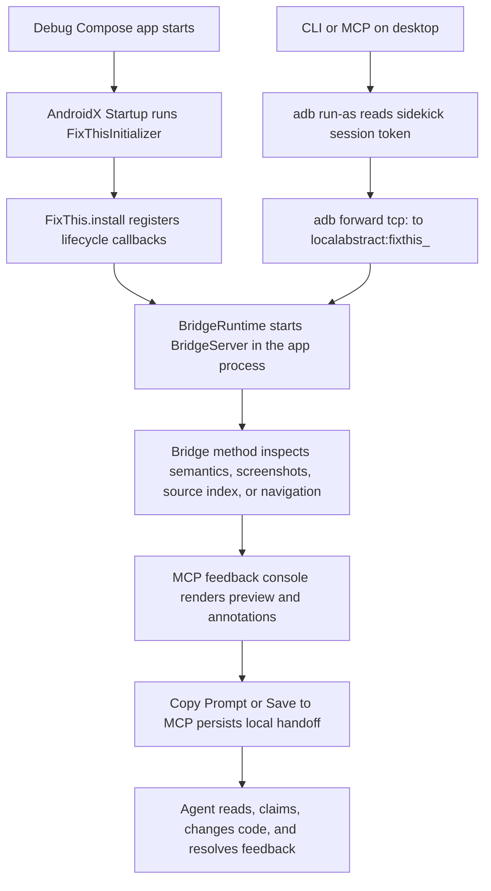

# FixThis Fullstack Tooling Handover Guide Implementation Plan

> **For agentic workers:** REQUIRED SUB-SKILL: Use superpowers:subagent-driven-development (recommended) or superpowers:executing-plans to implement this plan task-by-task. Steps use checkbox (`- [ ]`) syntax for tracking.

**Goal:** Create a single Korean handover guide that teaches new fullstack/tooling maintainers how FixThis is built, why its technologies were chosen, and how the real maintenance flows move through the repo.

**Architecture:** Add one new guide under `docs/guides/` and expose it from `docs/index.md`. The guide links to canonical architecture/reference docs, but the explanatory narrative is self-contained enough for a first handover read. Implementation is docs-only: no Kotlin, JavaScript, Gradle, CLI, MCP, or Android behavior changes.

**Tech Stack:** Markdown, Mermaid, existing FixThis docs, source-path references, `node scripts/check-doc-consistency.mjs`, `git diff --check`, `graphify update .`.

---

## File Structure

- Create `docs/guides/fullstack-tooling-handover.md`: long-form Korean onboarding and handover guide.
- Modify `docs/index.md`: add one discoverable link to the new guide in the guide-oriented "Start Here" table.
- Read-only evidence anchors:
  - `README.md`
  - `CONTRIBUTING.md`
  - `docs/architecture/overview.md`
  - `docs/product/decision-rationale.md`
  - `docs/reference/mcp-tools.md`
  - `docs/reference/feedback-console-contract.md`
  - `docs/reference/output-schema.md`
  - `docs/reference/bridge-protocol.md`
  - `settings.gradle.kts`
  - `gradle/libs.versions.toml`
  - module `build.gradle.kts` files
  - representative Kotlin and console source files named in the guide

## Task 1: Re-Verify Source And Contract Anchors

**Files:**
- Read: `README.md`
- Read: `CONTRIBUTING.md`
- Read: `docs/architecture/overview.md`
- Read: `docs/product/decision-rationale.md`
- Read: `docs/reference/mcp-tools.md`
- Read: `docs/reference/feedback-console-contract.md`
- Read: `docs/reference/output-schema.md`
- Read: `docs/reference/bridge-protocol.md`
- Read: `settings.gradle.kts`
- Read: `gradle/libs.versions.toml`
- Read: `fixthis-compose-sidekick/src/main/kotlin/io/github/beyondwin/fixthis/compose/sidekick/bridge/BridgeProtocol.kt`
- Read: `fixthis-mcp/src/main/kotlin/io/github/beyondwin/fixthis/mcp/tools/McpToolRegistry.kt`
- Read: `fixthis-mcp/src/main/kotlin/io/github/beyondwin/fixthis/mcp/session/dto/SessionDtoModels.kt`
- Read: `fixthis-gradle-plugin/src/main/kotlin/io/github/beyondwin/fixthis/gradle/FixThisGradlePlugin.kt`

- [ ] **Step 1: Confirm the workspace is clean**

Run:

```bash
git status --short
```

Expected: no output, or only unrelated user changes that are not touched by this plan.

- [ ] **Step 2: Confirm module names and included builds**

Run:

```bash
sed -n '1,120p' settings.gradle.kts
```

Expected: output includes `includeBuild("fixthis-gradle-plugin")`, `include(":app")`, `project(":app").projectDir = file("sample")`, `include(":fixthis-compose-core")`, `include(":fixthis-compose-sidekick")`, `include(":fixthis-cli")`, and `include(":fixthis-mcp")`.

- [ ] **Step 3: Confirm current technology versions and libraries**

Run:

```bash
sed -n '1,120p' gradle/libs.versions.toml
```

Expected: output includes JDK/Kotlin/AGP-adjacent dependencies used in the guide, including `kotlin`, `agp`, `composeBom`, `startup`, `serialization`, `coroutines`, `clikt`, `junit`, `robolectric`, `spotless`, and `detekt`.

- [ ] **Step 4: Confirm MCP tool names from maintained docs**

Run:

```bash
rg -n "^`fixthis_|fixthis_(status|get_current_screen|verify_ui_change|open_feedback_console|list_feedback_sessions|capture_screen|navigate_app|list_feedback|read_feedback|claim_feedback|resolve_feedback)`" docs/reference/mcp-tools.md AGENTS.md
```

Expected: output contains the public tool names the guide will list: `fixthis_status`, `fixthis_get_current_screen`, `fixthis_verify_ui_change`, `fixthis_open_feedback_console`, `fixthis_list_feedback_sessions`, `fixthis_capture_screen`, `fixthis_navigate_app`, `fixthis_list_feedback`, `fixthis_read_feedback`, `fixthis_claim_feedback`, and `fixthis_resolve_feedback`.

- [ ] **Step 5: Confirm compatibility field names from output/session contracts**

Run:

```bash
rg -n "items|screens|itemId|screenId|targetEvidence|targetReliability|sourceCandidates|editSurfaceCandidates" docs/reference/output-schema.md docs/architecture/overview.md fixthis-mcp/src/main/kotlin/io/github/beyondwin/fixthis/mcp/session/dto/SessionDtoModels.kt
```

Expected: output confirms those names are current persisted/session compatibility anchors.

- [ ] **Step 6: Confirm bridge protocol and app-side boundary**

Run:

```bash
sed -n '1,220p' docs/reference/bridge-protocol.md
sed -n '1,220p' fixthis-compose-sidekick/src/main/kotlin/io/github/beyondwin/fixthis/compose/sidekick/bridge/BridgeProtocol.kt
```

Expected: docs state the Android app does not host MCP/HTTP, and source confirms the current bridge protocol/capability names used by the guide.

- [ ] **Step 7: Confirm canonical docs-only verification commands**

Run:

```bash
rg -n "check-doc-consistency|git diff --check|graphify update|spotlessCheck|detekt" CONTRIBUTING.md AGENTS.md docs/architecture/overview.md
```

Expected: output supports the guide's verification section and docs-only validation plan.

## Task 2: Create The Guide Skeleton

**Files:**
- Create: `docs/guides/fullstack-tooling-handover.md`

- [ ] **Step 1: Create the new guide with the approved section structure**

Create `docs/guides/fullstack-tooling-handover.md` with this initial content:

````markdown
# FixThis 풀스택/툴링 인수인계 가이드

이 문서는 FixThis를 처음 인수인계 받는 풀스택/툴링 개발자를 위한 긴 형식의 가이드입니다. Android Compose 앱 안에서 수집한 UI 근거가 어떻게 데스크톱 CLI/MCP, 브라우저 콘솔, 로컬 `.fixthis/` handoff로 이어지는지 한 흐름으로 설명합니다.

기존 문서를 대체하지 않습니다. 빠른 제품 이해는 [README](../../README.md), 현재 아키텍처 지도는 [Architecture overview](../architecture/overview.md), 결정 근거는 [Decision rationale](../product/decision-rationale.md), 호환성 계약은 [Reference docs](../index.md#reference-contracts), 검증 명령은 [CONTRIBUTING](../../CONTRIBUTING.md)을 우선합니다.

## 이 문서를 읽는 방법

## FixThis를 한 문장으로 이해하기

## 전체 시스템 흐름



## 프로젝트 구성과 모듈 책임

## 기술선정 이유와 장단점

## 실제 로직 추적

## 데이터와 저장소 구조

## 호환성 계약과 금지사항

## 변경 유형별 작업 가이드

## 검증 명령과 실패 해석

## 처음 3일 온보딩 루트
````

- [ ] **Step 2: Check Markdown fence balance**

Run:

```bash
python3 - <<'PY'
from pathlib import Path
p = Path("docs/guides/fullstack-tooling-handover.md")
text = p.read_text()
count = text.count("```")
print(f"fence_count={count}")
raise SystemExit(0 if count % 2 == 0 else 1)
PY
```

Expected: prints an even `fence_count` and exits successfully.

- [ ] **Step 3: Commit the skeleton**

Run:

```bash
git add docs/guides/fullstack-tooling-handover.md
git commit -m "docs: add fullstack handover guide skeleton"
```

Expected: commit succeeds with only the new guide skeleton staged.

## Task 3: Fill Product Boundary And Module Ownership Sections

**Files:**
- Modify: `docs/guides/fullstack-tooling-handover.md`

- [ ] **Step 1: Replace the reading, one-line summary, flow, and module sections**

Edit `docs/guides/fullstack-tooling-handover.md` so the first four sections contain these concrete points in Korean prose:

```markdown
## 이 문서를 읽는 방법

- 첫 번째 독자는 Android만 아는 개발자와 CLI/MCP만 아는 개발자 모두입니다.
- 이 문서는 "처음 읽는 길잡이"이고, 호환성 계약은 reference 문서가 source of truth입니다.
- 문서가 충돌하면 현재 코드, `docs/reference/*`, `CONTRIBUTING.md`를 우선합니다.
- 코드 검색을 쉽게 하도록 public tool name, class name, file path는 번역하지 않습니다.

## FixThis를 한 문장으로 이해하기

FixThis는 Jetpack Compose debug 앱 안에 작은 sidekick runtime을 붙이고, 현재 화면의 semantics, screenshot, source candidate, 사용자의 annotation을 로컬 desktop MCP/브라우저 콘솔로 넘겨 AI coding agent가 수정할 위치와 근거를 빠르게 이해하게 만드는 도구입니다.

핵심 경계는 네 가지입니다.

- Debug-only: release build에는 들어가면 안 됩니다.
- Compose-only: V1은 Compose semantics를 중심으로 동작합니다.
- Local-first: screenshot, semantics, handoff는 로컬 파일과 localhost/ADB 안에서 처리됩니다.
- MCP/browser-console-first: 앱 안에서 annotation하지 않고 데스크톱 브라우저 콘솔에서 선택, 작성, 저장합니다.

## 전체 시스템 흐름

다이어그램 아래에 Android app process, desktop CLI/MCP process, browser console, `.fixthis/` local persistence가 각각 무엇을 맡는지 설명합니다.

## 프로젝트 구성과 모듈 책임

각 모듈은 아래 형식으로 설명합니다.

### `:app` (`sample/`)

- Responsibility: validation sample app.
- Must not depend on: product-only shortcuts that hide real external-app behavior.
- First files to open: `sample/build.gradle.kts`, `sample/src/main/java/io/github/beyondwin/fixthis/sample/MainActivity.kt`, `sample/src/main/java/io/github/beyondwin/fixthis/sample/FixThisStudioApp.kt`.
- Important tests: sample connected tests and smoke commands in `CONTRIBUTING.md`.
- Common change types: sample scenarios, semantics coverage, visual fixture screens.

### `:fixthis-compose-core`

- Responsibility: pure Kotlin domain, selection, source matching, target evidence, reliability, formatters, use cases.
- Must not depend on: MCP, CLI, Android UI surfaces, `.fixthis/` paths, browser DTOs.
- First files to open: `SourceMatcher.kt`, `NodeSelector.kt`, `TargetEvidenceFactory.kt`, `TargetReliabilityCalculator.kt`, formatter files.
- Important tests: `:fixthis-compose-core:test`.
- Common change types: scoring policy, confidence wording, identity/occurrence logic, formatter behavior.

### `:fixthis-compose-sidekick`

- Responsibility: debug Android runtime installed in target app.
- Must not depend on: MCP session storage or desktop console state.
- First files to open: `FixThisInitializer.kt`, `FixThis.kt`, `BridgeServer.kt`, `SemanticsInspector.kt`, `ScreenshotCapturer.kt`.
- Important tests: `:fixthis-compose-sidekick:testDebugUnitTest`, connected tests when bridge/runtime behavior changes.
- Common change types: bridge methods, lifecycle, screenshot capture, semantics mapping, status pill.

### `fixthis-gradle-plugin/`

- Responsibility: add debug runtime and generate source-index/build metadata assets.
- Must not depend on: running device state or MCP session files.
- First files to open: `FixThisGradlePlugin.kt`, `GenerateFixThisSourceIndexTask.kt`, source scanner files.
- Important tests: `:fixthis-gradle-plugin:test`.
- Common change types: install wiring, source scanner, generated asset schema.

### `:fixthis-cli`

- Responsibility: desktop command surface and ADB bridge client.
- Must not depend on: browser DOM state or MCP session internals beyond public setup behavior.
- First files to open: `Main.kt`, `DoctorCommand.kt`, `RunCommand.kt`, `SetupCommand.kt`, `BridgeClient.kt`, `Adb.kt`.
- Important tests: `:fixthis-cli:test`.
- Common change types: command flags, doctor JSON, package resolution, setup writers, ADB discovery.

### `:fixthis-mcp`

- Responsibility: stdio MCP server, local HTTP feedback console, session store, handoff rendering, queue tools.
- Must not depend on: Android-only APIs except through CLI/bridge adapters.
- First files to open: `McpServer.kt`, `McpProtocol.kt`, `FixThisTools.kt`, `FeedbackConsoleServer.kt`, `FeedbackSessionService.kt`, `session/`, `console/`, `src/main/console/`.
- Important tests: `:fixthis-mcp:test`, console JS tests, connected smoke when runtime path changes.
- Common change types: MCP tools, console routes, draft workflow, Save to MCP, event log, compact handoff.
```

- [ ] **Step 2: Verify the module section names are searchable**

Run:

```bash
rg -n ":fixthis-compose-core|:fixthis-compose-sidekick|fixthis-gradle-plugin|:fixthis-cli|:fixthis-mcp|FixThisInitializer|FeedbackSessionService" docs/guides/fullstack-tooling-handover.md
```

Expected: output includes all module names and representative entry files.

- [ ] **Step 3: Commit product boundary and module sections**

Run:

```bash
git add docs/guides/fullstack-tooling-handover.md
git commit -m "docs: explain fixthis module ownership"
```

Expected: commit succeeds with only guide changes staged.

## Task 4: Fill Technology Choice Sections

**Files:**
- Modify: `docs/guides/fullstack-tooling-handover.md`

- [ ] **Step 1: Add the fixed technology-choice format**

Under `## 기술선정 이유와 장단점`, add a short introduction and then one subsection per technology. Every subsection must include these bullets:

```markdown
- FixThis에서 하는 역할:
- 왜 이 기술을 선택했나:
- 장점:
- 단점/한계:
- 변경하거나 확장할 때 고려할 점:
- 관련 코드/문서:
```

- [ ] **Step 2: Add the required technology subsections**

Add subsections for:

```markdown
### Jetpack Compose semantics
### `debugImplementation`과 debuggable guard
### AndroidX Startup
### Android local socket과 ADB forward
### MCP stdio JSON-RPC
### Kotlin/JVM과 `kotlinx.serialization`
### Clikt 기반 CLI
### Gradle plugin과 source index
### Plain browser JavaScript console
### SSE와 polling fallback
### Local file persistence와 event log
### JUnit, Robolectric, connected Android tests, console JS tests
### Spotless, detekt, release/trust gates
```

For each subsection, include at least one concrete related path or document link. Use these anchors where relevant:

```markdown
`docs/product/decision-rationale.md`
`docs/reference/bridge-protocol.md`
`docs/reference/mcp-tools.md`
`docs/reference/feedback-console-contract.md`
`docs/reference/output-schema.md`
`fixthis-compose-core/src/main/kotlin/io/github/beyondwin/fixthis/compose/core/`
`fixthis-compose-sidekick/src/main/kotlin/io/github/beyondwin/fixthis/compose/sidekick/`
`fixthis-cli/src/main/kotlin/io/github/beyondwin/fixthis/cli/`
`fixthis-mcp/src/main/kotlin/io/github/beyondwin/fixthis/mcp/`
`fixthis-mcp/src/main/console/`
`fixthis-gradle-plugin/src/main/kotlin/io/github/beyondwin/fixthis/gradle/`
`CONTRIBUTING.md`
```

- [ ] **Step 3: Check every subsection has the full bullet shape**

Run:

```bash
python3 - <<'PY'
from pathlib import Path
text = Path("docs/guides/fullstack-tooling-handover.md").read_text()
start = text.index("## 기술선정 이유와 장단점")
end = text.index("## 실제 로직 추적")
section = text[start:end]
required = [
    "- FixThis에서 하는 역할:",
    "- 왜 이 기술을 선택했나:",
    "- 장점:",
    "- 단점/한계:",
    "- 변경하거나 확장할 때 고려할 점:",
    "- 관련 코드/문서:",
]
blocks = [b for b in section.split("\\n### ") if b.strip() and not b.startswith("## ")]
missing = []
for block in blocks:
    title = block.splitlines()[0]
    for marker in required:
        if marker not in block:
            missing.append(f"{title}: {marker}")
if missing:
    print("\\n".join(missing))
    raise SystemExit(1)
print(f"checked={len(blocks)}")
PY
```

Expected: prints `checked=13`.

- [ ] **Step 4: Commit technology-choice sections**

Run:

```bash
git add docs/guides/fullstack-tooling-handover.md
git commit -m "docs: document fixthis technology tradeoffs"
```

Expected: commit succeeds with only guide changes staged.

## Task 5: Fill Real Logic, Data, Contracts, Runbook, Verification, And Onboarding Sections

**Files:**
- Modify: `docs/guides/fullstack-tooling-handover.md`

- [ ] **Step 1: Add the fixed real-flow format**

Under `## 실제 로직 추적`, add a short introduction and one subsection for each flow. Every flow subsection must include these bullets:

```markdown
- 사용자가 보는 동작:
- 시작 명령/도구:
- 핵심 코드 경로:
- 데이터가 이동하는 방식:
- 실패할 수 있는 지점:
- 수정할 때 먼저 볼 테스트:
```

- [ ] **Step 2: Add the required real-flow subsections**

Add subsections for:

```markdown
### 외부 앱 설치: `fixthis install-agent`
### 상태 진단: `fixthis doctor --json`
### 샘플 실행: `fixthis run`
### 앱 내부 sidekick 시작
### Bridge 요청 처리
### Compose screen inspection
### Source matching
### Feedback console 열기
### Live preview와 Annotate
### `Copy Prompt`와 `Save to MCP`
### Agent queue 처리: read/claim/resolve
### `fixthis_verify_ui_change`
```

Each flow must include at least two concrete source paths or reference docs.

- [ ] **Step 3: Fill data and storage model**

Under `## 데이터와 저장소 구조`, explain these exact artifacts:

```markdown
- `files/fixthis/session.json`
- `cache/fixthis/<yyyy-MM-dd>/<annotation-id>-full.png`
- `cache/fixthis/<yyyy-MM-dd>/<annotation-id>-crop.png`
- `.fixthis/project.json`
- `.fixthis/feedback-sessions/<session-id>/session.json`
- `.fixthis/feedback-sessions/<session-id>/events/`
- `.fixthis/feedback-sessions/index.json`
- `.fixthis/preview-cache/<session-id>/`
- `localStorage["fixthis.workspace.<sessionId>.<workspaceId>"]`
```

State that per-session `session.json` is authoritative, `index.json` is derived, and `.fixthis/` remains local-only.

- [ ] **Step 4: Fill compatibility contracts and forbidden moves**

Under `## 호환성 계약과 금지사항`, include bullets for:

```markdown
- debug-only scope
- Compose-only V1 scope
- no committed `.fixthis/` or `graphify-out/`
- persisted JSON fields: `items`, `screens`, `itemId`, `screenId`, `targetEvidence`, `targetReliability`, `sourceCandidates`
- MCP tool names and queue semantics
- bridge protocol additive compatibility
- source index as best-effort ranked hints
- screenshot privacy and redaction limits
- stdio JSON-RPC stdout/stderr rules
- `:fixthis-compose-core` dependency boundary
```

- [ ] **Step 5: Fill change-type runbook**

Under `## 변경 유형별 작업 가이드`, add one subsection each for:

```markdown
### CLI 명령을 추가하거나 바꿀 때
### MCP tool을 바꿀 때
### Console HTTP route를 바꿀 때
### Browser console 동작을 바꿀 때
### Sidekick bridge를 바꿀 때
### Source matching 또는 target reliability를 바꿀 때
### Gradle plugin/source index를 바꿀 때
### 문서나 release claim을 바꿀 때
```

Each subsection must name the first files to inspect and the focused tests/checks to run.

- [ ] **Step 6: Fill verification and onboarding sections**

Under `## 검증 명령과 실패 해석`, include:

```markdown
### Docs-only 변경
`node scripts/check-doc-consistency.mjs`
`git diff --check`
`graphify update .`

### 빠른 Kotlin/JVM 확인
`:fixthis-compose-core:test`, `:fixthis-cli:test`, `:fixthis-mcp:test`, `:fixthis-gradle-plugin:test`

### Android runtime 확인
`:fixthis-compose-sidekick:testDebugUnitTest`, connected tests when device evidence matters

### Console JS 확인
console scripts from `CONTRIBUTING.md`

### Release/trust evidence
strict evidence commands from `CONTRIBUTING.md` only when release/runtime trust claims change
```

Under `## 처음 3일 온보딩 루트`, include Day 1, Day 2, and Day 3 steps from the spec, written as practical actions.

- [ ] **Step 7: Check flow subsection coverage**

Run:

```bash
python3 - <<'PY'
from pathlib import Path
text = Path("docs/guides/fullstack-tooling-handover.md").read_text()
start = text.index("## 실제 로직 추적")
end = text.index("## 데이터와 저장소 구조")
section = text[start:end]
required = [
    "- 사용자가 보는 동작:",
    "- 시작 명령/도구:",
    "- 핵심 코드 경로:",
    "- 데이터가 이동하는 방식:",
    "- 실패할 수 있는 지점:",
    "- 수정할 때 먼저 볼 테스트:",
]
blocks = [b for b in section.split("\\n### ") if b.strip() and not b.startswith("## ")]
missing = []
for block in blocks:
    title = block.splitlines()[0]
    for marker in required:
        if marker not in block:
            missing.append(f"{title}: {marker}")
if missing:
    print("\\n".join(missing))
    raise SystemExit(1)
print(f"checked={len(blocks)}")
PY
```

Expected: prints `checked=12`.

- [ ] **Step 8: Commit flow and maintenance sections**

Run:

```bash
git add docs/guides/fullstack-tooling-handover.md
git commit -m "docs: trace fixthis maintenance flows"
```

Expected: commit succeeds with only guide changes staged.

## Task 6: Link The Guide From The Documentation Index

**Files:**
- Modify: `docs/index.md`

- [ ] **Step 1: Add the guide link to the Start Here table**

In `docs/index.md`, add this row to the `## Start Here` table near the agent workflow and Graphify rows:

```markdown
| Take over FixThis as a new fullstack/tooling maintainer | [Fullstack/tooling handover guide](guides/fullstack-tooling-handover.md) |
```

- [ ] **Step 2: Confirm the new link is present once**

Run:

```bash
rg -n "Fullstack/tooling handover guide|fullstack-tooling-handover" docs/index.md
```

Expected: exactly one table row points to `guides/fullstack-tooling-handover.md`.

- [ ] **Step 3: Commit the index link**

Run:

```bash
git add docs/index.md
git commit -m "docs: link fullstack handover guide"
```

Expected: commit succeeds with only `docs/index.md` staged.

## Task 7: Final Self-Review, Verification, Graphify Update, And Cleanup

**Files:**
- Review: `docs/guides/fullstack-tooling-handover.md`
- Review: `docs/index.md`
- Generated ignored artifacts may change: `graphify-out/`

- [ ] **Step 1: Scan for placeholders and weak language**

Run:

```bash
rg -n "UNRESOLVED|PLACEHOLDER|나중에|적절히|필요시|대충|아마|\\.{3}/" docs/guides/fullstack-tooling-handover.md docs/index.md
```

Expected: no output. Replace weak wording or abbreviated source paths before proceeding.

- [ ] **Step 2: Check the main required concepts are present**

Run:

```bash
rg -n "debug-only|Compose-only|local-first|MCP|ADB|AndroidX Startup|source index|Save to MCP|Copy Prompt|targetEvidence|targetReliability|\\.fixthis|BridgeServer|FeedbackSessionService|SourceMatcher|FixThisGradlePlugin" docs/guides/fullstack-tooling-handover.md
```

Expected: output includes every concept in the command.

- [ ] **Step 3: Run doc consistency checks**

Run:

```bash
node scripts/check-doc-consistency.mjs
```

Expected: all doc-consistency rules pass.

- [ ] **Step 4: Run whitespace diff check**

Run:

```bash
git diff --check
```

Expected: no output.

- [ ] **Step 5: Update Graphify**

Run:

```bash
graphify update .
```

Expected: command succeeds. Dirty `graphify-out/` files are expected and must not be staged.

- [ ] **Step 6: Verify only intended tracked files are changed**

Run:

```bash
git status --short
```

Expected: tracked changes only for `docs/guides/fullstack-tooling-handover.md` and `docs/index.md` if final commits have not already been made. Ignored/generated `graphify-out/` changes must not be staged.

- [ ] **Step 7: If final verification caused tracked changes, commit them**

If `git status --short` shows tracked doc changes after verification, run:

```bash
git add docs/guides/fullstack-tooling-handover.md docs/index.md
git commit -m "docs: finalize fullstack handover guide"
```

Expected: commit succeeds. If there are no tracked changes, skip this step and report the last successful commits.

- [ ] **Step 8: Report final result**

Report:

```text
Created docs/guides/fullstack-tooling-handover.md.
Linked it from docs/index.md.
Verification passed:
- node scripts/check-doc-consistency.mjs
- git diff --check
- graphify update .
No .fixthis/ or graphify-out/ artifacts were staged.
```

## Self-Review Checklist

- Spec coverage: Tasks 2-6 cover guide creation, all required sections, technology trade-offs, real-flow walkthroughs, storage model, compatibility contracts, runbook, verification, onboarding, and index discoverability.
- Placeholder scan: The plan contains no unresolved markers or undefined future sections.
- Type/name consistency: Public names match the approved spec: `docs/guides/fullstack-tooling-handover.md`, `docs/index.md`, `fixthis install-agent`, `fixthis doctor --json`, `fixthis run`, `Copy Prompt`, `Save to MCP`, `targetEvidence`, `targetReliability`, and the listed MCP tool names.
