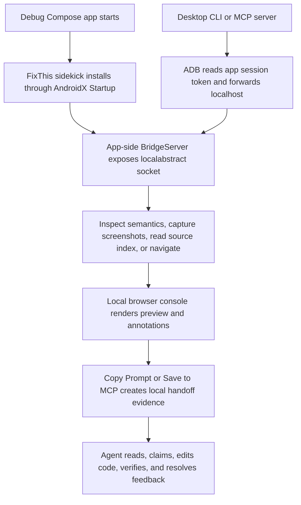

# Balanced Documentation Navigation Implementation Plan

> **For agentic workers:** REQUIRED SUB-SKILL: Use superpowers:subagent-driven-development (recommended) or superpowers:executing-plans to implement this plan task-by-task. Steps use checkbox (`- [ ]`) syntax for tracking.

**Goal:** Build a durable documentation navigation layer that lets both developers and coding agents find current FixThis docs, contracts, and validation commands without mistaking historical planning files for current behavior.

**Architecture:** Add one shared project map and update the existing top-level navigation docs to point readers to it. Keep reference docs as the source-of-truth contract layer, keep long-form handover docs intact, and add lightweight structural checks to prevent navigation drift.

**Tech Stack:** Markdown documentation, Node.js ESM script `scripts/check-doc-consistency.mjs`, Git documentation checks, existing shell validation scripts.

## Global Constraints

- Do not rewrite every documentation page.
- Do not move `docs/superpowers/`, `docs/specs/`, or `docs/plans/` in this pass.
- Do not change CLI, MCP, bridge, persisted JSON, Gradle plugin, or runtime behavior.
- Do not make Graphify a product dependency or source of truth.
- Do not add strict prose-style linting. The drift checks should validate structure and links, not writing style.
- Keep FixThis described as debug-only, Compose-only, local-first, and never commit `.fixthis/`.
- Treat `docs/reference/*` and current implementation sources as newer evidence than historical planning documents.

---

## File Structure

- Create `docs/guides/project-map.md`: compact map for humans and agents; owns module responsibilities, first files, task routes, validation commands, and source-of-truth priority.
- Modify `README.md`: keep product pitch and quick starts, add docs-reading routes, and link `docs/guides/project-map.md`.
- Modify `AGENTS.md`: add repository read order and historical-doc boundary, link `docs/guides/project-map.md`.
- Modify `docs/index.md`: restructure the start section around reader/task paths, add project map, contract labeling, and historical planning section.
- Modify `MCP.md`, `docs/getting-started/add-to-your-app.md`, and `docs/getting-started/connect-your-agent.md`: reduce repeated setup prose by routing detailed CLI and MCP setup to canonical docs.
- Modify `scripts/check-doc-consistency.mjs`: add structural drift checks for project-map links, historical planning labels, docs index sections, and required module names.

## Task 1: Create The Shared Project Map

**Files:**
- Create: `docs/guides/project-map.md`
- Read: `docs/guides/fullstack-tooling-handover.md`
- Read: `docs/architecture/overview.md`
- Read: `CONTRIBUTING.md`

**Interfaces:**
- Consumes: approved design in `docs/superpowers/specs/2026-07-01-balanced-documentation-navigation-design.md`
- Produces: `docs/guides/project-map.md`, later linked by `README.md`, `AGENTS.md`, `docs/index.md`, and checked by `scripts/check-doc-consistency.mjs`

- [ ] **Step 1: Create the project map document**

Create `docs/guides/project-map.md` with this full structure and content. Keep code identifiers and file paths in English; Korean is not needed in repo docs.

````markdown
# FixThis Project Map

FixThis attaches a debug-only sidekick runtime to a Jetpack Compose app, mirrors UI context into a local desktop console, and turns UI annotations into source-aware handoffs for coding agents.

Use this page when you need to understand where to start. For the long-form maintainer explanation, read [Fullstack/tooling handover](fullstack-tooling-handover.md). For stable API, CLI, MCP, bridge, and persisted JSON behavior, prefer the reference docs under [`docs/reference/`](../reference/).

## Source-Of-Truth Priority

When sources disagree, use this order:

1. Current Kotlin, JavaScript, Gradle, shell, and Markdown implementation.
2. `docs/reference/*` for stable CLI, MCP, bridge, output schema, privacy, compatibility, and console contracts.
3. `CONTRIBUTING.md`, `docs/contributing/*`, and release docs for required checks and release state.
4. `docs/guides/*`, `docs/architecture/*`, and `docs/product/*` for explanations and navigation.
5. `docs/superpowers/*`, `docs/specs/*`, and `docs/plans/*` for historical planning context.

Historical planning files are useful for understanding why work happened. They are not current contracts unless a maintained guide, reference page, or source file explicitly points to them.

## Runtime Flow



The Android app does not host MCP or HTTP. The desktop `fixthis-mcp` process owns the local HTTP console, MCP tools, session store, and `.fixthis/feedback-sessions/` queue.

## Module Map

| Module | Responsibility | Must Not Depend On | Start With | Focused Checks |
| --- | --- | --- | --- | --- |
| `:app` (`sample/`) | Validation sample app and product-scene fixtures | External-app-only shortcuts or hidden contracts | `sample/src/main/java/io/github/beyondwin/fixthis/sample/FixThisStudioApp.kt` | `./gradlew :app:assembleDebug` |
| `:fixthis-compose-core` | Pure Kotlin domain: selection, source matching, target evidence, reliability, formatter, redaction | Android UI, MCP, CLI, browser DTOs, `.fixthis/` paths | `fixthis-compose-core/src/main/kotlin/io/github/beyondwin/fixthis/compose/core/source/SourceMatcher.kt` | `./gradlew :fixthis-compose-core:test --no-daemon` |
| `:fixthis-compose-sidekick` | Debug runtime inside the target app: startup, lifecycle, semantics, screenshot, local socket bridge | MCP session storage, desktop console state, browser DOM | `fixthis-compose-sidekick/src/main/kotlin/io/github/beyondwin/fixthis/compose/sidekick/bridge/BridgeServer.kt` | `./gradlew :fixthis-compose-sidekick:testDebugUnitTest --no-daemon` |
| `fixthis-gradle-plugin` | Debug variant wiring and source-index/build metadata generation | Running device state, MCP queue state, browser session state | `fixthis-gradle-plugin/src/main/kotlin/io/github/beyondwin/fixthis/gradle/FixThisGradlePlugin.kt` | `./gradlew :fixthis-gradle-plugin:test --no-daemon` |
| `:fixthis-cli` | Desktop command surface, ADB bridge client, setup/install/doctor/run commands | Browser DOM state or MCP internals | `fixthis-cli/src/main/kotlin/io/github/beyondwin/fixthis/cli/Main.kt` | `./gradlew :fixthis-cli:test --no-daemon` |
| `:fixthis-mcp` | MCP stdio server, local feedback console, session store, handoff rendering, queue tools | Android-only APIs or app-private files outside bridge/CLI adapters | `fixthis-mcp/src/main/kotlin/io/github/beyondwin/fixthis/mcp/session/FeedbackSessionService.kt` | `./gradlew :fixthis-mcp:test --no-daemon` |

## Work Routes

| Work Type | First Docs | First Source Files | Verification |
| --- | --- | --- | --- |
| External app setup | `docs/getting-started/add-to-your-app.md`, `docs/reference/cli.md`, `docs/reference/agent-setup-schema.md` | `fixthis-cli/src/main/kotlin/io/github/beyondwin/fixthis/cli/commands/InstallAgentCommand.kt`, `fixthis-cli/src/main/kotlin/io/github/beyondwin/fixthis/cli/commands/DoctorCommand.kt` | `bash scripts/check-docs-cli-surface.sh`, `./gradlew :fixthis-cli:test --no-daemon` |
| Agent and MCP workflow | `docs/getting-started/connect-your-agent.md`, `docs/guides/agents.md`, `docs/reference/mcp-tools.md` | `fixthis-mcp/src/main/kotlin/io/github/beyondwin/fixthis/mcp/tools/FixThisTools.kt`, `fixthis-mcp/src/main/kotlin/io/github/beyondwin/fixthis/mcp/tools/McpToolRegistry.kt` | `./gradlew :fixthis-mcp:test --no-daemon` |
| Compact handoff or output schema | `docs/reference/output-schema.md`, `docs/reference/feedback-console-contract.md`, `docs/design/handoff-prompt-rationale.md` | `fixthis-mcp/src/main/kotlin/io/github/beyondwin/fixthis/mcp/session/handoff/CompactHandoffRenderer.kt`, `fixthis-compose-core/src/main/kotlin/io/github/beyondwin/fixthis/compose/core/format/FixThisMarkdownFormatter.kt` | `npm run handoff:eval:test`, `./gradlew :fixthis-mcp:test --no-daemon` |
| Source matching and target reliability | `docs/reference/source-matching.md`, `docs/reference/output-schema.md` | `fixthis-compose-core/src/main/kotlin/io/github/beyondwin/fixthis/compose/core/source/SourceMatcher.kt`, `fixthis-compose-core/src/main/kotlin/io/github/beyondwin/fixthis/compose/core/target/TargetReliabilityCalculator.kt` | `npm run source-matching:fixtures:test`, `./gradlew :fixthis-compose-core:test --no-daemon` |
| Bridge protocol and Android runtime | `docs/reference/bridge-protocol.md`, `docs/architecture/overview.md` | `fixthis-compose-sidekick/src/main/kotlin/io/github/beyondwin/fixthis/compose/sidekick/bridge/BridgeServer.kt`, `fixthis-cli/src/main/kotlin/io/github/beyondwin/fixthis/cli/BridgeClient.kt` | `./gradlew :fixthis-compose-sidekick:testDebugUnitTest :fixthis-cli:test --no-daemon` |
| Console UI and session lifecycle | `docs/reference/feedback-console-contract.md`, `docs/architecture/console-state-sync-design.md` | `fixthis-mcp/src/main/console/app.js`, `fixthis-mcp/src/main/kotlin/io/github/beyondwin/fixthis/mcp/session/FeedbackSessionService.kt` | `npm run console:test:fast`, `./gradlew :fixthis-mcp:test --no-daemon` |
| Release readiness | `docs/contributing/release-readiness.md`, `docs/contributing/release-process.md`, `CONTRIBUTING.md` | `scripts/check-release-readiness.mjs`, `scripts/run-release-evidence.mjs`, `package.json` | `npm run release:check` |

## Artifact Boundaries

- Do not commit `.fixthis/`; it contains local handoff sessions, screenshots, generated setup handoffs, and smoke artifacts.
- Do not commit `graphify-out/`; Graphify is an agent navigation aid and its outputs are local artifacts.
- Do not commit Android build outputs, local source-matching fixture workspaces, generated Graphify HTML/wiki output, or screenshots unless a maintained doc explicitly asks for a checked-in asset.
- When changing code, run the focused checks for the touched module, then the broader check requested by `CONTRIBUTING.md` or the release workflow.
- When changing docs that mention CLI commands or flags, run `bash scripts/check-docs-cli-surface.sh`.

## Next Reads

- [Documentation index](../index.md) for all maintained docs.
- [Architecture overview](../architecture/overview.md) for module and runtime detail.
- [Fullstack/tooling handover](fullstack-tooling-handover.md) for deep maintainer onboarding.
- [MCP tools reference](../reference/mcp-tools.md) for agent tool contracts.
- [Output schema](../reference/output-schema.md) for persisted JSON and handoff fields.
- [Contributing](../../CONTRIBUTING.md) for local validation and release checks.
````

- [ ] **Step 2: Verify the new document contains all required module names**

Run:

```bash
for module in ':app' ':fixthis-compose-core' ':fixthis-compose-sidekick' 'fixthis-gradle-plugin' ':fixthis-cli' ':fixthis-mcp'; do
  rg -F "$module" docs/guides/project-map.md >/dev/null || exit 1
done
```

Expected: command exits 0 with no output.

- [ ] **Step 3: Verify markdown whitespace**

Run:

```bash
git diff --check -- docs/guides/project-map.md
```

Expected: no output and exit 0.

- [ ] **Step 4: Commit**

```bash
git add docs/guides/project-map.md
git commit -m "docs: add project map"
```

## Task 2: Wire The Main Reader And Agent Entry Points

**Files:**
- Modify: `README.md`
- Modify: `AGENTS.md`
- Modify: `docs/index.md`

**Interfaces:**
- Consumes: `docs/guides/project-map.md` from Task 1
- Produces: stable navigation links and role boundaries consumed by the drift checker in Task 4

- [ ] **Step 1: Update `README.md` with a documentation routing section**

Insert this section after the existing `Pick Your Path` table and before `Why FixThis vs. just sending a screenshot?`.

```markdown
## How to Read the Docs

| Reader | Start Here | Why |
| --- | --- | --- |
| First-time user | [Quick Start with the sample](docs/getting-started/try-the-sample.md) | Creates one real handoff before touching your app. |
| External app developer | [Add FixThis to your app](docs/getting-started/add-to-your-app.md) | Covers Gradle wiring, agent setup, and done-state checks. |
| Coding agent in this repo | [AGENTS.md](AGENTS.md) and [Project map](docs/guides/project-map.md) | Gives read order, source-of-truth priority, module boundaries, and artifact rules. |
| Maintainer | [Documentation index](docs/index.md) and [Project map](docs/guides/project-map.md) | Routes architecture, reference contracts, validation, and release docs. |
| Contract or CLI change | [Reference docs](docs/index.md#reference-contracts) | Stable CLI, MCP, bridge, output schema, and compatibility surfaces live there. |
```

Keep the existing `Pick Your Path` table. Do not duplicate the detailed Homebrew, npm, curl, and bootstrap examples in this new section.

- [ ] **Step 2: Add read order to `AGENTS.md`**

Insert this section after the opening paragraph that says this file is the entry point.

```markdown
## Read Order For Agents

1. Read this `AGENTS.md` for repository constraints and tool workflow.
2. Read [`docs/index.md`](docs/index.md) to choose the maintained docs path for the task.
3. Read [`docs/guides/project-map.md`](docs/guides/project-map.md) for module responsibilities, first files, validation commands, and artifact boundaries.
4. Read the task-specific guide or reference contract before changing behavior.
5. Use `docs/superpowers/*`, `docs/specs/*`, and `docs/plans/*` only as historical planning context unless a maintained guide, reference page, or source file explicitly points to them.

When documents disagree, prefer the current implementation and `docs/reference/*` over historical planning docs. Graphify is useful navigation context, but behavior changes still need source and reference-doc verification.
```

Do not remove the existing Quick Start, Feedback Workflow, MCP tools, Constraints, Diagnostics, Build/Test, Module Map, or Graphify sections.

- [ ] **Step 3: Rework `docs/index.md` start paths**

Replace the current `## Start Here` table with this table. Keep the surrounding introduction and the existing lower sections.

```markdown
## Start Here

| Reader or task | Read first | Then read |
| --- | --- | --- |
| Try FixThis without changing your app | [Quick Start - sample app](getting-started/try-the-sample.md) | [Feedback console tour](guides/feedback-console-tour.md) |
| Add FixThis to an external Compose app | [Add FixThis to your app](getting-started/add-to-your-app.md) | [CLI reference](reference/cli.md), [Agent setup schema](reference/agent-setup-schema.md) |
| Connect Claude Code, Codex, Cursor, or ChatGPT | [Connect your AI agent](getting-started/connect-your-agent.md) | [Working with AI agents](guides/agents.md), [MCP tools reference](reference/mcp-tools.md) |
| Work inside this repository as an agent | [Project map](guides/project-map.md) | [AGENTS.md](../AGENTS.md), task-specific reference docs |
| Maintain FixThis architecture or tooling | [Project map](guides/project-map.md) | [Architecture overview](architecture/overview.md), [Fullstack/tooling handover](guides/fullstack-tooling-handover.md) |
| Change a compatibility contract | [Reference contracts](#reference-contracts) | The implementation files named by [Project map](guides/project-map.md) |
| Prepare or audit a release | [Release readiness checklist](contributing/release-readiness.md) | [Release process](contributing/release-process.md), [Contributing guide](../CONTRIBUTING.md) |
| Understand historical design context | [Historical planning](#historical-planning) | Current reference docs before changing behavior |
```

- [ ] **Step 4: Update `docs/index.md` architecture and history sections**

Add `Project map` as the first bullet under `## Architecture and Design`:

```markdown
- [Project map](guides/project-map.md) — compact repository map for humans and agents: module responsibilities, first files, task routes, validation commands, and artifact boundaries
```

Then add this section before the final horizontal rule:

```markdown
## Historical Planning

- `docs/superpowers/specs/` and `docs/superpowers/plans/` contain approved design and implementation-plan artifacts from previous agentic work.
- `docs/specs/` and `docs/plans/` contain older project planning records that may still explain why a feature exists.
- These files are historical context. They are not the current source of truth for CLI flags, MCP tool shapes, bridge protocol fields, persisted JSON contracts, or release readiness unless a maintained guide, reference page, or source file explicitly points to them.
```

- [ ] **Step 5: Verify links and required text**

Run:

```bash
rg -F "docs/guides/project-map.md" README.md AGENTS.md
rg -F "guides/project-map.md" docs/index.md
rg -F "Historical Planning" docs/index.md
rg -F "historical planning context" AGENTS.md
```

Expected: each command prints at least one matching line.

- [ ] **Step 6: Run existing doc consistency check**

Run:

```bash
node scripts/check-doc-consistency.mjs
```

Expected: prints `All doc-consistency rules pass.`

- [ ] **Step 7: Commit**

```bash
git add README.md AGENTS.md docs/index.md
git commit -m "docs: clarify reader and agent entry points"
```

## Task 3: Reduce Setup Repetition In Setup-Facing Docs

**Files:**
- Modify: `MCP.md`
- Modify: `docs/getting-started/add-to-your-app.md`
- Modify: `docs/getting-started/connect-your-agent.md`

**Interfaces:**
- Consumes: navigation links from Task 2 and existing CLI reference docs
- Produces: setup docs with one canonical path per scenario and fewer repeated explanations

- [ ] **Step 1: Add a canonical setup note to `MCP.md`**

Insert this paragraph after the first paragraph in `MCP.md`.

```markdown
For full command flags and recovery cases, prefer the [CLI reference](docs/reference/cli.md). For choosing between sample setup, external-app setup, and chat-style Copy Prompt, start from the [documentation index](docs/index.md) or [project map](docs/guides/project-map.md).
```

Keep the current sample bootstrap, installed CLI, and external repo command examples.

- [ ] **Step 2: Add a routing note to `docs/getting-started/add-to-your-app.md`**

Insert this paragraph after the `# Add FixThis to Your Own App` heading.

```markdown
This page is the how-to for wiring FixThis into an external Compose debug app. For a compact repository map, see [Project map](../guides/project-map.md). For every CLI flag and exit behavior, see [CLI reference](../reference/cli.md).
```

Then replace the sentence `See the [CLI reference](../reference/cli.md) for the full set of `fixthis setup` options.` with:

```markdown
See the [CLI reference](../reference/cli.md) for the full command surface, setup variants, and exit behavior.
```

- [ ] **Step 3: Add a routing note to `docs/getting-started/connect-your-agent.md`**

Insert this paragraph after the opening table that lists agent styles.

```markdown
This page explains how users connect an agent to FixThis. Agents working inside the FixThis repository should also read [AGENTS.md](../../AGENTS.md) and the [Project map](../guides/project-map.md) before changing files.
```

Keep the existing Claude Code, Codex, Cursor, ChatGPT, MCP queue lifecycle, and locality sections.

- [ ] **Step 4: Verify setup-facing docs still expose the canonical commands**

Run:

```bash
rg -F "fixthis install-agent --project-dir . --target all --verify --json" README.md docs/getting-started/add-to-your-app.md docs/getting-started/connect-your-agent.md
rg -F "./scripts/bootstrap-mcp.sh --sample" README.md MCP.md docs/getting-started/connect-your-agent.md
rg -F "fixthis init --agent --project-dir . --target codex" MCP.md docs/getting-started/add-to-your-app.md docs/getting-started/connect-your-agent.md
```

Expected: each command prints at least one matching line.

- [ ] **Step 5: Run CLI docs surface check**

Run:

```bash
bash scripts/check-docs-cli-surface.sh
```

Expected: exits 0. If it builds `:fixthis-cli:installDist`, that is expected.

- [ ] **Step 6: Commit**

```bash
git add MCP.md docs/getting-started/add-to-your-app.md docs/getting-started/connect-your-agent.md
git commit -m "docs: route setup docs through canonical references"
```

## Task 4: Add Structural Drift Checks And Run Final Verification

**Files:**
- Modify: `scripts/check-doc-consistency.mjs`
- Read: `README.md`
- Read: `AGENTS.md`
- Read: `docs/index.md`
- Read: `docs/guides/project-map.md`

**Interfaces:**
- Consumes: links and sections added in Tasks 1-3
- Produces: `scripts/check-doc-consistency.mjs` rules that fail when the new docs navigation layer drifts

- [ ] **Step 1: Add reusable contains checks to the script**

In `scripts/check-doc-consistency.mjs`, after the existing Rule 6 loop and before the final `if (failures.length > 0)` block, add this code:

```javascript
// Rule 7: the shared project map is linked from the main navigation entry points.
const docsIndex = read("docs/index.md");
const projectMap = read("docs/guides/project-map.md");
check(
  "R7.readme-project-map",
  readme.includes("docs/guides/project-map.md"),
  "README.md must link to docs/guides/project-map.md.",
);
check(
  "R7.agents-project-map",
  agents.includes("docs/guides/project-map.md"),
  "AGENTS.md must link to docs/guides/project-map.md.",
);
check(
  "R7.docs-index-project-map",
  docsIndex.includes("guides/project-map.md"),
  "docs/index.md must link to guides/project-map.md.",
);

// Rule 8: historical planning docs are labeled as context, not current contracts.
check(
  "R8.historical-planning-label",
  /docs\/superpowers[\s\S]{0,240}historical|historical[\s\S]{0,240}docs\/superpowers/i.test(`${agents}\n${docsIndex}`),
  "AGENTS.md or docs/index.md must describe docs/superpowers as historical planning context.",
);

// Rule 9: docs/index.md keeps the contract and history navigation sections.
check(
  "R9.reference-contracts-section",
  /^## Reference Contracts$/m.test(docsIndex),
  "docs/index.md must keep a 'Reference Contracts' section.",
);
check(
  "R9.historical-planning-section",
  /^## Historical Planning$/m.test(docsIndex),
  "docs/index.md must keep a 'Historical Planning' section.",
);

// Rule 10: project-map.md names every primary module.
for (const moduleName of [
  ":app",
  ":fixthis-compose-core",
  ":fixthis-compose-sidekick",
  "fixthis-gradle-plugin",
  ":fixthis-cli",
  ":fixthis-mcp",
]) {
  check(
    `R10.project-map-module-${moduleName.replace(/[^a-z0-9]+/gi, "-")}`,
    projectMap.includes(moduleName),
    `docs/guides/project-map.md must mention ${moduleName}.`,
  );
}
```

This code uses the script's existing `read` and `check` helpers. It does not add dependencies.

- [ ] **Step 2: Run the updated doc consistency check**

Run:

```bash
node scripts/check-doc-consistency.mjs
```

Expected: existing `PASS R1...R6...` lines plus new `PASS R7...`, `PASS R8...`, `PASS R9...`, and `PASS R10...` lines, ending with `All doc-consistency rules pass.`

- [ ] **Step 3: Run CLI surface check**

Run:

```bash
bash scripts/check-docs-cli-surface.sh
```

Expected: exits 0.

- [ ] **Step 4: Run whitespace check**

Run:

```bash
git diff --check
```

Expected: no output and exit 0.

- [ ] **Step 5: Run Graphify freshness update**

Run:

```bash
graphify update .
```

Expected: exits 0. `graphify-out/` may change locally and must not be staged.

- [ ] **Step 6: Verify final changed set excludes generated artifacts**

Run:

```bash
git status --short
```

Expected tracked changes include only Markdown docs and `scripts/check-doc-consistency.mjs`. `graphify-out/` should not appear as a staged change.

- [ ] **Step 7: Commit**

```bash
git add scripts/check-doc-consistency.mjs README.md AGENTS.md docs/index.md docs/guides/project-map.md MCP.md docs/getting-started/add-to-your-app.md docs/getting-started/connect-your-agent.md
git diff --cached --check
git commit -m "docs: guard documentation navigation"
```

## Final Verification

After all task commits exist, run:

```bash
node scripts/check-doc-consistency.mjs
bash scripts/check-docs-cli-surface.sh
git diff --check
git status --short
```

Expected:

- `node scripts/check-doc-consistency.mjs` ends with `All doc-consistency rules pass.`
- `bash scripts/check-docs-cli-surface.sh` exits 0.
- `git diff --check` exits 0 with no output.
- `git status --short` shows a clean tree or only ignored local Graphify artifacts outside the commit.

If a release-oriented reviewer asks for a broader docs gate, also run:

```bash
npm run prepush
```

## Self-Review Notes

- Spec coverage: Tasks 1-4 cover the project map, README, AGENTS, docs index, setup-doc routing, structural checks, and verification commands required by the approved spec.
- Scope: The plan stays in Markdown plus `scripts/check-doc-consistency.mjs`; it does not alter CLI, MCP, Gradle, bridge, Android runtime, persisted JSON, or reference contract behavior.
- Type consistency: The only new script variables are `docsIndex` and `projectMap`; they use the existing `read` helper and do not conflict with existing names.
