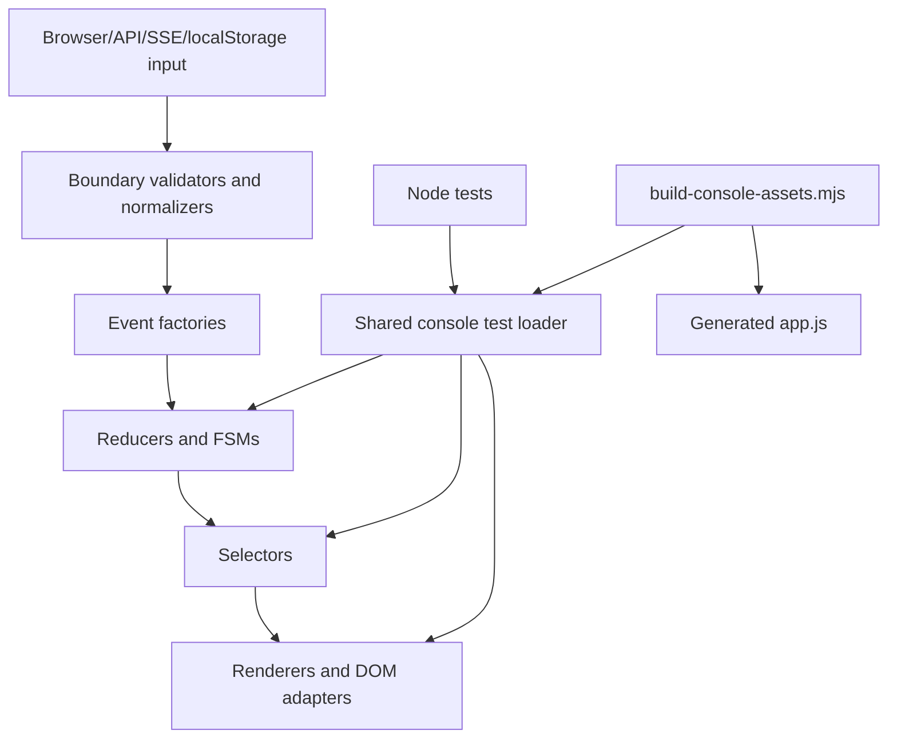

# Spec - Console JS Reliability Stabilization

Status: Draft for review
Date: 2026-05-15
Scope: `:fixthis-mcp` browser feedback console JavaScript, Node console tests, console asset build checks
Related docs:
- [`docs/reference/feedback-console-contract.md`](../../reference/feedback-console-contract.md)
- [`docs/reference/output-schema.md`](../../reference/output-schema.md)
- [`2026-05-15-console-canonical-single-source-detailed-spec.md`](2026-05-15-console-canonical-single-source-detailed-spec.md)
- [`2026-05-15-console-canonical-runtime-completion-design.md`](2026-05-15-console-canonical-runtime-completion-design.md)

## Summary

The feedback console has grown into a substantial browser JavaScript subsystem:
roughly 49 source modules under `fixthis-mcp/src/main/console` and more than 50
Node-based console test scripts under `scripts`. Bugs now tend to come from
shape drift, repeated ad hoc test loading, direct event object construction,
and weak validation at browser/server/storage boundaries.

This spec stabilizes that JS surface without converting the project to
TypeScript. The recommended path is to add four guardrails:

1. A shared console test loader that evaluates source modules the same way the
   bundle does.
2. Runtime validation and normalization at external boundaries.
3. Centralized event factories for reducer/FSM commands.
4. Focused pure-function extraction from the largest UI modules.

TypeScript remains useful as a later static checking layer through
`tsc --noEmit --allowJs --checkJs`, but it is not the first reliability move.
The first move is to reduce the number of places that can construct invalid
runtime state.

## Problem

### P1 - Test harnesses duplicate module loading

Many Node tests read console source files directly and evaluate them with
`new Function(...)`. Each test decides which files to load, in which order, and
which symbols to return. This creates three failure modes:

- a test accidentally omits a dependency that the production bundle includes;
- a test uses a different module order than `scripts/build-console-assets.mjs`;
- a test keeps passing because it evaluates a smaller world than the browser.

The build script already owns module discovery and `// @requires` topological
ordering. Tests should use the same graph.

### P2 - External data crosses boundaries as untrusted objects

Several console paths accept data from boundaries that are not statically safe:

- HTTP responses from `/api/*`;
- SSE payloads from `events.js`;
- localStorage draft recovery and pending mirrors;
- feedback session JSON loaded from local handoff files;
- browser DOM dataset values and canvas hit-test coordinates.

Internal code often assumes these objects already have the expected shape. When
fields are missing, renamed, stale, or attached to another session, the error is
detected late in rendering, overlay selection, handoff serialization, or prompt
readiness.

### P3 - Events are plain objects constructed in many places

Reducer and FSM inputs are mostly object literals such as
`{ type: 'DRAFT_COMMENT_CHANGED', itemId, comment }`. This is flexible, but it
lets callers forget context fields, misspell action names, or send payloads
that only some branches understand.

The canonical reducer work has made the event surface more important. Event
construction should be centralized so that every command has one constructor
and one validation point.

### P4 - Large UI files mix pure logic and DOM mutation

The largest files are also where bug fixes are riskiest:

- `rendering.js`
- `annotations.js`
- `history.js`
- `main.js`
- `state.js`
- `domain/consoleReducer.js`

Some of these files combine HTML string generation, DOM mutation, state
projection, hit testing, localStorage handling, event dispatch, and network
requests. That makes small behavior fixes harder to test without browser state.

## Goals

- Reduce recurring JS console errors without a full TypeScript migration.
- Keep the current browser bundle contract: source modules are discovered by
  `scripts/build-console-assets.mjs`, ordered by `// @requires`, and emitted to
  `fixthis-mcp/src/main/resources/console/app.js`.
- Keep the current Node `node:test` workflow.
- Make tests evaluate console modules through a shared loader that follows the
  production dependency graph.
- Validate and normalize untrusted browser/server/storage payloads before they
  enter reducer, selector, renderer, or handoff logic.
- Centralize canonical command construction for reducer/FSM events.
- Extract pure logic from the largest UI files only where it reduces concrete
  bug risk or enables focused tests.
- Add a small optional `checkJs` lane after runtime guardrails are in place.

## Non-Goals

- Full `.js` to `.ts` conversion.
- Replacing the `// @requires` bundle system with ESM imports.
- Rewriting the browser UI.
- Changing MCP tool signatures.
- Renaming persisted MCP JSON fields. The fields `items`, `screens`, `itemId`,
  `screenId`, `targetEvidence`, `targetReliability`, and `sourceCandidates`
  remain compatibility contracts.
- Moving console logic into Kotlin.
- Adding a heavy runtime schema dependency unless the small local validators
  prove insufficient.

## Decision

Adopt a JS reliability stabilization program before TypeScript migration.

The implementation should proceed in this order:

1. Build a shared test loader.
2. Add boundary validators and normalizers.
3. Add event factories and use them for canonical reducer/FSM inputs.
4. Extract pure helpers from large UI files while preserving behavior.
5. Add selected `checkJs` only for stable domain modules.

This order is intentional. TypeScript catches many mistakes after code has type
annotations. The current project first needs fewer ad hoc entry points and a
single way to load, validate, and dispatch console data.

## Architecture



### Unit 1 - Shared console test loader

Create `scripts/console-test-loader.mjs`.

Responsibilities:

- Read `fixthis-mcp/src/main/console` files.
- Parse `// @requires` by reusing `parseRequires` from
  `scripts/build-console-assets.mjs`.
- Use `topoSort` from the same build script.
- Evaluate the selected module closure with `new Function`.
- Return requested global symbols to tests.

The loader must not change production code. It reduces test divergence first.

### Unit 2 - Boundary validators and normalizers

Create `fixthis-mcp/src/main/console/domain/consoleBoundary.js`.

Responsibilities:

- Validate session-like objects.
- Validate preview snapshots.
- Validate draft contexts and draft items.
- Normalize string/null/number fields into stable internal shapes.
- Return `{ ok: true, value }` or `{ ok: false, error }` rather than throwing in
  ordinary malformed-input paths.

This module is local, dependency-free, and small enough to audit. It should be
used at browser boundaries before reducer events are dispatched.

### Unit 3 - Event factories

Create `fixthis-mcp/src/main/console/domain/consoleEvents.js`.

Responsibilities:

- Provide named constructors for reducer/FSM events.
- Normalize obvious optional values.
- Reject missing required context early.
- Keep event names centralized.

Example surface:

```js
const ConsoleEvents = Object.freeze({
  sessionRowClicked(sessionId) {
    return Object.freeze({ type: 'SESSION_ROW_CLICKED', sessionId: String(sessionId || '') });
  },
  draftCommentChanged(itemId, comment) {
    return Object.freeze({
      type: 'DRAFT_COMMENT_CHANGED',
      itemId: itemId || null,
      comment: String(comment || ''),
    });
  },
});
```

### Unit 4 - Pure helper extraction

Extract only logic that is already testable or repeatedly bug-prone.

Initial candidates:

- annotation target normalization from `annotations.js`;
- saved/pending overlay view model creation from `rendering.js`;
- history row label/session summary formatting from `history.js`;
- URL construction for preview/screenshot/artifact endpoints from `preview.js`;
- prompt readiness and handoff summary calculation from `prompt.js`.

Extraction should be conservative. The goal is not to produce many small files;
the goal is to create testable seams around the functions most likely to break.

### Unit 5 - Optional static check layer

After the previous units are stable, add:

- `tsconfig.console-check.json`;
- `npm run console:typecheck`;
- `typescript` and `@types/node` dev dependencies if they are not already
  present.

Initial include set:

- `fixthis-mcp/src/main/console/domain/*.js`;
- `fixthis-mcp/src/main/console/*Fsm.js`;
- `fixthis-mcp/src/main/console/draftWorkspace.js`;
- `fixthis-mcp/src/main/console/undoRedo.js`;
- `scripts/console-test-loader.mjs`.

The first typecheck lane should be local-only. Promote to CI after the error
count is zero and the team has accepted the maintenance cost.

## Data Flow

### API/SSE/localStorage input flow

1. Browser receives untrusted payload.
2. Boundary module validates and normalizes payload.
3. Invalid payload becomes a visible status message or ignored stale event.
4. Valid payload is converted through a `ConsoleEvents` constructor.
5. Store dispatches the event.
6. Reducer transitions canonical state.
7. Selectors derive view models.
8. Renderer updates DOM.

No renderer, reducer, or selector should parse raw localStorage JSON, raw SSE
payloads, or raw HTTP response bodies directly.

### Test flow

1. Test imports `loadConsoleModuleSet` from `scripts/console-test-loader.mjs`.
2. Test asks for modules and returned symbols.
3. Loader expands dependencies through `// @requires`.
4. Loader evaluates modules in production graph order.
5. Test calls returned functions.

This keeps source-order behavior aligned between tests and the generated
bundle.

## Error Handling

Boundary validation errors should be specific enough to debug and stable enough
for tests:

- `missing_session_id`
- `missing_preview_id`
- `invalid_screen`
- `invalid_draft_item`
- `invalid_storage_payload`
- `stale_session_context`

Ordinary malformed external data should not throw uncaught exceptions. It should
produce an error object that the adapter can log and convert into a status
message. Programming errors inside reducers may still throw through invariants.

## Testing Strategy

### Unit tests

- `scripts/console-test-loader-test.mjs`
  - verifies dependency expansion;
  - verifies production ordering;
  - verifies returned symbol lookup;
  - verifies unknown module/symbol failures.

- `scripts/consoleBoundary-test.mjs`
  - validates session, preview, draft item, and localStorage payload shapes;
  - verifies malformed payloads return stable errors;
  - verifies normalized values are immutable where appropriate.

- `scripts/consoleEvents-test.mjs`
  - verifies event factory outputs;
  - verifies missing required fields fail before reducer dispatch;
  - verifies event names match reducer cases.

### Migration tests

Update a small number of existing tests to use the shared loader first. Good
first targets:

- `scripts/draftWorkspace-test.mjs`
- `scripts/undoRedo-test.mjs`
- `scripts/consoleCanonicalState-test.mjs`
- `scripts/consoleSelectors-test.mjs`

Do not convert every test in one patch. Convert enough to prove the loader
works, then move file-by-file during nearby feature work.

### Static tests

Add source-structure checks that fail when:

- new console source files lack `// @requires`;
- UI handlers call `requestJson` directly after event factories are available;
- reducer event object literals are introduced outside `consoleEvents.js` and
  tests;
- boundary JSON parsing appears in reducers or renderers.

These tests should be narrow and explicit. Avoid broad regex rules that block
reasonable implementation work.

## Rollout

### Phase 1 - Foundation

- Add shared test loader.
- Add loader tests.
- Convert two low-risk tests to use the loader.
- Keep production bundle unchanged.

### Phase 2 - Boundary validation

- Add `consoleBoundary.js`.
- Add tests for malformed input.
- Use validators at one localStorage path and one API/SSE path.
- Keep behavior-compatible fallbacks for existing persisted data.

### Phase 3 - Event factories

- Add `consoleEvents.js`.
- Wire factories into canonical store call sites gradually.
- Add static checks for new direct object literal events in production code.

### Phase 4 - Pure helper extraction

- Extract helpers from the most active bug areas.
- Test each extracted helper before changing callers.
- Avoid broad file splitting unless a helper has a clear owner and test.

### Phase 5 - Optional `checkJs`

- Add TypeScript dev tooling for selected JS files.
- Keep typecheck out of CI until it is stable.
- Promote after the team agrees it is low-noise.

## Acceptance Criteria

- New tests pass:
  - `node --test scripts/console-test-loader-test.mjs`
  - `node --test scripts/consoleBoundary-test.mjs`
  - `node --test scripts/consoleEvents-test.mjs`
- Existing console tests still pass through `npm run console:test:all`.
- `node scripts/build-console-assets.mjs --check` passes after bundle
  regeneration where production console modules change.
- At least two existing tests use the shared loader.
- At least one API/SSE boundary and one storage boundary use validators.
- New canonical reducer/FSM events in production code are created through
  `ConsoleEvents`.
- No persisted MCP JSON compatibility fields are renamed.

## Risks and Mitigations

- **Risk:** Static source checks become noisy.
  **Mitigation:** Start with narrow checks for new files and obvious direct
  calls only.

- **Risk:** Boundary validators reject old localStorage data.
  **Mitigation:** Normalize old shapes where safe and clear only payloads that
  cannot be associated with a session/screen.

- **Risk:** Event factories add ceremony without coverage.
  **Mitigation:** Use factories first in reducers/FSM paths that already have
  canonical tests.

- **Risk:** Helper extraction becomes a broad refactor.
  **Mitigation:** Each extraction must have a named bug class and focused test.

## Open Decisions

### OD1 - Should `console:typecheck` enter CI immediately?

Decision: no. Add it as a local command after runtime guardrails land. Promote
when it is zero-noise.

### OD2 - Should validators use a schema library?

Decision: no for the first pass. The console bundle has a strict gzip budget,
and the needed shapes are small. Revisit only if local validators become hard to
maintain.

### OD3 - Should tests stop using `new Function` entirely?

Decision: no. The production bundle is still concat-style browser JS. A shared
`new Function` loader that follows production ordering is a better near-term
match than introducing a separate test module system.
