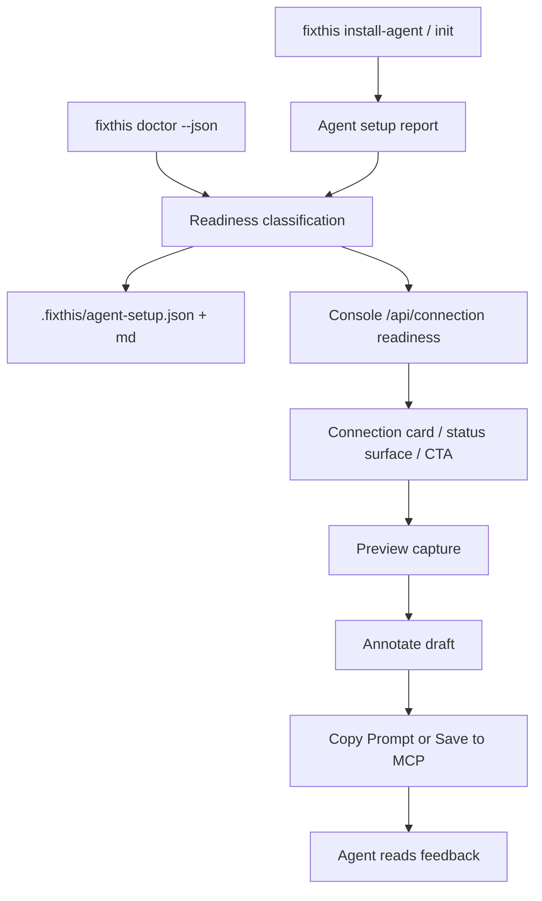

# v0.3 First-Run Trust Program Design

Date: 2026-05-16
Status: Approved design

## Goal

FixThis v0.3 should make the first successful external-project workflow feel
predictable and recoverable:

1. install or configure FixThis in a debug Compose app,
2. run doctor or read the agent setup handoff,
3. open the feedback console,
4. capture a preview,
5. add one or more annotations,
6. copy or save the handoff for an agent.

The program combines three approved tracks:

- First-Run Trust Pack: one readiness vocabulary and a smoke-tested happy path.
- Console Reliability Pack: clearer connection, preview, draft, session, and
  save states.
- Agent Setup Recovery Pack: consistent `install-agent`, `doctor`, and
  `.fixthis/agent-setup.*` recovery guidance.

## Non-Goals

- AndroidView, WebView, XML/View, Flutter, React Native, iOS, or production
  runtime support.
- Guaranteed exact source-line mapping or major source-matching expansion.
- New package channels such as Docker or PyPI.
- Automatic code edits inside FixThis.
- Cloud review or remote upload behavior.
- Sidekick bridge protocol changes unless an implementation task proves they
  are required for first-run recovery.

## Success Criteria

- A new user can identify the next action from any first-run failure state
  without reading raw stack traces.
- CLI, doctor, console, docs, and `.fixthis/agent-setup.*` use the same
  readiness vocabulary.
- Each blocking console state shows one primary action and optional hidden
  diagnostic details.
- Notification surfaces are consistent: recoverable errors are not toast-only,
  destructive actions use in-app sheets, and repeated polling failures dedupe.
- A local smoke test covers first-run ready to annotation to handoff.
- v0.3 release notes can truthfully describe the work as "first-run trust and
  console notification consistency".

## Readiness Model

Introduce a shared first-run readiness contract used by CLI, MCP console, and
agent setup files.

### Readiness States

| State | Meaning | Typical primary action |
| --- | --- | --- |
| `READY` | Debug app, sidekick, selected device, and console can capture. | Capture screen |
| `NEEDS_INSTALL` | FixThis is not configured or source metadata is missing. | Run `fixthis install-agent --project-dir . --target all` |
| `NEEDS_APP_LAUNCH` | ADB is usable, but the app or sidekick bridge is not reachable. | Open app |
| `DEVICE_BLOCKED` | Device or app is connected but not interactable. | Resolve the specific device state |
| `UNSUPPORTED_BUILD` | Release/non-debug build, missing sidekick, or `run-as` denied. | Install a debuggable build with FixThis enabled |
| `CONFIG_RECOVERABLE` | MCP or project config can be safely regenerated. | Re-run the setup command or dry-run it |
| `ENV_BLOCKER` | ADB, Android SDK, Node, JDK, or repo root prerequisite is missing. | Run doctor after fixing the prerequisite |
| `STALE_PREVIEW` | Frozen preview no longer matches the live screen. | Recapture, force-save, or cancel |
| `SESSION_MISMATCH` | A response or saved artifact belongs to a different session. | Refresh session or return to active session |
| `UNKNOWN_ERROR` | Unclassified failure. | Show diagnostic command and hidden details |

Each readiness value must carry:

- `state`: stable machine-readable enum.
- `cause`: short user-facing reason.
- `verify`: a command, UI check, or condition that confirms the problem.
- `fix`: the recommended corrective action.
- `nextAction`: one primary action suitable for CLI, console, or agent handoff.
- `details`: optional raw data for hidden diagnostics.

## Architecture

The design avoids a new runtime layer. Instead, existing surfaces converge on a
shared contract and presenter policy.

### FirstRunReadiness

`FirstRunReadiness` is the shared DTO and mapping policy for `doctor`,
`install-agent`, console `/api/connection`, and `.fixthis/agent-setup.json`.
It should live where CLI and MCP can both use it without coupling the Android
sidekick to desktop UI concerns.

The model should classify known failures before returning raw messages. For
example, `run-as` denied and "not debuggable" both map to
`UNSUPPORTED_BUILD`, while missing `settings.gradle(.kts)` maps to
`ENV_BLOCKER` or `CONFIG_RECOVERABLE` depending on command context.

### Agent Setup Recovery Surface

`.fixthis/agent-setup.md` and `.fixthis/agent-setup.json` become recovery
contracts, not only setup notes. They preserve the current `state`, `next`, and
`recovery` sections, then add readiness-aligned fields:

- current package and project root,
- applied/skipped setup actions,
- classified failures,
- one next command,
- recovery table keyed by readiness state,
- doctor command to verify the result.

### Console Reliability Presenter

The console gains a thin presenter layer that maps readiness and browser state
to UI copy, surface choice, and actions. This keeps DOM code from making
inconsistent decisions about whether a problem is a toast, banner, inline
state, canvas modal, or sheet.

The presenter owns copy for:

- connection card state,
- blocked canvas state,
- stale preview state,
- draft recovery state,
- save and handoff failures,
- session boundary choices,
- recoverable config and auth failures.

### Notification Center

The existing `statusSurfaceRegistry` remains the low-level coordinator. Add a
policy layer above it, tentatively `NotificationCenter`, with a stable API:

```js
notify({
  severity: "error" | "warning" | "success" | "info",
  surface: "toast" | "banner" | "inline",
  title,
  message,
  primaryAction,
  secondaryAction,
  details,
  dedupeKey,
  ttlMs,
  allowErrorToast,   // opt-in: error severity is otherwise auto-promoted off toast
})
```

Destructive choices (session switch, discard, force-save, forget device) are
not part of `NotificationCenter`; they route to the boundary-dialog sheet
described under Console Reliability Presenter. `NotificationCenter.notify`
therefore covers three surfaces (toast, banner, inline) and is responsible
for: (a) auto-promoting `severity: "error"` away from `toast` unless the
caller opts in via `allowErrorToast`, (b) honoring `dedupeKey` for both
duplicate suppression *and* coordinated `hide(id)` calls from existing call
sites, and (c) expiring `dedupeKey` entries once `ttlMs` elapses so a
legitimate later notification with the same key can re-display.

This layer replaces direct `error.textContent`, manual undo toast DOM, and most
native `window.confirm` calls. Existing tests that inject prompt hooks can keep
using hook functions while production UI routes through in-app sheets.

### First-Run Smoke Harness

Use the existing fake bridge and console harness direction rather than a
networked package-manager E2E. The smoke should be deterministic inside this
repository:

1. no device or welcome state,
2. device ready,
3. console ready,
4. preview captured,
5. annotation draft created,
6. Copy Prompt or Save to MCP succeeds,
7. session updates show the handoff state.

## Data Flow



Important invariant: all user-facing surfaces may render different copy, but
they must not invent separate state names for the same condition.

## Notification Policy

| Surface | Use for | Avoid |
| --- | --- | --- |
| Toast | Success, cancel, undo, short non-blocking notices. | Recoverable errors that need action. |
| Inline status | Local state in connection, preview, inspector, or save controls. | Global failures unrelated to the local area. |
| Global banner | Whole-workflow issues that should remain visible. | Routine success messages. |
| Modal or sheet | Session switch, discard, destructive actions, force-save choices. | Passive information. |
| Details panel | Raw JSON, stack traces, diagnostic commands. | Primary guidance. |

Native `alert` and `confirm` should be removed except for browser-controlled
navigation prompts (for example the dialog the browser itself renders when a
`beforeunload` handler sets `event.returnValue`). FixThis never calls
`window.confirm` from `beforeunload` handlers; the only sanctioned use of
`window.confirm` is in test hook fallbacks (see the `loadConsoleSymbols` test
loader) and never in production console code paths.

Notification requirements:

- repeated polling failures use `dedupeKey`,
- maximum visible toast count remains enforced,
- toast TTL is explicit,
- error toasts do not hide required next actions,
- `role="alert"` and `aria-live` match severity,
- 403 token/origin errors recommend console reload or opening the served URL,
- clipboard failures explain the fallback and final manual-copy state,
- screenshot 404 and semantics-only captures receive specific copy.

## Edge Case Inventory

The implementation plan must map each case below to a readiness state,
notification surface, and next action.

### Install and Setup

- Not running from an Android repository root.
- Missing app module.
- Multiple app modules or multiple `applicationId` candidates.
- Missing or ambiguous `applicationId`.
- Debug variant missing or release-only project.
- Gradle plugin patch failure.
- MCP config collision.
- Global config write blocked by guard.
- Dry-run output that could be mistaken for an actual write.
- `.fixthis/project.json` package differs from the installed package.
- `.fixthis/agent-setup.*` exists but is stale or from another project root.
- Config directory cannot be created or written.

### ADB and Device

- `adb` not found.
- No device.
- Unauthorized device.
- Offline device.
- Multiple devices, no selection.
- Selected device disconnected or changed state.
- Wireless ADB drops mid-flow.
- Secure lockscreen.
- Screen off.
- App backgrounded.
- Picture-in-Picture.
- No Compose root.
- Package installed only on a different connected device.

### Build and Bridge

- `run-as` denied.
- `run-as` unknown package.
- Sidekick session missing.
- App not launched after install.
- App process death.
- App reinstalled after source-index generation.
- Bridge timeout.
- Bridge closed before response.
- Bridge protocol mismatch.
- Stale binary or stale source index.
- Unsupported release build.
- Sidekick missing from debug runtime.

### Console and Browser

- Console server restarted and token changed.
- Mutating request returns 403 because of token, origin, or host.
- SSE disconnect.
- SSE replay overflow.
- Session polling backoff.
- Hidden tab pauses preview polling.
- Clipboard API denied.
- Fallback copy fails.
- localStorage draft recovery is corrupt.
- Legacy pending mirror has items but no preview context.
- History session is closed while displayed.
- Cross-session SSE or preview response arrives late.

### Preview, Annotation, and Handoff

- Preview screenshot missing or returns 404.
- Screenshot capture fails but semantics exists.
- Navigation succeeds but follow-up capture fails.
- Selected node no longer exists on frozen preview.
- Selection bounds are invalid.
- Empty comment.
- Screen fingerprint mismatch.
- Session switch during dirty draft.
- Draft save conflict.
- Preview save in progress.
- Older save finishes after newer local edits.
- Duplicate click on Save to MCP or Copy Prompt.
- Copy Prompt succeeds but mark-handed-off fails.
- Save to MCP succeeds while residual pin-only draft remains.
- Agent handoff requested with empty `itemIds`.
- Unknown item or non-editable item.

## Error Handling Policy

The first visible response should answer "what can I do next?" Raw data is
secondary.

- `ENV_BLOCKER`: show missing prerequisite and a verify command.
- `CONFIG_RECOVERABLE`: show the safe regeneration command and dry-run option.
- `NEEDS_APP_LAUNCH`: primary action opens or reconnects the app.
- `DEVICE_BLOCKED`: canvas input is blocked and the per-cause fix is visible.
- `UNSUPPORTED_BUILD`: do not loop on Try Again; explain debug build install.
- `STALE_PREVIEW`: offer recapture, force-save, and cancel through an in-app
  sheet.
- `SESSION_MISMATCH`: ignore stale responses when possible; otherwise show a
  refresh or return-to-session action.
- `UNKNOWN_ERROR`: show a short failure message plus hidden details and a
  diagnostic command.

Browser `requestJson` should preserve structured server error fields instead of
throwing only a string. At minimum, the console needs access to `error`,
`message`, `action`, and conflict metadata so `NotificationCenter` can choose
the correct surface.

## Testing Strategy

### Contract Tests

- Readiness enum names are stable across CLI, MCP, and docs.
- `doctor --json` failures include readiness, cause, fix, and next action.
- `.fixthis/agent-setup.json` includes state, next, recovery, and classified
  failures.
- Console `/api/connection` returns readiness-compatible states.

### Console Unit Tests

- `NotificationCenter` routes severities to the expected surface.
- Repeated errors dedupe by `dedupeKey`.
- Toast TTL and stack limits hold.
- Error states are not toast-only.
- Structured HTTP errors survive `requestJson`.
- Native `confirm` is absent from first-run and session/draft boundary paths
  except explicit platform exceptions.
- Accessibility roles and live regions match surface intent.

### Browser Smoke Tests

- First-run happy path: welcome to ready to preview to annotation to handoff.
- Unsupported build shows debug-build guidance.
- Device blocked overlays show one action and resume when clear.
- Stale preview conflict opens the in-app choice surface.
- Save failure keeps dirty draft and shows a recoverable action.
- 403 token/origin failure instructs reload or correct console URL.

### CLI Tests

- `install-agent --json` reports applied, skipped, errors, next, and recovery.
- Dry-run does not claim writes happened.
- Global write guard explains override and risk.
- Doctor text and JSON surface the same readiness classification.

## Rollout

1. Land the readiness contract and mapping tests.
2. Update CLI and agent setup recovery surfaces.
3. Add the notification policy layer while keeping `statusSurfaceRegistry`.
4. Migrate high-risk console call sites: structured errors, native confirms,
   undo toast, global error text, save/handoff failures.
5. Add first-run smoke coverage.
6. Refresh troubleshooting and v0.3 release notes.

Do not start by rewriting the entire console. The migration should be
compatibility-first and focused on first-run paths, save/handoff paths, and
known confusing failures.

## Implementation Choices

The implementation plan should use these choices unless code inspection proves
one of them unworkable.

- Put `FirstRunReadiness` in the CLI module under a neutral package because
  `:fixthis-mcp` already depends on CLI utilities and bridge adapters.
- Add a separate `npm run first-run:smoke` command first. Include it in
  `npm run ci:local` after it is deterministic in local and CI environments.
- Reuse the existing in-app boundary sheet pattern for fingerprint mismatch,
  draft recovery, session switching, clear local draft, clear server draft, and
  forget device.
- Remove native `window.confirm` from production console paths covered by this
  spec. Keep only platform-required prompts such as `beforeunload`.
